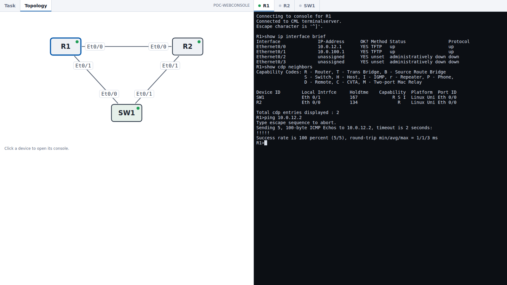

# PoC: ラボをブラウザ 1 画面で解く — BL-234 (2026-10-06 実施)

> **本実装済み(2026-10-06)**。本体は [topologies/lab_console.py](../../topologies/lab_console.py)
> (端末ライブラリは `topologies/assets/`)。`scripts/pack.sh serve` が配信サーバと一緒に起動し、
> パックのラボの問題ページ右上「Open lab workspace ▸」から開く。
> ここは PoC の記録と、使い捨てラボ(`mklab.py`)・仮タスクの置き場。
> PoC 時点の中継(`bridge.py`)と端末ライブラリ(`vendor/`)は本体へ移したので削除済み。

画面: **左半分= タスク／トポロジ(タブ切替)・右半分= 機器コンソール(機器ごとのタブ)**。

```
ブラウザ(xterm.js) ⇄ WebSocket ⇄ bridge.py(aiohttp) ⇄ SSH(asyncssh) ⇄ CML コンソールサーバ ⇄ ノードのシリアル
```

| ファイル | 役割 |
|---|---|
| (`bridge.py`) | PoC 時点の中継サーバ＋画面。→ 本体 `topologies/lab_console.py` へ移して削除 |
| `mklab.py` | 使い捨てラボ `POC-WEBCONSOLE`(IOL ルータ 2＋IOL L2 スイッチ 1)の作成 `up`／削除 `down` |
| `sample_task.md` | 左のタブに出す仮のタスク(採点対象ではない) |
| (`vendor/`) | xterm.js 5.5.0・addon-fit 0.10.0(MIT。jsdelivr から取得)。→ `topologies/assets/` へ移して削除 |

## 動かし方(使い捨てラボで単発に開く)

```
.venv/bin/python3 poc/webconsole/mklab.py up
.venv/bin/python3 topologies/lab_console.py --lab POC-WEBCONSOLE --task poc/webconsole/sample_task.md
# → http://localhost:8897/ (VSCode のポート転送越し)。LAN から直接開くなら --bind 0.0.0.0 を足す
.venv/bin/python3 poc/webconsole/mklab.py down      # 片付け
```

`--lab` は稼働中の出題ラボ(`CCNP-LAB-xxxxxxxx`)にも向けられる。`--task` に `lab/<ID>/Task.md` を渡せばその問題文が出る。
パックのラボは `scripts/pack.sh serve` 経由(上の囲み)。



## 結果サマリ

| # | 項目 | 結果 |
|---|------|------|
| P1 | ブラウザからコンソールを操作 | ✅ 打鍵・Tab 補完・`?` ヘルプ・`--More--`・syslog の割り込み表示まで実ブラウザ(ヘッドレス Chromium)で確認。接続 0.3 秒・`show` の往復 0.1 秒台 |
| P2 | 接続方式 | ✅ コンソールサーバへ `open /<ラボ>/<ノード>/0` を **exec で渡す**形が通る(asyncssh)。シェルを開いてから打つ必要はない |
| P3 | 同じノードへの同時接続 | ✅ **拒否も横取りもされず、全員に同じ画面が映る(共有)**。どちらからも打てる。片方を閉じても他方は生きる |
| P4 | 一括貼り付け | ⚠️→✅ **素通しだと取りこぼす**(200 行 9.7KB を 1 フレームで送ると約 40 行で崩れる)。行ごとに 3〜30ms 空ければ 200/200。中継に流量制御(行間 10ms)を入れて解消 — ブラウザの Ctrl+V で 80 行→ 80/80 |
| P5 | コピー | ✅ 範囲選択して Ctrl+C でコピー(選択が無い時の Ctrl+C は従来どおり `^C` を機器へ) |
| P6 | 切断と再接続 | ✅ エスケープ文字 Ctrl+] でコンソールが切れ、SSH ごと終わる(コンソールサーバのプロンプトへは降りられない)。Enter で再接続。スクロールバックは保持 |
| P7 | 接続先の限定 | ✅ 未知のノード名・他ラボのノード名・パス混入は 404、別オリジンからの WebSocket は 403 |
| P8 | トポロジ | ✅ CML API の座標・リンク・IF 名から SVG を起こす(0.3 秒)。管理網の部品(MGMT-SW とその外部接続)は描かない。ノードのクリックでそのコンソールが開く。稼働中の出題ラボ 2 本でも描画を確認(API の読み取りのみ): ルータ 7 台の盤面は崩れなし／スイッチ 6 台・リンク 20 本(並行リンクあり)の盤面は PoC 版だと IF 名のラベルが重なった → **本体で衝突回避を実装**(箱や他のラベルと重なる時は線に沿って先へ送る。同じ盤面で 40 個とも読めることを確認) |
| P9 | 画面幅 | ✅ IOS のコンソールは 80 桁で折り返すので、右半分に 80 桁入らない時は字を 11px まで自動で縮める。1280 幅= 86 桁(12px)／1366= 85 桁(13px)／1600= 93 桁／1920= 111 桁(14px) |
| P10 | 放置 | ✅ 繋いだまま 5 分無操作でも切れず、改行にすぐ応答(WebSocket 30 秒 ping＋SSH 30 秒 keepalive)。それ以上の長時間は未測定 |

## 分かったこと(本実装の前提)

1. **コンソールは共有される** — 採点のコンソール経路(`collect_console.py`)も同じコンソールサーバを通るので、
   ブラウザを開いたまま採点すると、採点側が打つコマンドが受験者の画面に流れ、同時に打鍵すれば混ざる。
   CML 標準のコンソールを開いたまま採点する今の状況と同じで、この方式で新しく生じる問題ではない。
2. **貼り付けは中継で絞る必要がある** — シリアルの入力バッファは 2KB 前後で溢れる。値は IOL での実測。
   IOSv・ASAv などコンソールが遅い機種は行間 10ms で足りるかを別途測る。
3. **Ctrl+W はブラウザに取られる** — IOS では単語削除だが、ブラウザはタブを閉じる。ページ側では横取りできない。
   接続中は閉じる前に確認ダイアログを出すようにした(これは実ブラウザで未検証)。
4. **接続時に機器へは何も送らない** — 画面が空のまま始まるので、受験者が Enter を 1 回打ってプロンプトを出す
   (CML のコンソールと同じ挙動)。出題状態を変えないため、中継からは改行すら打たない。
5. タスクは問題用紙と同じ描画(`render_html.render`)を iframe に入れている。Mermaid もそのまま出る。

## 本実装で足したもの(2026-10-06)

- **パック常駐モード**: `/lab?pack=<PACK-ID>&no=<N>`。繋ぐラボは manifest のラボ項目からサーバ側で決める
  (問題 ID → `CCNP-LAB-<md5 先頭 8 桁>`)。紙面の問番号・無いパック・他ラボのノード名は 404。
- 左のタスクは**パックの問題ページそのもの**を枠に入れる(解答欄・メモ・ストップウォッチがそのまま動く。
  枠の中からメモを保存 → `解答.md` に反映されることを確認)。
- 入口: ラボの問題ページのナビ右端「Open lab workspace ▸」→ 配信サーバの `/_lab` → ワークスペースへ転送
  (問題ページにポート番号を焼き込まない。ワークスペースが落ちていれば理由を 503 で返す)。
- `pack.sh serve` が同時に起動し、配信サーバが終わればワークスペースも終わる(`--with-parent`)。
- **問題文の盤面の節(トポロジ／構成図)は Topology タブへ移す**(2026-10-06 ユーザ指示「Topology タブと重複する」)。
  ただし消さない: 節の図には結線図(CML 由来= 機器名・結線・IF 名だけ)に無いアドレス・AS・Loopback が載る
  (公開ラボ 360 問中、節あり 93 問・図あり 89 問のうち 83 問)。Topology タブは上に結線図、下に問題文の盤面の節。
  Task タブからはその節が消える。切り分けは `render_html.split_topology`(見出しに トポロジ／構成図／Topology を
  含む ## 節)。パックでは `q<N>.ws.html`(節を除いた問題ページ)と `q<N>.topo.html`(節だけ)を別に書き、
  問題ページ単体 `q<N>.html` は従来どおり全文。ラボが CML に無い時も盤面の節は読める。
- 検証は一時領域に組んだ試験用パック＋使い捨てラボで通し(リンク → 1 画面 → 打鍵)。
  実パックの manifest でも解決を確認(撤収済みのラボは「CML で動いていない」と画面に出る)。

## 未確認・残り(BL-235)

- ~~Windows の実ブラウザでの表示~~ → 2026-10-06 ユーザ確認済み(見た目・操作感は PoC のまま確定)。
- **稼働中の実パックのラボでの通し**(次のパックが初回)。
- IOL 以外のノード(IOSv・ASAv・FortiGate・Linux)。経路は同じだが貼り付けの流量と画面制御は未測定。
- containerlab 側のノード(CML の外)。別の経路が要る。
- 20 ノード級のラボでのトポロジの見やすさ(拡大縮小は未実装)。
- パックを介さない出題(/quiz の 1 問出題)からの入口。今は単発モードを手で起動する。

## 画面の検証のしかた(このホストにブラウザは無い)

Playwright の Chromium を一時領域に入れて撮る。足りない共有ライブラリは `apt-get download` → `dpkg -x` で
一時領域に展開し `LD_LIBRARY_PATH` で渡す(sudo 不要・システムには入れない)。
要るのは libatk1.0-0t64 libatk-bridge2.0-0t64 libatspi2.0-0t64 libxcomposite1 libxdamage1 libxfixes3
libxrandr2 libxrender1 libxi6 libgbm1 libasound2t64。
