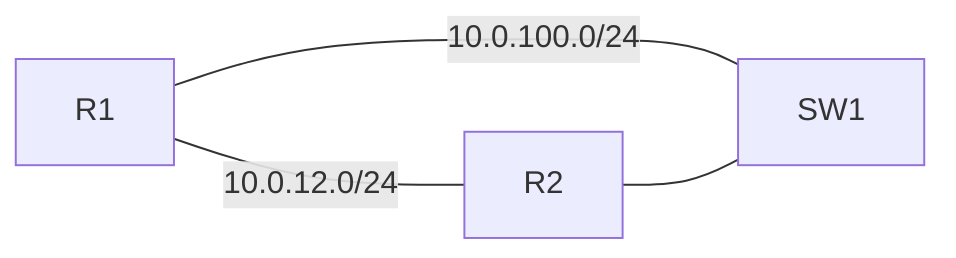

# PoC — Browser Lab Console

> This is a placeholder task for the layout PoC (BL-234). It is not a graded problem.

## Scenario

R1 and R2 are directly connected, and both are also attached to SW1.
Use the console tabs on the right to work on the devices.

## Addressing

| Device | Interface | Address |
|---|---|---|
| R1 | Ethernet0/0 | 10.0.12.1/24 |
| R1 | Ethernet0/1 | 10.0.100.1/24 |
| R2 | Ethernet0/0 | 10.0.12.2/24 |
| R2 | Ethernet0/1 | 10.0.100.2/24 |

## Tasks

1. Verify that R1 can reach R2 on the directly connected link.
2. Configure OSPF process 1 on R1 and R2 so that the two routers form an adjacency in area 0 over the 10.0.12.0/24 link.
3. Create Loopback0 on each router (R1: 1.1.1.1/32, R2: 2.2.2.2/32) and advertise it into OSPF.
4. Verify that R1 can reach 2.2.2.2 sourced from its own Loopback0.
