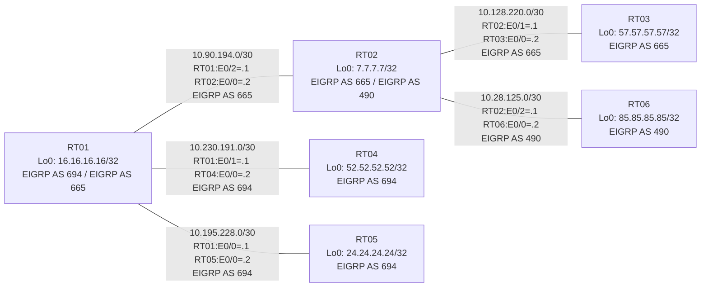

# 問題 20260801-001 : ルーティング到達性の分析

> **本問は機器に接続せずに解答すること。追加の show 実行は認めない。**

## トポロジ

社内網は 3 つのルーティングドメイン(EIGRP AS 694 / EIGRP AS 665 / EIGRP AS 490)を境界ルータで接続し、
相互再配送によって全拠点の到達性を提供する構成です。



## 要件

1. 全ルータの Loopback0 (/32) が、すべてのドメイン間で相互に到達可能であること。
2. EIGRP への経路注入は、redistribute 文で seed metric `100000 100 255 1 1500` を直接指定すること(default-metric による代替は社内標準外)。
3. 再配送に対するフィルタ(route-map / distribute-list)の適用は禁止されていること。

## 現在の状態

一部の拠点間で通信が確立できないことが報告されています。意図した動作ではありません。示された出力を参照してください。

```
RT06# show ip route
Gateway of last resort is not set
      7.0.0.0/32 is subnetted, 1 subnets
D        7.7.7.7 [90/409600] via 10.28.125.1, 00:04:39, Ethernet0/0
      10.0.0.0/8 is variably subnetted, 2 subnets, 2 masks
C        10.28.125.0/30 is directly connected, Ethernet0/0
L        10.28.125.2/32 is directly connected, Ethernet0/0
      85.0.0.0/32 is subnetted, 1 subnets
C        85.85.85.85 is directly connected, Loopback0
```
```
RT04# show ip route
Gateway of last resort is not set
      7.0.0.0/32 is subnetted, 1 subnets
D EX     7.7.7.7 [170/307200] via 10.230.191.1, 00:05:04, Ethernet0/0
      10.0.0.0/8 is variably subnetted, 6 subnets, 2 masks
D EX     10.28.125.0/30 [170/307200] via 10.230.191.1, 00:05:04, Ethernet0/0
D EX     10.90.194.0/30 [170/307200] via 10.230.191.1, 00:05:04, Ethernet0/0
D EX     10.128.220.0/30 [170/307200] via 10.230.191.1, 00:05:04, Ethernet0/0
D        10.195.228.0/30 [90/307200] via 10.230.191.1, 00:05:04, Ethernet0/0
C        10.230.191.0/30 is directly connected, Ethernet0/0
L        10.230.191.2/32 is directly connected, Ethernet0/0
      16.0.0.0/32 is subnetted, 1 subnets
D        16.16.16.16 [90/409600] via 10.230.191.1, 00:05:04, Ethernet0/0
      24.0.0.0/32 is subnetted, 1 subnets
D        24.24.24.24 [90/435200] via 10.230.191.1, 00:04:56, Ethernet0/0
      52.0.0.0/32 is subnetted, 1 subnets
C        52.52.52.52 is directly connected, Loopback0
      57.0.0.0/32 is subnetted, 1 subnets
D EX     57.57.57.57 [170/307200] via 10.230.191.1, 00:05:03, Ethernet0/0
      85.0.0.0/32 is subnetted, 1 subnets
D EX     85.85.85.85 [170/307200] via 10.230.191.1, 00:04:54, Ethernet0/0
```
```
RT02# show ip protocols
*** IP Routing is NSF aware ***

Routing Protocol is "application"
  Sending updates every 0 seconds
  Invalid after 0 seconds, hold down 0, flushed after 0
  Outgoing update filter list for all interfaces is not set
  Incoming update filter list for all interfaces is not set
  Maximum path: 32
  Routing for Networks:
  Routing Information Sources:
    Gateway         Distance      Last Update
  Distance: (default is 4)

Routing Protocol is "eigrp 665"
  Outgoing update filter list for all interfaces is not set
  Incoming update filter list for all interfaces is not set
  Default networks flagged in outgoing updates
  Default networks accepted from incoming updates
  Redistributing: eigrp 490
  EIGRP-IPv4 Protocol for AS(665)
    Metric weight K1=1, K2=0, K3=1, K4=0, K5=0
    Soft SIA disabled
    NSF-aware route hold timer is 240
    Router-ID: 7.7.7.7
    Topology : 0 (base) 
      Active Timer: 3 min
      Distance: internal 90 external 170
      Maximum path: 4
      Maximum hopcount 100
      Maximum metric variance 1
      Total Prefix Count: 11
      Total Redist Count: 2

  Automatic Summarization: disabled
  Maximum path: 4
  Routing for Networks:
    7.7.7.7/32
    10.90.194.0/30
    10.128.220.0/30
  Routing Information Sources:
    Gateway         Distance      Last Update
    10.128.220.2          90      00:05:12
    10.90.194.1           90      00:05:12
  Distance: internal 90 external 170

Routing Protocol is "eigrp 490"
  Outgoing update filter list for all interfaces is not set
  Incoming update filter list for all interfaces is not set
  Default networks flagged in outgoing updates
  Default networks accepted from incoming updates
  EIGRP-IPv4 Protocol for AS(490)
    Metric weight K1=1, K2=0, K3=1, K4=0, K5=0
    Soft SIA disabled
    NSF-aware route hold timer is 240
    Router-ID: 7.7.7.7
    Topology : 0 (base) 
      Active Timer: 3 min
      Distance: internal 90 external 170
      Maximum path: 4
      Maximum hopcount 100
      Maximum metric variance 1
      Total Prefix Count: 3
      Total Redist Count: 0

  Automatic Summarization: disabled
  Maximum path: 4
  Routing for Networks:
    7.7.7.7/32
    10.28.125.0/30
  Routing Information Sources:
    Gateway         Distance      Last Update
    10.28.125.2           90      00:05:10
  Distance: internal 90 external 170
```

## 設定抜粋

```
RT01# show running-config | section router
router eigrp 694
 network 10.195.228.0 0.0.0.3
 network 10.230.191.0 0.0.0.3
 network 16.16.16.16 0.0.0.0
 redistribute eigrp 665 metric 100000 100 255 1 1500
router eigrp 665
 network 10.90.194.0 0.0.0.3
 network 16.16.16.16 0.0.0.0
 redistribute eigrp 694 metric 100000 100 255 1 1500
```
```
RT02# show running-config | section router
router eigrp 665
 network 7.7.7.7 0.0.0.0
 network 10.90.194.0 0.0.0.3
 network 10.128.220.0 0.0.0.3
 redistribute eigrp 490 metric 100000 100 255 1 1500
router eigrp 490
 network 7.7.7.7 0.0.0.0
 network 10.28.125.0 0.0.0.3
```
```
RT04# show running-config | section router
router eigrp 694
 network 10.230.191.0 0.0.0.3
 network 52.52.52.52 0.0.0.0
```

## 設問

この問題を解決し、下記の要件をすべて満たすために必要な手順はどれですか。(1つ選択)

## 選択肢

A. RT02 の router eigrp 490 配下に「default-metric 100000 100 255 1 1500」を追加する
B. RT02 の router eigrp 490 配下に「redistribute eigrp 665 metric 100000 100 255 1 1500」を追加する
C. RT02 の router eigrp 490 配下に「redistribute eigrp 672 metric 100000 100 255 1 1500」を追加する
D. RT02 の router eigrp 665 配下に「redistribute eigrp 490 metric 100000 100 255 1 1500」を追加する
