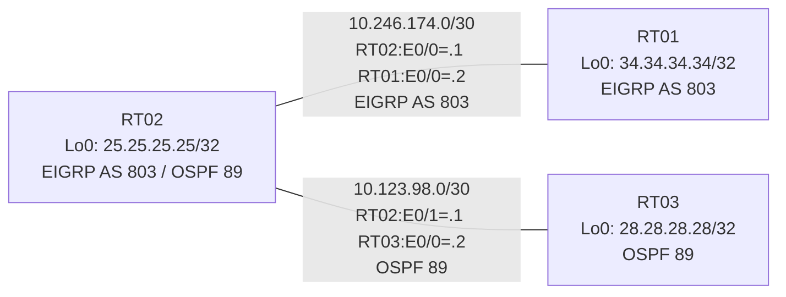

# 問題 20260801-002 : ルーティング到達性の分析

> **本問は機器に接続せずに解答すること。追加の show 実行は認めない。**

## トポロジ

社内網は 2 つのルーティングドメイン(EIGRP AS 803 / OSPF 89)を境界ルータで接続し、
相互再配送によって全拠点の到達性を提供する構成です。



## 要件

1. 全ルータの Loopback0 (/32) が、すべてのドメイン間で相互に到達可能であること。
2. EIGRP への経路注入は、redistribute 文で seed metric `100000 100 255 1 1500` を直接指定すること(default-metric による代替は社内標準外)。
3. 再配送に対するフィルタ(route-map / distribute-list)の適用は禁止されていること。

## 現在の状態

一部の経路が期待どおりに広報されていません。意図した動作ではありません。示された出力を参照してください。

```
RT01# show ip route
Gateway of last resort is not set
      10.0.0.0/8 is variably subnetted, 2 subnets, 2 masks
C        10.246.174.0/30 is directly connected, Ethernet0/0
L        10.246.174.2/32 is directly connected, Ethernet0/0
      25.0.0.0/32 is subnetted, 1 subnets
D        25.25.25.25 [90/409600] via 10.246.174.1, 00:03:52, Ethernet0/0
      34.0.0.0/32 is subnetted, 1 subnets
C        34.34.34.34 is directly connected, Loopback0
```
```
RT03# show ip route
Gateway of last resort is not set
      10.0.0.0/8 is variably subnetted, 3 subnets, 2 masks
C        10.123.98.0/30 is directly connected, Ethernet0/0
L        10.123.98.2/32 is directly connected, Ethernet0/0
O E2     10.246.174.0/30 [110/20] via 10.123.98.1, 00:03:27, Ethernet0/0
      25.0.0.0/32 is subnetted, 1 subnets
O        25.25.25.25 [110/11] via 10.123.98.1, 00:03:27, Ethernet0/0
      28.0.0.0/32 is subnetted, 1 subnets
C        28.28.28.28 is directly connected, Loopback0
      34.0.0.0/32 is subnetted, 1 subnets
O E2     34.34.34.34 [110/20] via 10.123.98.1, 00:03:27, Ethernet0/0
```
```
RT02# show ip protocols
*** IP Routing is NSF aware ***

Routing Protocol is "application"
  Sending updates every 0 seconds
  Invalid after 0 seconds, hold down 0, flushed after 0
  Outgoing update filter list for all interfaces is not set
  Incoming update filter list for all interfaces is not set
  Maximum path: 32
  Routing for Networks:
  Routing Information Sources:
    Gateway         Distance      Last Update
  Distance: (default is 4)

Routing Protocol is "eigrp 803"
  Outgoing update filter list for all interfaces is not set
  Incoming update filter list for all interfaces is not set
  Default networks flagged in outgoing updates
  Default networks accepted from incoming updates
  Redistributing: ospf 89
  EIGRP-IPv4 Protocol for AS(803)
    Metric weight K1=1, K2=0, K3=1, K4=0, K5=0
    Soft SIA disabled
    NSF-aware route hold timer is 240
    Router-ID: 25.25.25.25
    Topology : 0 (base) 
      Active Timer: 3 min
      Distance: internal 90 external 170
      Maximum path: 4
      Maximum hopcount 100
      Maximum metric variance 1
      Total Prefix Count: 3
      Total Redist Count: 0

  Automatic Summarization: disabled
  Maximum path: 4
  Routing for Networks:
    10.246.174.0/30
    25.25.25.25/32
  Routing Information Sources:
    Gateway         Distance      Last Update
    10.246.174.2          90      00:04:23
  Distance: internal 90 external 170

Routing Protocol is "ospf 89"
  Outgoing update filter list for all interfaces is not set
  Incoming update filter list for all interfaces is not set
  Router ID 25.25.25.25
  It is an autonomous system boundary router
 Redistributing External Routes from,
    eigrp 803, includes subnets in redistribution
  Number of areas in this router is 1. 1 normal 0 stub 0 nssa
  Maximum path: 4
  Routing for Networks:
    10.123.98.0 0.0.0.3 area 0
    25.25.25.25 0.0.0.0 area 0
  Routing Information Sources:
    Gateway         Distance      Last Update
    28.28.28.28          110      00:03:44
  Distance: (default is 110)
```

## 設定抜粋

```
RT02# show running-config | section router
router eigrp 803
 network 10.246.174.0 0.0.0.3
 network 25.25.25.25 0.0.0.0
 redistribute ospf 89 match internal external 1 external 2
router ospf 89
 router-id 25.25.25.25
 redistribute eigrp 803
 network 10.123.98.0 0.0.0.3 area 0
 network 25.25.25.25 0.0.0.0 area 0
```
```
RT03# show running-config | section router
router ospf 89
 router-id 28.28.28.28
 network 10.123.98.0 0.0.0.3 area 0
 network 28.28.28.28 0.0.0.0 area 0
```
```
RT01# show running-config | section router
router eigrp 803
 network 10.246.174.0 0.0.0.3
 network 34.34.34.34 0.0.0.0
```

## 設問

この問題を解決し、下記の要件をすべて満たすために必要な手順はどれですか。(1つ選択)

## 選択肢

A. RT02 の router eigrp 803 配下に「redistribute connected metric 100000 100 255 1 1500」を追加する
B. RT02 の router eigrp 803 配下に「default-metric 100000 100 255 1 1500」を追加する
C. RT02 の router ospf 89 配下の「redistribute eigrp 803」に metric 20 を追加する
D. RT02 の router eigrp 803 配下で「redistribute ospf 89 match internal external 1 external 2 metric 100000 100 255 1 1500」を設定する
