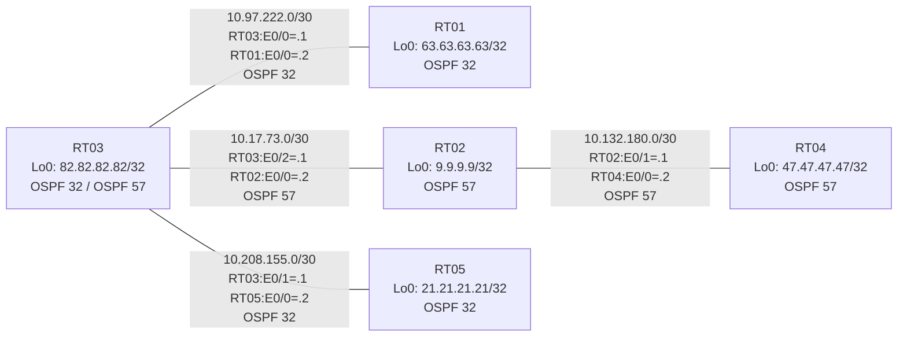

# 問題 20260801-003 : ルーティング到達性の分析

> **本問は機器に接続せずに解答すること。追加の show 実行は認めない。**

## トポロジ

社内網は 2 つのルーティングドメイン(OSPF 32 / OSPF 57)を境界ルータで接続し、
相互再配送によって全拠点の到達性を提供する構成です。



## 要件

1. 全ルータの Loopback0 (/32) が、すべてのドメイン間で相互に到達可能であること。
2. EIGRP への経路注入は、redistribute 文で seed metric `100000 100 255 1 1500` を直接指定すること(default-metric による代替は社内標準外)。
3. 再配送に対するフィルタ(route-map / distribute-list)の適用は禁止されていること。

## 現在の状態

サーバ 63.63.63.63 への到達性が一部の拠点で失われていると報告されています。他の宛先への到達性は正常です。意図した動作ではありません。示された出力を参照してください。

```
RT04# show ip route
Gateway of last resort is not set
      9.0.0.0/32 is subnetted, 1 subnets
O        9.9.9.9 [110/11] via 10.132.180.1, 00:03:48, Ethernet0/0
      10.0.0.0/8 is variably subnetted, 5 subnets, 2 masks
O        10.17.73.0/30 [110/20] via 10.132.180.1, 00:03:48, Ethernet0/0
O E2     10.97.222.0/30 [110/10] via 10.132.180.1, 00:03:48, Ethernet0/0
C        10.132.180.0/30 is directly connected, Ethernet0/0
L        10.132.180.2/32 is directly connected, Ethernet0/0
O E2     10.208.155.0/30 [110/10] via 10.132.180.1, 00:03:48, Ethernet0/0
      21.0.0.0/32 is subnetted, 1 subnets
O E2     21.21.21.21 [110/11] via 10.132.180.1, 00:03:43, Ethernet0/0
      47.0.0.0/32 is subnetted, 1 subnets
C        47.47.47.47 is directly connected, Loopback0
      82.0.0.0/32 is subnetted, 1 subnets
O E2     82.82.82.82 [110/1] via 10.132.180.1, 00:03:48, Ethernet0/0
```
```
RT05# show ip route
Gateway of last resort is not set
      9.0.0.0/32 is subnetted, 1 subnets
O E2     9.9.9.9 [110/11] via 10.208.155.1, 00:04:01, Ethernet0/0
      10.0.0.0/8 is variably subnetted, 5 subnets, 2 masks
O E2     10.17.73.0/30 [110/10] via 10.208.155.1, 00:04:01, Ethernet0/0
O        10.97.222.0/30 [110/20] via 10.208.155.1, 00:04:01, Ethernet0/0
O E2     10.132.180.0/30 [110/20] via 10.208.155.1, 00:04:01, Ethernet0/0
C        10.208.155.0/30 is directly connected, Ethernet0/0
L        10.208.155.2/32 is directly connected, Ethernet0/0
      21.0.0.0/32 is subnetted, 1 subnets
C        21.21.21.21 is directly connected, Loopback0
      47.0.0.0/32 is subnetted, 1 subnets
O E2     47.47.47.47 [110/21] via 10.208.155.1, 00:04:01, Ethernet0/0
      63.0.0.0/32 is subnetted, 1 subnets
O        63.63.63.63 [110/21] via 10.208.155.1, 00:04:01, Ethernet0/0
      82.0.0.0/32 is subnetted, 1 subnets
O        82.82.82.82 [110/11] via 10.208.155.1, 00:04:01, Ethernet0/0
```
```
RT03# show ip protocols
*** IP Routing is NSF aware ***

Routing Protocol is "application"
  Sending updates every 0 seconds
  Invalid after 0 seconds, hold down 0, flushed after 0
  Outgoing update filter list for all interfaces is not set
  Incoming update filter list for all interfaces is not set
  Maximum path: 32
  Routing for Networks:
  Routing Information Sources:
    Gateway         Distance      Last Update
  Distance: (default is 4)

Routing Protocol is "ospf 32"
  Outgoing update filter list for all interfaces is not set
  Incoming update filter list for all interfaces is not set
  Router ID 82.82.82.82
  It is an autonomous system boundary router
 Redistributing External Routes from,
    ospf 57, includes subnets in redistribution
  Number of areas in this router is 1. 1 normal 0 stub 0 nssa
  Maximum path: 4
  Routing for Networks:
    10.97.222.0 0.0.0.3 area 0
    10.208.155.0 0.0.0.3 area 0
    82.82.82.82 0.0.0.0 area 0
  Routing Information Sources:
    Gateway         Distance      Last Update
    21.21.21.21          110      00:04:17
    63.63.63.63          110      00:04:22
  Distance: (default is 110)

Routing Protocol is "ospf 57"
  Outgoing update filter list for all interfaces is not set
  Incoming update filter list for all interfaces is not set
  Router ID 10.208.155.1
  It is an autonomous system boundary router
 Redistributing External Routes from,
    ospf 32, includes subnets in redistribution
  Number of areas in this router is 1. 1 normal 0 stub 0 nssa
  Maximum path: 4
  Routing for Networks:
    10.17.73.0 0.0.0.3 area 0
  Routing Information Sources:
    Gateway         Distance      Last Update
    47.47.47.47          110      00:04:18
    9.9.9.9              110      00:04:26
  Distance: (default is 110)
```
```
RT04# show ip route 63.63.63.63
% Network not in table
```
```
RT03# show route-map RM-SVC
route-map RM-SVC, deny, sequence 10
  Match clauses:
    ip address prefix-lists: PL-SVC 
  Set clauses:
  Policy routing matches: 0 packets, 0 bytes
route-map RM-SVC, permit, sequence 20
  Match clauses:
  Set clauses:
  Policy routing matches: 0 packets, 0 bytes
```
```
RT03# show ip prefix-list PL-SVC
ip prefix-list PL-SVC: 1 entries
   seq 5 permit 63.63.63.63/32
```

## 設定抜粋

```
RT03# show running-config | section router
router ospf 32
 router-id 82.82.82.82
 redistribute ospf 57 match internal external 1 external 2
 network 10.97.222.0 0.0.0.3 area 0
 network 10.208.155.0 0.0.0.3 area 0
 network 82.82.82.82 0.0.0.0 area 0
router ospf 57
 redistribute ospf 32 match internal external 1 external 2 route-map RM-SVC
 network 10.17.73.0 0.0.0.3 area 0
```
```
RT05# show running-config | section router
router ospf 32
 router-id 21.21.21.21
 network 10.208.155.0 0.0.0.3 area 0
 network 21.21.21.21 0.0.0.0 area 0
```
```
RT04# show running-config | section router
router ospf 57
 router-id 47.47.47.47
 network 10.132.180.0 0.0.0.3 area 0
 network 47.47.47.47 0.0.0.0 area 0
```

## 設問

この問題を解決し、下記の要件をすべて満たすために必要な手順はどれですか。(1つ選択)

## 選択肢

A. ip prefix-list PL-SVC に「seq 10 permit 0.0.0.0/0 le 32」を追加する
B. RT03 の router ospf 57 配下で redistribute から route-map RM-SVC を外し、route-map / prefix-list を削除する
C. route-map RM-SVC のシーケンス 10 を deny から permit に変更する
D. RT03 の router ospf 32 配下の redistribute にも route-map RM-SVC を適用する
