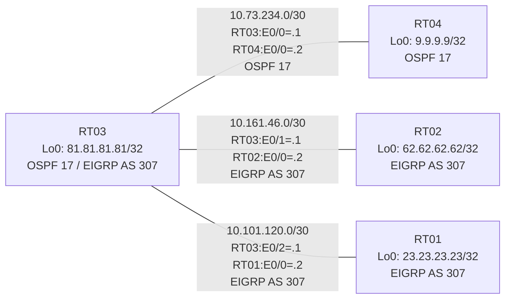

# 問題 20260801-004 : ルーティング到達性の分析

> **本問は機器に接続せずに解答すること。追加の show 実行は認めない。**

## トポロジ

社内網は 2 つのルーティングドメイン(OSPF 17 / EIGRP AS 307)を境界ルータで接続し、
相互再配送によって全拠点の到達性を提供する構成です。



| ルータ | 参加プロトコル | Loopback0 |
|--------|----------------|-----------|
| RT01 | EIGRP AS 307 | `23.23.23.23/32` |
| RT02 | EIGRP AS 307 | `62.62.62.62/32` |
| RT03 | OSPF 17 / EIGRP AS 307 | `81.81.81.81/32` |
| RT04 | OSPF 17 | `9.9.9.9/32` |

リンク一覧(接続・アドレス):
```
  RT03:E0/0(.1) ── RT04:E0/0(.2)   OSPF 17 / 10.73.234.0/30
  RT03:E0/1(.1) ── RT02:E0/0(.2)   EIGRP AS 307 / 10.161.46.0/30
  RT03:E0/2(.1) ── RT01:E0/0(.2)   EIGRP AS 307 / 10.101.120.0/30
```

## 要件

1. 全ルータの Loopback0 (/32) が、すべてのドメイン間で相互に到達可能であること。
2. EIGRP への経路注入は、redistribute 文で seed metric `100000 100 255 1 1500` を直接指定すること(default-metric による代替は社内標準外)。
3. 再配送に対するフィルタ(route-map / distribute-list)の適用は禁止されていること。

## 現在の状態

一部の拠点間で通信が確立できないことが報告されています。意図した動作ではありません。示された出力を参照してください。

```
RT04# show ip route
Gateway of last resort is not set
      9.0.0.0/32 is subnetted, 1 subnets
C        9.9.9.9 is directly connected, Loopback0
      10.0.0.0/8 is variably subnetted, 2 subnets, 2 masks
C        10.73.234.0/30 is directly connected, Ethernet0/0
L        10.73.234.2/32 is directly connected, Ethernet0/0
      81.0.0.0/32 is subnetted, 1 subnets
O        81.81.81.81 [110/11] via 10.73.234.1, 00:03:27, Ethernet0/0
```
```
RT02# show ip route
Gateway of last resort is not set
      9.0.0.0/32 is subnetted, 1 subnets
D EX     9.9.9.9 [170/307200] via 10.161.46.1, 00:03:45, Ethernet0/0
      10.0.0.0/8 is variably subnetted, 4 subnets, 2 masks
D EX     10.73.234.0/30 [170/307200] via 10.161.46.1, 00:04:28, Ethernet0/0
D        10.101.120.0/30 [90/307200] via 10.161.46.1, 00:04:28, Ethernet0/0
C        10.161.46.0/30 is directly connected, Ethernet0/0
L        10.161.46.2/32 is directly connected, Ethernet0/0
      23.0.0.0/32 is subnetted, 1 subnets
D        23.23.23.23 [90/435200] via 10.161.46.1, 00:04:26, Ethernet0/0
      62.0.0.0/32 is subnetted, 1 subnets
C        62.62.62.62 is directly connected, Loopback0
      81.0.0.0/32 is subnetted, 1 subnets
D        81.81.81.81 [90/409600] via 10.161.46.1, 00:04:28, Ethernet0/0
```
```
RT03# show ip protocols
*** IP Routing is NSF aware ***

Routing Protocol is "application"
  Sending updates every 0 seconds
  Invalid after 0 seconds, hold down 0, flushed after 0
  Outgoing update filter list for all interfaces is not set
  Incoming update filter list for all interfaces is not set
  Maximum path: 32
  Routing for Networks:
  Routing Information Sources:
    Gateway         Distance      Last Update
  Distance: (default is 4)

Routing Protocol is "ospf 17"
  Outgoing update filter list for all interfaces is not set
  Incoming update filter list for all interfaces is not set
  Router ID 81.81.81.81
  Number of areas in this router is 1. 1 normal 0 stub 0 nssa
  Maximum path: 4
  Routing for Networks:
    10.73.234.0 0.0.0.3 area 0
    81.81.81.81 0.0.0.0 area 0
  Routing Information Sources:
    Gateway         Distance      Last Update
    9.9.9.9              110      00:04:01
  Distance: (default is 110)

Routing Protocol is "eigrp 307"
  Outgoing update filter list for all interfaces is not set
  Incoming update filter list for all interfaces is not set
  Default networks flagged in outgoing updates
  Default networks accepted from incoming updates
  Redistributing: ospf 17
  EIGRP-IPv4 Protocol for AS(307)
    Metric weight K1=1, K2=0, K3=1, K4=0, K5=0
    Soft SIA disabled
    NSF-aware route hold timer is 240
    Router-ID: 81.81.81.81
    Topology : 0 (base) 
      Active Timer: 3 min
      Distance: internal 90 external 170
      Maximum path: 4
      Maximum hopcount 100
      Maximum metric variance 1
      Total Prefix Count: 7
      Total Redist Count: 2

  Automatic Summarization: disabled
  Maximum path: 4
  Routing for Networks:
    10.101.120.0/30
    10.161.46.0/30
    81.81.81.81/32
  Routing Information Sources:
    Gateway         Distance      Last Update
    10.101.120.2          90      00:04:39
    10.161.46.2           90      00:04:39
  Distance: internal 90 external 170
```

## 設定抜粋

```
RT03# show running-config | section router
router eigrp 307
 network 10.101.120.0 0.0.0.3
 network 10.161.46.0 0.0.0.3
 network 81.81.81.81 0.0.0.0
 redistribute ospf 17 match internal external 1 external 2 metric 100000 100 255 1 1500
router ospf 17
 router-id 81.81.81.81
 network 10.73.234.0 0.0.0.3 area 0
 network 81.81.81.81 0.0.0.0 area 0
```
```
RT02# show running-config | section router
router eigrp 307
 network 10.161.46.0 0.0.0.3
 network 62.62.62.62 0.0.0.0
```
```
RT04# show running-config | section router
router ospf 17
 router-id 9.9.9.9
 network 9.9.9.9 0.0.0.0 area 0
 network 10.73.234.0 0.0.0.3 area 0
```

## 設問

この問題を解決し、下記の要件をすべて満たすために必要な手順はどれですか。(1つ選択)

## 選択肢

A. RT03 の router ospf 17 配下に「redistribute eigrp 314 subnets」を追加する
B. RT03 の router ospf 17 配下に「default-metric 20」を追加する
C. RT03 の router ospf 17 配下に「redistribute eigrp 307 subnets」を追加する
D. RT03 の router eigrp 307 配下に「redistribute ospf 17 match internal external 1 external 2 metric 100000 100 255 1 1500」を追加する
