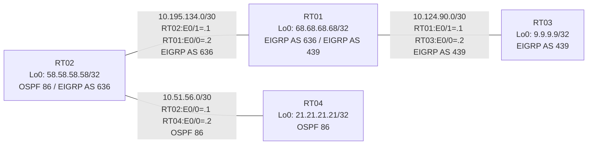

# 問題 20260801-005 : ルーティング到達性の分析

> **本問は機器に接続せずに解答すること。追加の show 実行は認めない。**

## トポロジ

社内網は 3 つのルーティングドメイン(OSPF 86 / EIGRP AS 636 / EIGRP AS 439)を境界ルータで接続し、
相互再配送によって全拠点の到達性を提供する構成です。



| ルータ | 参加プロトコル | Loopback0 |
|--------|----------------|-----------|
| RT01 | EIGRP AS 636 / EIGRP AS 439 | `68.68.68.68/32` |
| RT02 | OSPF 86 / EIGRP AS 636 | `58.58.58.58/32` |
| RT03 | EIGRP AS 439 | `9.9.9.9/32` |
| RT04 | OSPF 86 | `21.21.21.21/32` |

リンク一覧(接続・アドレス):
```
  RT02:E0/0(.1) ── RT04:E0/0(.2)   OSPF 86 / 10.51.56.0/30
  RT02:E0/1(.1) ── RT01:E0/0(.2)   EIGRP AS 636 / 10.195.134.0/30
  RT01:E0/1(.1) ── RT03:E0/0(.2)   EIGRP AS 439 / 10.124.90.0/30
```

## 要件

1. 全ルータの Loopback0 (/32) が、すべてのドメイン間で相互に到達可能であること。
2. EIGRP への経路注入は、redistribute 文で seed metric `100000 100 255 1 1500` を直接指定すること(default-metric による代替は社内標準外)。
3. 再配送に対するフィルタ(route-map / distribute-list)の適用は禁止されていること。
4. redistribute が参照するプロセス ID / AS 番号は本問のドメイン表記に一致させ、実在しないプロセスへの参照を残置しないこと。

## 現在の状態

一部の拠点間で通信が確立できないことが報告されています。意図した動作ではありません。示された出力を参照してください。

```
RT01# show ip route
Gateway of last resort is not set
      9.0.0.0/32 is subnetted, 1 subnets
D        9.9.9.9 [90/409600] via 10.124.90.2, 00:04:05, Ethernet0/1
      10.0.0.0/8 is variably subnetted, 4 subnets, 2 masks
C        10.124.90.0/30 is directly connected, Ethernet0/1
L        10.124.90.1/32 is directly connected, Ethernet0/1
C        10.195.134.0/30 is directly connected, Ethernet0/0
L        10.195.134.2/32 is directly connected, Ethernet0/0
      58.0.0.0/32 is subnetted, 1 subnets
D        58.58.58.58 [90/409600] via 10.195.134.1, 00:04:08, Ethernet0/0
      68.0.0.0/32 is subnetted, 1 subnets
C        68.68.68.68 is directly connected, Loopback0
```
```
RT04# show ip route
Gateway of last resort is not set
      9.0.0.0/32 is subnetted, 1 subnets
O E2     9.9.9.9 [110/20] via 10.51.56.1, 00:03:43, Ethernet0/0
      10.0.0.0/8 is variably subnetted, 4 subnets, 2 masks
C        10.51.56.0/30 is directly connected, Ethernet0/0
L        10.51.56.2/32 is directly connected, Ethernet0/0
O E2     10.124.90.0/30 [110/20] via 10.51.56.1, 00:03:43, Ethernet0/0
O E2     10.195.134.0/30 [110/20] via 10.51.56.1, 00:03:43, Ethernet0/0
      21.0.0.0/32 is subnetted, 1 subnets
C        21.21.21.21 is directly connected, Loopback0
      58.0.0.0/32 is subnetted, 1 subnets
O        58.58.58.58 [110/11] via 10.51.56.1, 00:03:43, Ethernet0/0
      68.0.0.0/32 is subnetted, 1 subnets
O E2     68.68.68.68 [110/20] via 10.51.56.1, 00:03:43, Ethernet0/0
```

## 設定抜粋

```
RT02# show running-config | section router
router eigrp 636
 network 10.195.134.0 0.0.0.3
 network 58.58.58.58 0.0.0.0
 redistribute ospf 93 match internal external 1 external 2 metric 100000 100 255 1 1500
router ospf 86
 router-id 58.58.58.58
 redistribute eigrp 636
 network 10.51.56.0 0.0.0.3 area 0
 network 58.58.58.58 0.0.0.0 area 0
```
```
RT01# show running-config | section router
router eigrp 636
 network 10.195.134.0 0.0.0.3
 network 68.68.68.68 0.0.0.0
 redistribute eigrp 439 metric 100000 100 255 1 1500
router eigrp 439
 network 10.124.90.0 0.0.0.3
 network 68.68.68.68 0.0.0.0
 redistribute eigrp 636 metric 100000 100 255 1 1500
```
```
RT04# show running-config | section router
router ospf 86
 router-id 21.21.21.21
 network 10.51.56.0 0.0.0.3 area 0
 network 21.21.21.21 0.0.0.0 area 0
```

## 設問

この問題を解決し、下記の要件をすべて満たすために必要な手順はどれですか。(1つ選択)

## 選択肢

A. RT02 の router ospf 86 配下の「redistribute eigrp 636」を削除して参照 ID を見直す
B. RT02 の router eigrp 636 配下に「default-metric 100000 100 255 1 1500」を追加する
C. RT02 の router eigrp 636 配下で「no redistribute ospf 93」を実行し「redistribute ospf 86 match internal external 1 external 2 metric 100000 100 255 1 1500」を設定する
D. RT02 の router eigrp 636 配下に「redistribute ospf 86 match internal external 1 external 2 metric 100000 100 255 1 1500」を追加する(既存行はそのまま)
