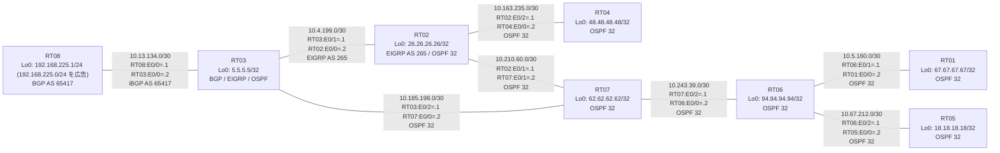

# 問題 20260801-006 : ルーティング到達性の分析

> **本問は機器に接続せずに解答すること。追加の show 実行は認めない。**

## トポロジ

本社の顧客網 `192.168.225.0/24` は BGP AS 65417 の RT08 が広告しています。
社内は BGP / EIGRP / OSPF の 3 ドメイン構成で、境界のいずれかで再配送が行われています。



| ルータ | 参加プロトコル | Loopback0 / 広告網 |
|--------|----------------|--------------------|
| RT01 | OSPF 32 | 67.67.67.67/32 |
| RT02 | EIGRP AS 265 / OSPF 32 | 26.26.26.26/32 |
| RT03 | BGP / EIGRP / OSPF | 5.5.5.5/32 |
| RT04 | OSPF 32 | 48.48.48.48/32 |
| RT05 | OSPF 32 | 18.18.18.18/32 |
| RT06 | OSPF 32 | 94.94.94.94/32 |
| RT07 | OSPF 32 | 62.62.62.62/32 |
| RT08 | BGP AS 65417 | 192.168.225.1/24 (`192.168.225.0/24` を広告) |

リンク一覧(接続・アドレス):
```
  RT08:E0/0(.1) ── RT03:E0/0(.2)   iBGP AS 65417 / 10.13.134.0/30
  RT03:E0/1(.1) ── RT02:E0/0(.2)   EIGRP AS 265 / 10.4.199.0/30
  RT03:E0/2(.1) ── RT07:E0/0(.2)   OSPF 32 area 0 / 10.185.198.0/30
  RT02:E0/1(.1) ── RT07:E0/1(.2)   OSPF 32 area 0 / 10.210.60.0/30
  RT07:E0/2(.1) ── RT06:E0/0(.2)   OSPF 32 area 0 / 10.243.39.0/30
  RT06:E0/1(.1) ── RT01:E0/0(.2)   OSPF 32 area 0 / 10.5.160.0/30
  RT06:E0/2(.1) ── RT05:E0/0(.2)   OSPF 32 area 0 / 10.67.212.0/30
  RT02:E0/2(.1) ── RT04:E0/0(.2)   OSPF 32 area 0 / 10.163.235.0/30
```

## 要件

1. すべてのルータが `192.168.225.0/24` を含む全宛先(各 Loopback)へ到達できること。
2. `192.168.225.0/24` 宛のパケットが広告元 RT08 の方向へ転送され、転送ループが存在しないこと。
3. 各ドメイン間の再配送設計は維持すること(redistribute の削除・停止や静的経路による回避は不可)。

## 現在の状態

複数の拠点から `192.168.225.0/24` 宛の通信がタイムアウトすると報告されています。
各ルータの Loopback 宛の通信は正常です。意図した動作ではありません。
示された出力を参照してください。

```
RT03# show ip route 192.168.225.0
Routing entry for 192.168.225.0/24
  Known via "eigrp 265", distance 170, metric 307200, precedence routine (0), type external
  Redistributing via eigrp 265, ospf 32
  Advertised by ospf 32 subnets
  Last update from 10.4.199.2 on Ethernet0/1, 00:05:09 ago
  Routing Descriptor Blocks:
  * 10.4.199.2, from 10.4.199.2, 00:05:09 ago, via Ethernet0/1
      Route metric is 307200, traffic share count is 1
      Total delay is 2000 microseconds, minimum bandwidth is 10000 Kbit
      Reliability 255/255, minimum MTU 1500 bytes
      Loading 1/255, Hops 1
```
```
RT02# show ip route 192.168.225.0
Routing entry for 192.168.225.0/24
  Known via "ospf 32", distance 110, metric 20, type extern 2, forward metric 20
  Redistributing via eigrp 265
  Advertised by eigrp 265 metric 100000 100 255 1 1500
  Last update from 10.210.60.2 on Ethernet0/1, 00:05:26 ago
  Routing Descriptor Blocks:
  * 10.210.60.2, from 5.5.5.5, 00:05:26 ago, via Ethernet0/1
      Route metric is 20, traffic share count is 1
```
```
RT07# show ip route 192.168.225.0
Routing entry for 192.168.225.0/24
  Known via "ospf 32", distance 110, metric 20, type extern 2, forward metric 10
  Last update from 10.185.198.1 on Ethernet0/0, 00:05:43 ago
  Routing Descriptor Blocks:
  * 10.185.198.1, from 5.5.5.5, 00:05:43 ago, via Ethernet0/0
      Route metric is 20, traffic share count is 1
```
```
RT03# show ip bgp
BGP table version is 16, local router ID is 5.5.5.5
Status codes: s suppressed, d damped, h history, * valid, > best, i - internal, 
              r RIB-failure, S Stale, m multipath, b backup-path, f RT-Filter, 
              x best-external, a additional-path, c RIB-compressed, 
              t secondary path, L long-lived-stale,
Origin codes: i - IGP, e - EGP, ? - incomplete
RPKI validation codes: V valid, I invalid, N Not found

     Network          Next Hop            Metric LocPrf Weight Path
 *>   5.5.5.5/32       0.0.0.0                  0         32768 i
 *>   10.5.160.0/30    10.185.198.2            30         32768 ?
 *>   10.67.212.0/30   10.185.198.2            30         32768 ?
 *>   10.163.235.0/30  10.185.198.2            30         32768 ?
 *>   10.185.198.0/30  0.0.0.0                  0         32768 ?
 *>   10.210.60.0/30   10.185.198.2            20         32768 ?
 *>   10.243.39.0/30   10.185.198.2            20         32768 ?
 *>   18.18.18.18/32   10.185.198.2            31         32768 ?
 *>   26.26.26.26/32   10.185.198.2            21         32768 ?
 *>   48.48.48.48/32   10.185.198.2            31         32768 ?
 *>   62.62.62.62/32   10.185.198.2            11         32768 ?
 *>   67.67.67.67/32   10.185.198.2            31         32768 ?
 *>   94.94.94.94/32   10.185.198.2            21         32768 ?
 r>i  192.168.225.0    10.13.134.1              0    100      0 i
```
```
RT01# traceroute 192.168.225.1 probe 1 timeout 1 ttl 1 8
Type escape sequence to abort.
Tracing the route to 192.168.225.1
VRF info: (vrf in name/id, vrf out name/id)
  1 10.5.160.1 1 msec
  2 10.243.39.1 2 msec
  3 10.185.198.1 2 msec
  4 10.4.199.2 2 msec
  5 10.210.60.2 2 msec
  6 10.185.198.1 2 msec
  7 10.4.199.2 3 msec
  8 10.210.60.2 31 msec
```

## 設定抜粋

```
RT03# show running-config | section router
router eigrp 265
 network 10.4.199.0 0.0.0.3
router ospf 32
 router-id 5.5.5.5
 redistribute eigrp 265
 redistribute bgp 65417
 network 5.5.5.5 0.0.0.0 area 0
 network 10.185.198.0 0.0.0.3 area 0
router bgp 65417
 bgp router-id 5.5.5.5
 bgp log-neighbor-changes
 bgp redistribute-internal
 network 5.5.5.5 mask 255.255.255.255
 redistribute ospf 32
 neighbor 10.13.134.1 remote-as 65417
```
```
RT02# show running-config | section router
router eigrp 265
 network 10.4.199.0 0.0.0.3
 redistribute ospf 32 metric 100000 100 255 1 1500
router ospf 32
 router-id 26.26.26.26
 redistribute eigrp 265
 network 10.163.235.0 0.0.0.3 area 0
 network 10.210.60.0 0.0.0.3 area 0
 network 26.26.26.26 0.0.0.0 area 0
```
```
RT07# show running-config | section router
router ospf 32
 router-id 62.62.62.62
 network 10.185.198.0 0.0.0.3 area 0
 network 10.210.60.0 0.0.0.3 area 0
 network 10.243.39.0 0.0.0.3 area 0
 network 62.62.62.62 0.0.0.0 area 0
```
```
RT08# show running-config | section router
router bgp 65417
 bgp router-id 192.168.225.1
 bgp log-neighbor-changes
 network 192.168.225.0
 neighbor 10.13.134.2 remote-as 65417
```

## 設問

この問題を解決し、上記の要件をすべて満たすために必要な手順はどれですか。(1つ選択)

## 選択肢

A. RT03 の router bgp 65417 配下から「bgp redistribute-internal」を削除する
B. RT02 の router eigrp 265 配下に「distance eigrp 90 205」を設定する
C. RT03 の router bgp 65417 配下に「distance bgp 20 165 165」を設定し、clear ip route * を実行する
D. RT03 で「clear ip bgp *」および「clear ip route *」を実行する
