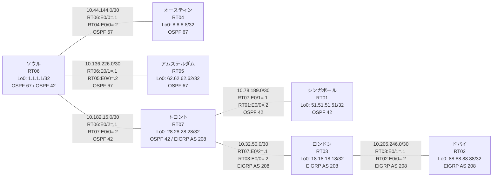

# 問題 20260801-007 : ルーティング到達性の分析

> **本問は機器に接続せずに解答すること。追加の show 実行は認めない。**

## トポロジ

社内網は 3 つのルーティングドメイン(OSPF 67 / OSPF 42 / EIGRP AS 208)を境界ルータで接続し、
相互再配送によって全拠点の到達性を提供する構成です。
各拠点のルータと拠点網の対応は下表のとおりです(拠点網の代表 = 当該ルータの Loopback0)。



| 拠点 | ルータ | 参加プロトコル | 拠点網(代表アドレス) |
|------|--------|----------------|----------------------|
| アムステルダム | RT05 | OSPF 67 | `62.62.62.62/32` |
| オースティン | RT04 | OSPF 67 | `8.8.8.8/32` |
| シンガポール | RT01 | OSPF 42 | `51.51.51.51/32` |
| ソウル | RT06 | OSPF 67 / OSPF 42 | `1.1.1.1/32` |
| トロント | RT07 | OSPF 42 / EIGRP AS 208 | `28.28.28.28/32` |
| ドバイ | RT02 | EIGRP AS 208 | `88.88.88.88/32` |
| ロンドン | RT03 | EIGRP AS 208 | `18.18.18.18/32` |

リンク一覧(接続・アドレス):
```
  RT06:E0/0(.1) ── RT04:E0/0(.2)   OSPF 67 / 10.44.144.0/30
  RT06:E0/1(.1) ── RT05:E0/0(.2)   OSPF 67 / 10.136.226.0/30
  RT06:E0/2(.1) ── RT07:E0/0(.2)   OSPF 42 / 10.182.15.0/30
  RT07:E0/1(.1) ── RT01:E0/0(.2)   OSPF 42 / 10.78.189.0/30
  RT07:E0/2(.1) ── RT03:E0/0(.2)   EIGRP AS 208 / 10.32.50.0/30
  RT03:E0/1(.1) ── RT02:E0/0(.2)   EIGRP AS 208 / 10.205.246.0/30
```

## 要件

1. 全ルータの Loopback0 (/32) が、すべてのドメイン間で相互に到達可能であること。
2. EIGRP への経路注入は、redistribute 文で seed metric `100000 100 255 1 1500` を直接指定すること(default-metric による代替は社内標準外)。
3. 再配送に対するフィルタ(route-map / distribute-list)の適用は禁止されていること。
4. redistribute が参照するプロセス ID / AS 番号は本問のドメイン表記に一致させ、実在しないプロセスへの参照を残置しないこと。

## 現在の状態

シンガポール拠点のユーザからドバイ拠点へ到達できないと報告されています。ソウル拠点からも同様の申告が上がっています。意図した動作ではありません。示された出力を参照してください。

```
RT01# show ip route
Gateway of last resort is not set
      1.0.0.0/32 is subnetted, 1 subnets
O E2     1.1.1.1 [110/1] via 10.78.189.1, 00:04:26, Ethernet0/0
      8.0.0.0/32 is subnetted, 1 subnets
O E2     8.8.8.8 [110/11] via 10.78.189.1, 00:04:19, Ethernet0/0
      10.0.0.0/8 is variably subnetted, 5 subnets, 2 masks
O E2     10.44.144.0/30 [110/10] via 10.78.189.1, 00:04:26, Ethernet0/0
C        10.78.189.0/30 is directly connected, Ethernet0/0
L        10.78.189.2/32 is directly connected, Ethernet0/0
O E2     10.136.226.0/30 [110/10] via 10.78.189.1, 00:04:26, Ethernet0/0
O        10.182.15.0/30 [110/20] via 10.78.189.1, 00:04:26, Ethernet0/0
      28.0.0.0/32 is subnetted, 1 subnets
O        28.28.28.28 [110/11] via 10.78.189.1, 00:04:26, Ethernet0/0
      51.0.0.0/32 is subnetted, 1 subnets
C        51.51.51.51 is directly connected, Loopback0
      62.0.0.0/32 is subnetted, 1 subnets
O E2     62.62.62.62 [110/11] via 10.78.189.1, 00:04:26, Ethernet0/0
```
```
RT02# show ip route
Gateway of last resort is not set
      1.0.0.0/32 is subnetted, 1 subnets
D EX     1.1.1.1 [170/332800] via 10.205.246.1, 00:05:09, Ethernet0/0
      8.0.0.0/32 is subnetted, 1 subnets
D EX     8.8.8.8 [170/332800] via 10.205.246.1, 00:04:36, Ethernet0/0
      10.0.0.0/8 is variably subnetted, 7 subnets, 2 masks
D        10.32.50.0/30 [90/307200] via 10.205.246.1, 00:05:17, Ethernet0/0
D EX     10.44.144.0/30 [170/332800] via 10.205.246.1, 00:05:09, Ethernet0/0
D EX     10.78.189.0/30 [170/332800] via 10.205.246.1, 00:05:17, Ethernet0/0
D EX     10.136.226.0/30 [170/332800] via 10.205.246.1, 00:05:09, Ethernet0/0
D EX     10.182.15.0/30 [170/332800] via 10.205.246.1, 00:05:17, Ethernet0/0
C        10.205.246.0/30 is directly connected, Ethernet0/0
L        10.205.246.2/32 is directly connected, Ethernet0/0
      18.0.0.0/32 is subnetted, 1 subnets
D        18.18.18.18 [90/409600] via 10.205.246.1, 00:05:17, Ethernet0/0
      28.0.0.0/32 is subnetted, 1 subnets
D        28.28.28.28 [90/435200] via 10.205.246.1, 00:05:17, Ethernet0/0
      51.0.0.0/32 is subnetted, 1 subnets
D EX     51.51.51.51 [170/332800] via 10.205.246.1, 00:04:43, Ethernet0/0
      62.0.0.0/32 is subnetted, 1 subnets
D EX     62.62.62.62 [170/332800] via 10.205.246.1, 00:05:05, Ethernet0/0
      88.0.0.0/32 is subnetted, 1 subnets
C        88.88.88.88 is directly connected, Loopback0
```

## 設定抜粋

```
RT06# show running-config | section router
router ospf 67
 router-id 1.1.1.1
 redistribute ospf 42 match internal external 1 external 2
 network 1.1.1.1 0.0.0.0 area 0
 network 10.44.144.0 0.0.0.3 area 0
 network 10.136.226.0 0.0.0.3 area 0
router ospf 42
 redistribute ospf 67 match internal external 1 external 2
 network 10.182.15.0 0.0.0.3 area 0
```
```
RT07# show running-config | section router
router eigrp 208
 network 10.32.50.0 0.0.0.3
 network 28.28.28.28 0.0.0.0
 redistribute ospf 42 match internal external 1 external 2 metric 100000 100 255 1 1500
router ospf 42
 router-id 28.28.28.28
 redistribute eigrp 215 
 network 10.78.189.0 0.0.0.3 area 0
 network 10.182.15.0 0.0.0.3 area 0
 network 28.28.28.28 0.0.0.0 area 0
```
```
RT02# show running-config | section router
router eigrp 208
 network 10.205.246.0 0.0.0.3
 network 88.88.88.88 0.0.0.0
```

## 設問

この問題を解決し、下記の要件をすべて満たすために必要な手順はどれですか。(1つ選択)

## 選択肢

A. RT07 の router ospf 42 配下に「default-metric 20」を追加する
B. RT07 の router ospf 42 配下に「redistribute eigrp 208 subnets」を追加する(既存行はそのまま)
C. RT07 の router ospf 42 配下で「no redistribute eigrp 215」を実行し「redistribute eigrp 208 subnets」を設定する
D. RT07 の router eigrp 208 配下の「redistribute ospf 42 match internal external 1 external 2 metric 100000 100 255 1 1500」を削除して参照 ID を見直す
