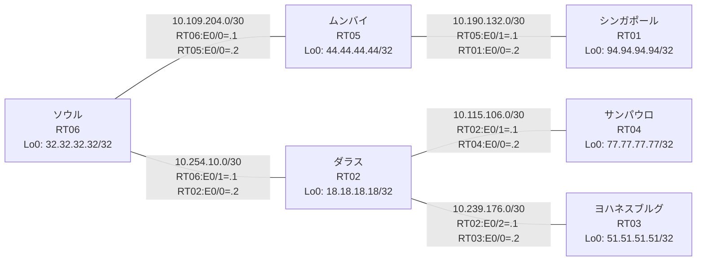

# 問題 20260801-008 : ルーティング到達性の分析

> **本問は機器に接続せずに解答すること。追加の show 実行は認めない。**

## トポロジ

社内網は複数のルーティングドメインを境界ルータで接続し、相互再配送によって全拠点の到達性を提供する構成です。
ルーティング設計の詳細は、提示された設定から読み取ってください。
各拠点のルータと拠点網の対応は下表のとおりです(拠点網の代表 = 当該ルータの Loopback0)。



| 拠点 | ルータ | 拠点網(代表アドレス) |
|------|--------|----------------------|
| サンパウロ | RT04 | `77.77.77.77/32` |
| シンガポール | RT01 | `94.94.94.94/32` |
| ソウル | RT06 | `32.32.32.32/32` |
| ダラス | RT02 | `18.18.18.18/32` |
| ムンバイ | RT05 | `44.44.44.44/32` |
| ヨハネスブルグ | RT03 | `51.51.51.51/32` |

リンク一覧(接続・アドレス):
```
  RT06:E0/0(.1) ── RT05:E0/0(.2)   10.109.204.0/30
  RT05:E0/1(.1) ── RT01:E0/0(.2)   10.190.132.0/30
  RT06:E0/1(.1) ── RT02:E0/0(.2)   10.254.10.0/30
  RT02:E0/1(.1) ── RT04:E0/0(.2)   10.115.106.0/30
  RT02:E0/2(.1) ── RT03:E0/0(.2)   10.239.176.0/30
```

## 要件

1. 全ルータの Loopback0 (/32) が、すべてのドメイン間で相互に到達可能であること。
2. EIGRP への経路注入は、redistribute 文で seed metric `100000 100 255 1 1500` を直接指定すること(default-metric による代替は社内標準外)。
3. 再配送に対するフィルタ(route-map / distribute-list)の適用は禁止されていること。
4. redistribute が参照するプロセス ID / AS 番号は、その境界に実在する隣接ドメインのものと一致させ、実在しないプロセスへの参照を残置しないこと。

## 現在の状態

サンパウロ拠点のユーザからヨハネスブルグ拠点へ到達できないと報告されています。ソウル拠点からも同様の申告が上がっています。意図した動作ではありません。示された出力を参照してください。

```
RT04# show ip route
Gateway of last resort is not set
      10.0.0.0/8 is variably subnetted, 5 subnets, 2 masks
O E2     10.109.204.0/30 [110/20] via 10.115.106.1, 00:04:00, Ethernet0/0
C        10.115.106.0/30 is directly connected, Ethernet0/0
L        10.115.106.2/32 is directly connected, Ethernet0/0
O E2     10.190.132.0/30 [110/20] via 10.115.106.1, 00:04:00, Ethernet0/0
O        10.254.10.0/30 [110/20] via 10.115.106.1, 00:04:00, Ethernet0/0
      18.0.0.0/32 is subnetted, 1 subnets
O        18.18.18.18 [110/11] via 10.115.106.1, 00:04:00, Ethernet0/0
      32.0.0.0/32 is subnetted, 1 subnets
O        32.32.32.32 [110/21] via 10.115.106.1, 00:04:00, Ethernet0/0
      44.0.0.0/32 is subnetted, 1 subnets
O E2     44.44.44.44 [110/20] via 10.115.106.1, 00:04:00, Ethernet0/0
      77.0.0.0/32 is subnetted, 1 subnets
C        77.77.77.77 is directly connected, Loopback0
      94.0.0.0/32 is subnetted, 1 subnets
O E2     94.94.94.94 [110/20] via 10.115.106.1, 00:04:00, Ethernet0/0
```
```
RT03# show ip route
Gateway of last resort is not set
      10.0.0.0/8 is variably subnetted, 6 subnets, 2 masks
D EX     10.109.204.0/30 [170/307200] via 10.239.176.1, 00:04:30, Ethernet0/0
D EX     10.115.106.0/30 [170/307200] via 10.239.176.1, 00:05:01, Ethernet0/0
D EX     10.190.132.0/30 [170/307200] via 10.239.176.1, 00:04:30, Ethernet0/0
C        10.239.176.0/30 is directly connected, Ethernet0/0
L        10.239.176.2/32 is directly connected, Ethernet0/0
D EX     10.254.10.0/30 [170/307200] via 10.239.176.1, 00:05:01, Ethernet0/0
      18.0.0.0/32 is subnetted, 1 subnets
D        18.18.18.18 [90/409600] via 10.239.176.1, 00:05:01, Ethernet0/0
      32.0.0.0/32 is subnetted, 1 subnets
D EX     32.32.32.32 [170/307200] via 10.239.176.1, 00:04:30, Ethernet0/0
      44.0.0.0/32 is subnetted, 1 subnets
D EX     44.44.44.44 [170/307200] via 10.239.176.1, 00:04:30, Ethernet0/0
      51.0.0.0/32 is subnetted, 1 subnets
C        51.51.51.51 is directly connected, Loopback0
      77.0.0.0/32 is subnetted, 1 subnets
D EX     77.77.77.77 [170/307200] via 10.239.176.1, 00:04:19, Ethernet0/0
      94.0.0.0/32 is subnetted, 1 subnets
D EX     94.94.94.94 [170/307200] via 10.239.176.1, 00:04:30, Ethernet0/0
```

## 設定抜粋

```
RT01# show running-config | section router
router eigrp 193
 network 10.190.132.0 0.0.0.3
 network 94.94.94.94 0.0.0.0
```
```
RT02# show running-config | section router
router eigrp 383
 network 10.239.176.0 0.0.0.3
 network 18.18.18.18 0.0.0.0
 redistribute ospf 7 match internal external 1 external 2 metric 100000 100 255 1 1500
router ospf 7
 router-id 18.18.18.18
 network 10.115.106.0 0.0.0.3 area 0
 network 10.254.10.0 0.0.0.3 area 0
 network 18.18.18.18 0.0.0.0 area 0
```
```
RT03# show running-config | section router
router eigrp 383
 network 10.239.176.0 0.0.0.3
 network 51.51.51.51 0.0.0.0
```
```
RT04# show running-config | section router
router ospf 7
 router-id 77.77.77.77
 network 10.115.106.0 0.0.0.3 area 0
 network 77.77.77.77 0.0.0.0 area 0
```
```
RT05# show running-config | section router
router eigrp 193
 network 10.109.204.0 0.0.0.3
 network 10.190.132.0 0.0.0.3
 network 44.44.44.44 0.0.0.0
```
```
RT06# show running-config | section router
router eigrp 193
 network 10.109.204.0 0.0.0.3
 network 32.32.32.32 0.0.0.0
 redistribute ospf 7 match internal external 1 external 2 metric 100000 100 255 1 1500
router ospf 7
 router-id 32.32.32.32
 redistribute eigrp 193
 network 10.254.10.0 0.0.0.3 area 0
 network 32.32.32.32 0.0.0.0 area 0
```

## 設問

この事象の原因として最も可能性が高いのはどれですか。(1つ選択)

## 選択肢

A. RT04 に Loopback0 の network 文が設定されていない
B. RT02 と RT04 側ドメインの間のリンクで MTU が一致していない
C. RT04 と隣接ルータの間で OSPF のネイバー(隣接関係)が確立していない
D. RT02 の router ospf 7 配下に、隣接ドメインからの redistribute が設定されていない
