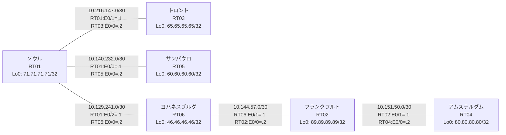

# 問題 20260801-009 : ルーティング到達性の分析

> **本問は機器に接続せずに解答すること。追加の show 実行は認めない。**

## トポロジ

社内網は複数のルーティングドメインを境界ルータで接続し、相互再配送によって全拠点の到達性を提供する構成です。
ルーティング設計の詳細は、提示された設定から読み取ってください。
各拠点のルータと拠点網の対応は下表のとおりです(拠点網の代表 = 当該ルータの Loopback0)。



| 拠点 | ルータ | 拠点網(代表アドレス) |
|------|--------|----------------------|
| アムステルダム | RT04 | `80.80.80.80/32` |
| サンパウロ | RT05 | `60.60.60.60/32` |
| ソウル | RT01 | `71.71.71.71/32` |
| トロント | RT03 | `65.65.65.65/32` |
| フランクフルト | RT02 | `89.89.89.89/32` |
| ヨハネスブルグ | RT06 | `46.46.46.46/32` |

リンク一覧(接続・アドレス):
```
  RT01:E0/0(.1) ── RT05:E0/0(.2)   10.140.232.0/30
  RT01:E0/1(.1) ── RT03:E0/0(.2)   10.216.147.0/30
  RT01:E0/2(.1) ── RT06:E0/0(.2)   10.129.241.0/30
  RT06:E0/1(.1) ── RT02:E0/0(.2)   10.144.57.0/30
  RT02:E0/1(.1) ── RT04:E0/0(.2)   10.151.50.0/30
```

## 要件

1. 全ルータの Loopback0 (/32) が、すべてのドメイン間で相互に到達可能であること。
2. EIGRP への経路注入は、redistribute 文で seed metric `100000 100 255 1 1500` を直接指定すること(default-metric による代替は社内標準外)。
3. 再配送に対するフィルタ(route-map / distribute-list)の適用は禁止されていること。
4. redistribute が参照するプロセス ID / AS 番号は、その境界に実在する隣接ドメインのものと一致させ、実在しないプロセスへの参照を残置しないこと。

## 現在の状態

サンパウロ拠点のユーザからフランクフルト拠点へ到達できないと報告されています。トロント拠点からも同様の申告が上がっています。意図した動作ではありません。示された出力を参照してください。

```
RT05# show ip route
Gateway of last resort is not set
      10.0.0.0/8 is variably subnetted, 3 subnets, 2 masks
C        10.140.232.0/30 is directly connected, Ethernet0/0
L        10.140.232.2/32 is directly connected, Ethernet0/0
D        10.216.147.0/30 [90/307200] via 10.140.232.1, 00:04:40, Ethernet0/0
      60.0.0.0/32 is subnetted, 1 subnets
C        60.60.60.60 is directly connected, Loopback0
      65.0.0.0/32 is subnetted, 1 subnets
D        65.65.65.65 [90/435200] via 10.140.232.1, 00:04:40, Ethernet0/0
      71.0.0.0/32 is subnetted, 1 subnets
D        71.71.71.71 [90/409600] via 10.140.232.1, 00:04:40, Ethernet0/0
```
```
RT02# show ip route
Gateway of last resort is not set
      10.0.0.0/8 is variably subnetted, 7 subnets, 2 masks
D EX     10.129.241.0/30 [170/307200] via 10.144.57.1, 00:05:04, Ethernet0/0
D EX     10.140.232.0/30 [170/307200] via 10.144.57.1, 00:04:27, Ethernet0/0
C        10.144.57.0/30 is directly connected, Ethernet0/0
L        10.144.57.2/32 is directly connected, Ethernet0/0
C        10.151.50.0/30 is directly connected, Ethernet0/1
L        10.151.50.1/32 is directly connected, Ethernet0/1
D EX     10.216.147.0/30 [170/307200] via 10.144.57.1, 00:04:27, Ethernet0/0
      46.0.0.0/32 is subnetted, 1 subnets
D        46.46.46.46 [90/409600] via 10.144.57.1, 00:05:04, Ethernet0/0
      60.0.0.0/32 is subnetted, 1 subnets
D EX     60.60.60.60 [170/307200] via 10.144.57.1, 00:04:27, Ethernet0/0
      65.0.0.0/32 is subnetted, 1 subnets
D EX     65.65.65.65 [170/307200] via 10.144.57.1, 00:04:27, Ethernet0/0
      71.0.0.0/32 is subnetted, 1 subnets
D EX     71.71.71.71 [170/307200] via 10.144.57.1, 00:04:27, Ethernet0/0
      80.0.0.0/32 is subnetted, 1 subnets
D        80.80.80.80 [90/409600] via 10.151.50.2, 00:04:59, Ethernet0/1
      89.0.0.0/32 is subnetted, 1 subnets
C        89.89.89.89 is directly connected, Loopback0
```
```
RT04# show ip route
Gateway of last resort is not set
      10.0.0.0/8 is variably subnetted, 6 subnets, 2 masks
D EX     10.129.241.0/30 [170/332800] via 10.151.50.1, 00:05:20, Ethernet0/0
D EX     10.140.232.0/30 [170/332800] via 10.151.50.1, 00:04:44, Ethernet0/0
D        10.144.57.0/30 [90/307200] via 10.151.50.1, 00:05:20, Ethernet0/0
C        10.151.50.0/30 is directly connected, Ethernet0/0
L        10.151.50.2/32 is directly connected, Ethernet0/0
D EX     10.216.147.0/30 [170/332800] via 10.151.50.1, 00:04:44, Ethernet0/0
      46.0.0.0/32 is subnetted, 1 subnets
D        46.46.46.46 [90/435200] via 10.151.50.1, 00:05:20, Ethernet0/0
      60.0.0.0/32 is subnetted, 1 subnets
D EX     60.60.60.60 [170/332800] via 10.151.50.1, 00:04:44, Ethernet0/0
      65.0.0.0/32 is subnetted, 1 subnets
D EX     65.65.65.65 [170/332800] via 10.151.50.1, 00:04:44, Ethernet0/0
      71.0.0.0/32 is subnetted, 1 subnets
D EX     71.71.71.71 [170/332800] via 10.151.50.1, 00:04:44, Ethernet0/0
      80.0.0.0/32 is subnetted, 1 subnets
C        80.80.80.80 is directly connected, Loopback0
      89.0.0.0/32 is subnetted, 1 subnets
D        89.89.89.89 [90/409600] via 10.151.50.1, 00:05:20, Ethernet0/0
```

## 設定抜粋

```
RT01# show running-config | section router
router eigrp 197
 network 10.140.232.0 0.0.0.3
 network 10.216.147.0 0.0.0.3
 network 71.71.71.71 0.0.0.0
 redistribute ospf 81 match internal external 1 external 2
router ospf 81
 router-id 71.71.71.71
 redistribute eigrp 197
 network 10.129.241.0 0.0.0.3 area 0
 network 71.71.71.71 0.0.0.0 area 0
```
```
RT02# show running-config | section router
router eigrp 796
 network 10.144.57.0 0.0.0.3
 network 10.151.50.0 0.0.0.3
 network 89.89.89.89 0.0.0.0
```
```
RT03# show running-config | section router
router eigrp 197
 network 10.216.147.0 0.0.0.3
 network 65.65.65.65 0.0.0.0
```
```
RT04# show running-config | section router
router eigrp 796
 network 10.151.50.0 0.0.0.3
 network 80.80.80.80 0.0.0.0
```
```
RT05# show running-config | section router
router eigrp 197
 network 10.140.232.0 0.0.0.3
 network 60.60.60.60 0.0.0.0
```
```
RT06# show running-config | section router
router eigrp 796
 network 10.144.57.0 0.0.0.3
 network 46.46.46.46 0.0.0.0
 redistribute ospf 81 match internal external 1 external 2 metric 100000 100 255 1 1500
router ospf 81
 router-id 46.46.46.46
 redistribute eigrp 796
 network 10.129.241.0 0.0.0.3 area 0
 network 46.46.46.46 0.0.0.0 area 0
```

## 設問

この問題を解決し、下記の要件をすべて満たすために必要な手順はどれですか。(1つ選択)

## 選択肢

A. RT01 で「clear ip route *」を実行する
B. RT01 の router eigrp 197 配下に「redistribute connected metric 100000 100 255 1 1500」を追加する
C. RT01 の router ospf 81 配下の「redistribute eigrp 197」に metric 20 を追加する
D. RT01 の router eigrp 197 配下で「redistribute ospf 81 match internal external 1 external 2 metric 100000 100 255 1 1500」を設定する
E. RT05 の router eigrp 197 配下で「no passive-interface <上流IF>」を設定する
F. RT01 の router eigrp 197 配下に「default-metric 100000 100 255 1 1500」を追加する
