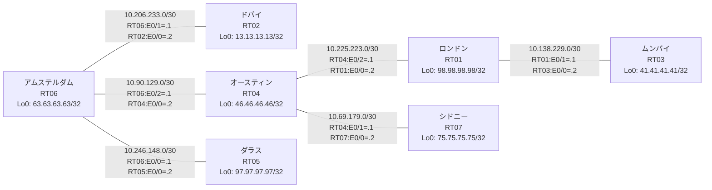

# 問題 20260801-010 : ルーティング到達性の分析

> **本問は機器に接続せずに解答すること。追加の show 実行は認めない。**

## トポロジ

社内網は複数のルーティングドメインを境界ルータで接続し、相互再配送によって全拠点の到達性を提供する構成です。
ルーティング設計の詳細は、提示された設定から読み取ってください。
各拠点のルータと拠点網の対応は下表のとおりです(拠点網の代表 = 当該ルータの Loopback0)。



| 拠点 | ルータ | 拠点網(代表アドレス) |
|------|--------|----------------------|
| アムステルダム | RT06 | `63.63.63.63/32` |
| オースティン | RT04 | `46.46.46.46/32` |
| シドニー | RT07 | `75.75.75.75/32` |
| ダラス | RT05 | `97.97.97.97/32` |
| ドバイ | RT02 | `13.13.13.13/32` |
| ムンバイ | RT03 | `41.41.41.41/32` |
| ロンドン | RT01 | `98.98.98.98/32` |

リンク一覧(接続・アドレス):
```
  RT06:E0/0(.1) ── RT05:E0/0(.2)   10.246.148.0/30
  RT06:E0/1(.1) ── RT02:E0/0(.2)   10.206.233.0/30
  RT06:E0/2(.1) ── RT04:E0/0(.2)   10.90.129.0/30
  RT04:E0/1(.1) ── RT07:E0/0(.2)   10.69.179.0/30
  RT04:E0/2(.1) ── RT01:E0/0(.2)   10.225.223.0/30
  RT01:E0/1(.1) ── RT03:E0/0(.2)   10.138.229.0/30
```

## 要件

1. 全ルータの Loopback0 (/32) が、すべてのドメイン間で相互に到達可能であること。
2. EIGRP への経路注入は、redistribute 文で seed metric `100000 100 255 1 1500` を直接指定すること(default-metric による代替は社内標準外)。
3. 再配送に対するフィルタ(route-map / distribute-list)の適用は禁止されていること。
4. redistribute が参照するプロセス ID / AS 番号は、その境界に実在する隣接ドメインのものと一致させ、実在しないプロセスへの参照を残置しないこと。

## 現在の状態

複数の拠点からロンドン拠点へ到達できないと報告されています。ロンドン拠点が関与しない拠点間の通信は正常とのことです。意図した動作ではありません。示された出力を参照してください。

```
RT07# show ip route
Gateway of last resort is not set
      10.0.0.0/8 is variably subnetted, 7 subnets, 2 masks
C        10.69.179.0/30 is directly connected, Ethernet0/0
L        10.69.179.2/32 is directly connected, Ethernet0/0
O        10.90.129.0/30 [110/20] via 10.69.179.1, 00:05:22, Ethernet0/0
O E2     10.138.229.0/30 [110/20] via 10.69.179.1, 00:05:22, Ethernet0/0
O E2     10.206.233.0/30 [110/20] via 10.69.179.1, 00:05:22, Ethernet0/0
O E2     10.225.223.0/30 [110/20] via 10.69.179.1, 00:05:22, Ethernet0/0
O E2     10.246.148.0/30 [110/20] via 10.69.179.1, 00:05:22, Ethernet0/0
      13.0.0.0/32 is subnetted, 1 subnets
O E2     13.13.13.13 [110/20] via 10.69.179.1, 00:05:22, Ethernet0/0
      41.0.0.0/32 is subnetted, 1 subnets
O E2     41.41.41.41 [110/20] via 10.69.179.1, 00:05:22, Ethernet0/0
      46.0.0.0/32 is subnetted, 1 subnets
O        46.46.46.46 [110/11] via 10.69.179.1, 00:05:22, Ethernet0/0
      63.0.0.0/32 is subnetted, 1 subnets
O        63.63.63.63 [110/21] via 10.69.179.1, 00:05:22, Ethernet0/0
      75.0.0.0/32 is subnetted, 1 subnets
C        75.75.75.75 is directly connected, Loopback0
      97.0.0.0/32 is subnetted, 1 subnets
O E2     97.97.97.97 [110/20] via 10.69.179.1, 00:05:22, Ethernet0/0
```
```
RT03# show ip route
Gateway of last resort is not set
      10.0.0.0/8 is variably subnetted, 7 subnets, 2 masks
D EX     10.69.179.0/30 [170/332800] via 10.138.229.1, 00:05:54, Ethernet0/0
D EX     10.90.129.0/30 [170/332800] via 10.138.229.1, 00:05:54, Ethernet0/0
C        10.138.229.0/30 is directly connected, Ethernet0/0
L        10.138.229.2/32 is directly connected, Ethernet0/0
D EX     10.206.233.0/30 [170/332800] via 10.138.229.1, 00:05:44, Ethernet0/0
D        10.225.223.0/30 [90/307200] via 10.138.229.1, 00:05:54, Ethernet0/0
D EX     10.246.148.0/30 [170/332800] via 10.138.229.1, 00:05:44, Ethernet0/0
      13.0.0.0/32 is subnetted, 1 subnets
D EX     13.13.13.13 [170/332800] via 10.138.229.1, 00:05:44, Ethernet0/0
      41.0.0.0/32 is subnetted, 1 subnets
C        41.41.41.41 is directly connected, Loopback0
      46.0.0.0/32 is subnetted, 1 subnets
D        46.46.46.46 [90/435200] via 10.138.229.1, 00:05:54, Ethernet0/0
      63.0.0.0/32 is subnetted, 1 subnets
D EX     63.63.63.63 [170/332800] via 10.138.229.1, 00:05:44, Ethernet0/0
      75.0.0.0/32 is subnetted, 1 subnets
D EX     75.75.75.75 [170/332800] via 10.138.229.1, 00:05:39, Ethernet0/0
      97.0.0.0/32 is subnetted, 1 subnets
D EX     97.97.97.97 [170/332800] via 10.138.229.1, 00:05:44, Ethernet0/0
      98.0.0.0/32 is subnetted, 1 subnets
D        98.98.98.98 [90/409600] via 10.138.229.1, 00:05:54, Ethernet0/0
```
```
RT01# show ip route
Gateway of last resort is not set
      10.0.0.0/8 is variably subnetted, 8 subnets, 2 masks
D EX     10.69.179.0/30 [170/307200] via 10.225.223.1, 00:06:18, Ethernet0/0
D EX     10.90.129.0/30 [170/307200] via 10.225.223.1, 00:06:18, Ethernet0/0
C        10.138.229.0/30 is directly connected, Ethernet0/1
L        10.138.229.1/32 is directly connected, Ethernet0/1
D EX     10.206.233.0/30 [170/307200] via 10.225.223.1, 00:06:01, Ethernet0/0
C        10.225.223.0/30 is directly connected, Ethernet0/0
L        10.225.223.2/32 is directly connected, Ethernet0/0
D EX     10.246.148.0/30 [170/307200] via 10.225.223.1, 00:06:01, Ethernet0/0
      13.0.0.0/32 is subnetted, 1 subnets
D EX     13.13.13.13 [170/307200] via 10.225.223.1, 00:06:01, Ethernet0/0
      41.0.0.0/32 is subnetted, 1 subnets
D        41.41.41.41 [90/409600] via 10.138.229.2, 00:06:06, Ethernet0/1
      46.0.0.0/32 is subnetted, 1 subnets
D        46.46.46.46 [90/409600] via 10.225.223.1, 00:06:18, Ethernet0/0
      63.0.0.0/32 is subnetted, 1 subnets
D EX     63.63.63.63 [170/307200] via 10.225.223.1, 00:06:01, Ethernet0/0
      75.0.0.0/32 is subnetted, 1 subnets
D EX     75.75.75.75 [170/307200] via 10.225.223.1, 00:05:56, Ethernet0/0
      97.0.0.0/32 is subnetted, 1 subnets
D EX     97.97.97.97 [170/307200] via 10.225.223.1, 00:06:01, Ethernet0/0
      98.0.0.0/32 is subnetted, 1 subnets
C        98.98.98.98 is directly connected, Loopback0
```
```
RT04# show route-map
route-map RM-SVC, deny, sequence 10
  Match clauses:
    ip address prefix-lists: PL-SVC 
  Set clauses:
  Policy routing matches: 0 packets, 0 bytes
route-map RM-SVC, permit, sequence 20
  Match clauses:
  Set clauses:
  Policy routing matches: 0 packets, 0 bytes
route-map RM-STG1, deny, sequence 10
  Match clauses:
    ip address prefix-lists: PL-STG1 
  Set clauses:
  Policy routing matches: 0 packets, 0 bytes
route-map RM-STG1, permit, sequence 20
  Match clauses:
  Set clauses:
  Policy routing matches: 0 packets, 0 bytes
```
```
RT04# show ip prefix-list
ip prefix-list PL-STG1: 2 entries
   seq 5 deny 98.98.98.98/32
   seq 10 permit 0.0.0.0/0 le 32
ip prefix-list PL-SVC: 1 entries
   seq 5 permit 98.98.98.98/32
```
```
RT04# show access-lists
Standard IP access list 23
    10 deny   98.98.98.98
    20 permit any
```

## 設定抜粋

```
RT01# show running-config | section router
router eigrp 301
 network 10.138.229.0 0.0.0.3
 network 10.225.223.0 0.0.0.3
 network 98.98.98.98 0.0.0.0
```
```
RT02# show running-config | section router
router eigrp 128
 network 10.206.233.0 0.0.0.3
 network 13.13.13.13 0.0.0.0
```
```
RT03# show running-config | section router
router eigrp 301
 network 10.138.229.0 0.0.0.3
 network 41.41.41.41 0.0.0.0
 passive-interface Loopback0
```
```
RT04# show running-config | section router
router eigrp 301
 timers active-time 5
 network 10.225.223.0 0.0.0.3
 network 46.46.46.46 0.0.0.0
 redistribute ospf 53 match internal external 1 external 2 metric 100000 100 255 1 1500
 passive-interface Loopback0
router ospf 53
 router-id 46.46.46.46
 redistribute eigrp 301 route-map RM-SVC
 network 10.69.179.0 0.0.0.3 area 0
 network 10.90.129.0 0.0.0.3 area 0
 network 46.46.46.46 0.0.0.0 area 0
```
```
RT05# show running-config | section router
router eigrp 128
 network 10.246.148.0 0.0.0.3
 network 97.97.97.97 0.0.0.0
```
```
RT06# show running-config | section router
router eigrp 128
 network 10.206.233.0 0.0.0.3
 network 10.246.148.0 0.0.0.3
 network 63.63.63.63 0.0.0.0
 redistribute ospf 53 match internal external 1 external 2 metric 100000 100 255 1 1500
 passive-interface Loopback0
router ospf 53
 router-id 63.63.63.63
 redistribute eigrp 128
 network 10.90.129.0 0.0.0.3 area 0
 network 63.63.63.63 0.0.0.0 area 0
```
```
RT07# show running-config | section router
router ospf 53
 router-id 75.75.75.75
 network 10.69.179.0 0.0.0.3 area 0
 network 75.75.75.75 0.0.0.0 area 0
```

## 設問

この問題を解決し、下記の要件をすべて満たすために必要な手順はどれですか。(1つ選択)

## 選択肢

A. ip prefix-list PL-SVC に「seq 10 permit 0.0.0.0/0 le 32」を追加する
B. RT07 の router ospf 53 配下で「no passive-interface <上流IF>」を設定する
C. RT04 で「clear ip route *」を実行する
D. RT04 の router eigrp 301 配下の redistribute にも route-map RM-SVC を適用する
E. RT04 の router ospf 53 配下で redistribute から route-map RM-SVC を外し、route-map / prefix-list を削除する
F. route-map RM-SVC のシーケンス 10 を deny から permit に変更する
