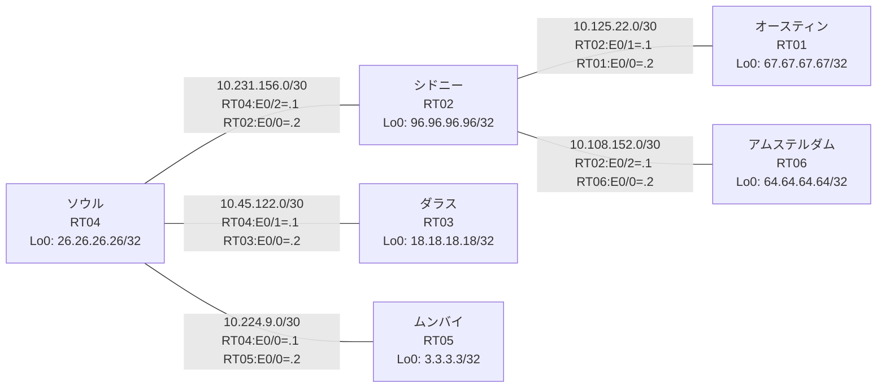

# 問題 20260802-001 : ルーティング到達性の分析

> **本問は機器に接続せずに解答すること。追加の show 実行は認めない。**

## トポロジ

社内網は複数のルーティングドメインを境界ルータで接続し、相互再配送によって全拠点の到達性を提供する構成です。
ルーティング設計の詳細は、提示された設定から読み取ってください。
各拠点のルータと拠点網の対応は下表のとおりです(拠点網の代表 = 当該ルータの Loopback0)。



| 拠点 | ルータ | 拠点網(代表アドレス) |
|------|--------|----------------------|
| アムステルダム | RT06 | `64.64.64.64/32` |
| オースティン | RT01 | `67.67.67.67/32` |
| シドニー | RT02 | `96.96.96.96/32` |
| ソウル | RT04 | `26.26.26.26/32` |
| ダラス | RT03 | `18.18.18.18/32` |
| ムンバイ | RT05 | `3.3.3.3/32` |

リンク一覧(接続・アドレス):
```
  RT04:E0/0(.1) ── RT05:E0/0(.2)   10.224.9.0/30
  RT04:E0/1(.1) ── RT03:E0/0(.2)   10.45.122.0/30
  RT04:E0/2(.1) ── RT02:E0/0(.2)   10.231.156.0/30
  RT02:E0/1(.1) ── RT01:E0/0(.2)   10.125.22.0/30
  RT02:E0/2(.1) ── RT06:E0/0(.2)   10.108.152.0/30
```

## 要件

1. 静的経路およびデフォルトルートによる迂回・回避は行わないこと。
2. EIGRP の初期メトリックは default-metric `100000 100 255 1 1500` に集約すること(redistribute 文ごとの個別指定は監査不適合)。
3. 再配送に対するフィルタ(route-map / distribute-list)の適用は禁止されていること。
4. インタフェースの IP アドレッシングは変更しないこと。
5. 各拠点網(Loopback0)は、ドメインをまたいで全拠点から到達できること。
6. 存在しないプロセス/AS を参照する設定行を残置しないこと(参照は隣接ドメインの実 ID に一致させる)。

## 現在の状態

シドニー拠点のユーザからムンバイ拠点へ到達できないと報告されています。影響範囲の全容はまだ把握できていません。意図した動作ではありません。示された出力を参照してください。

```
RT02# show ip route
Gateway of last resort is not set
      10.0.0.0/8 is variably subnetted, 6 subnets, 2 masks
C        10.108.152.0/30 is directly connected, Ethernet0/2
L        10.108.152.1/32 is directly connected, Ethernet0/2
C        10.125.22.0/30 is directly connected, Ethernet0/1
L        10.125.22.1/32 is directly connected, Ethernet0/1
C        10.231.156.0/30 is directly connected, Ethernet0/0
L        10.231.156.2/32 is directly connected, Ethernet0/0
      26.0.0.0/32 is subnetted, 1 subnets
D        26.26.26.26 [90/409600] via 10.231.156.1, 00:05:06, Ethernet0/0
      64.0.0.0/32 is subnetted, 1 subnets
D        64.64.64.64 [90/409600] via 10.108.152.2, 00:04:36, Ethernet0/2
      67.0.0.0/32 is subnetted, 1 subnets
D        67.67.67.67 [90/409600] via 10.125.22.2, 00:04:48, Ethernet0/1
      96.0.0.0/32 is subnetted, 1 subnets
C        96.96.96.96 is directly connected, Loopback0
```
```
RT05# show ip route
Gateway of last resort is not set
      3.0.0.0/32 is subnetted, 1 subnets
C        3.3.3.3 is directly connected, Loopback0
      10.0.0.0/8 is variably subnetted, 6 subnets, 2 masks
O        10.45.122.0/30 [110/20] via 10.224.9.1, 00:04:24, Ethernet0/0
O E2     10.108.152.0/30 [110/20] via 10.224.9.1, 00:04:24, Ethernet0/0
O E2     10.125.22.0/30 [110/20] via 10.224.9.1, 00:04:24, Ethernet0/0
C        10.224.9.0/30 is directly connected, Ethernet0/0
L        10.224.9.2/32 is directly connected, Ethernet0/0
O E2     10.231.156.0/30 [110/20] via 10.224.9.1, 00:04:24, Ethernet0/0
      18.0.0.0/32 is subnetted, 1 subnets
O        18.18.18.18 [110/21] via 10.224.9.1, 00:04:24, Ethernet0/0
      26.0.0.0/32 is subnetted, 1 subnets
O        26.26.26.26 [110/11] via 10.224.9.1, 00:04:24, Ethernet0/0
      64.0.0.0/32 is subnetted, 1 subnets
O E2     64.64.64.64 [110/20] via 10.224.9.1, 00:04:24, Ethernet0/0
      67.0.0.0/32 is subnetted, 1 subnets
O E2     67.67.67.67 [110/20] via 10.224.9.1, 00:04:24, Ethernet0/0
      96.0.0.0/32 is subnetted, 1 subnets
O E2     96.96.96.96 [110/20] via 10.224.9.1, 00:04:24, Ethernet0/0
```
```
RT03# show ip route
Gateway of last resort is not set
      3.0.0.0/32 is subnetted, 1 subnets
O        3.3.3.3 [110/21] via 10.45.122.1, 00:04:36, Ethernet0/0
      10.0.0.0/8 is variably subnetted, 6 subnets, 2 masks
C        10.45.122.0/30 is directly connected, Ethernet0/0
L        10.45.122.2/32 is directly connected, Ethernet0/0
O E2     10.108.152.0/30 [110/20] via 10.45.122.1, 00:04:42, Ethernet0/0
O E2     10.125.22.0/30 [110/20] via 10.45.122.1, 00:04:42, Ethernet0/0
O        10.224.9.0/30 [110/20] via 10.45.122.1, 00:04:42, Ethernet0/0
O E2     10.231.156.0/30 [110/20] via 10.45.122.1, 00:04:42, Ethernet0/0
      18.0.0.0/32 is subnetted, 1 subnets
C        18.18.18.18 is directly connected, Loopback0
      26.0.0.0/32 is subnetted, 1 subnets
O        26.26.26.26 [110/11] via 10.45.122.1, 00:04:42, Ethernet0/0
      64.0.0.0/32 is subnetted, 1 subnets
O E2     64.64.64.64 [110/20] via 10.45.122.1, 00:04:42, Ethernet0/0
      67.0.0.0/32 is subnetted, 1 subnets
O E2     67.67.67.67 [110/20] via 10.45.122.1, 00:04:42, Ethernet0/0
      96.0.0.0/32 is subnetted, 1 subnets
O E2     96.96.96.96 [110/20] via 10.45.122.1, 00:04:42, Ethernet0/0
```
```
RT04# show route-map
route-map RM-OLD1, deny, sequence 10
  Match clauses:
    ip address prefix-lists: PL-OLD1 
  Set clauses:
  Policy routing matches: 0 packets, 0 bytes
route-map RM-OLD1, permit, sequence 20
  Match clauses:
  Set clauses:
  Policy routing matches: 0 packets, 0 bytes
route-map RM-BACKUP2, deny, sequence 10
  Match clauses:
    ip address prefix-lists: PL-BACKUP2 
  Set clauses:
  Policy routing matches: 0 packets, 0 bytes
route-map RM-BACKUP2, permit, sequence 20
  Match clauses:
  Set clauses:
  Policy routing matches: 0 packets, 0 bytes
```
```
RT04# show ip prefix-list
ip prefix-list PL-BACKUP2: 2 entries
   seq 5 deny 26.26.26.26/32
   seq 10 permit 0.0.0.0/0 le 32
ip prefix-list PL-OLD1: 2 entries
   seq 5 deny 3.3.3.3/32
   seq 10 permit 0.0.0.0/0 le 32
```
```
RT04# show access-lists
Standard IP access list 60
    10 deny   26.26.26.26
    20 permit any
Standard IP access list 82
    10 deny   3.3.3.3
    20 permit any
```

## 設定抜粋

```
RT01# show running-config | section router
router eigrp 753
 network 10.125.22.0 0.0.0.3
 network 67.67.67.67 0.0.0.0
 passive-interface Loopback0
```
```
RT02# show running-config | section router
router eigrp 387
 timers active-time 5
 default-metric 100000 100 255 1 1500
 network 10.231.156.0 0.0.0.3
 network 96.96.96.96 0.0.0.0
 redistribute eigrp 753
 passive-interface Loopback0
router eigrp 753
 default-metric 100000 100 255 1 1500
 network 10.108.152.0 0.0.0.3
 network 10.125.22.0 0.0.0.3
 network 96.96.96.96 0.0.0.0
 redistribute eigrp 387
```
```
RT03# show running-config | section router
router ospf 63
 router-id 18.18.18.18
 network 10.45.122.0 0.0.0.3 area 0
 network 18.18.18.18 0.0.0.0 area 0
```
```
RT04# show running-config | section router
router eigrp 387
 timers active-time 5
 network 10.231.156.0 0.0.0.3
 network 26.26.26.26 0.0.0.0
 redistribute ospf 63 match internal external 1 external 2
 passive-interface Loopback0
router ospf 63
 router-id 26.26.26.26
 redistribute eigrp 387
 network 10.45.122.0 0.0.0.3 area 0
 network 10.224.9.0 0.0.0.3 area 0
 network 26.26.26.26 0.0.0.0 area 0
```
```
RT05# show running-config | section router
router ospf 63
 router-id 3.3.3.3
 passive-interface Loopback0
 network 3.3.3.3 0.0.0.0 area 0
 network 10.224.9.0 0.0.0.3 area 0
```
```
RT06# show running-config | section router
router eigrp 753
 network 10.108.152.0 0.0.0.3
 network 64.64.64.64 0.0.0.0
```

## 設問

この事象の原因として最も可能性が高いのはどれですか。(1つ選択)

## 選択肢

A. RT04 の router eigrp 387 配下に redistribute が設定されていない
B. RT04 と RT02 側ドメインの間のリンクで MTU が一致していない
C. RT04 の router eigrp 387 に default-metric が設定されていない
D. RT04 の route-map RM-OLD1 が対象の経路を拒否している
E. RT02 の router eigrp 387 で、上流側インタフェースが passive-interface に設定されている
F. RT04 の router eigrp 387 配下の redistribute が、実在しないプロセス/AS を参照している
