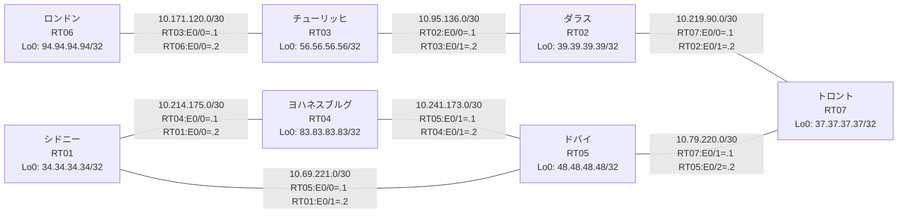

# 問題 20260802-002 : ルーティング到達性の分析

> **本問は機器に接続せずに解答すること。追加の show 実行は認めない。**

## トポロジ

社内網は複数のルーティングドメインを境界ルータで接続し、相互再配送によって全拠点の到達性を提供する構成です。
ルーティング設計の詳細は、提示された設定から読み取ってください。
各拠点のルータと拠点網の対応は下表のとおりです(拠点網の代表 = 当該ルータの Loopback0)。



| 拠点 | ルータ | 拠点網(代表アドレス) |
|------|--------|----------------------|
| シドニー | RT01 | `34.34.34.34/32` |
| ダラス | RT02 | `39.39.39.39/32` |
| チューリッヒ | RT03 | `56.56.56.56/32` |
| トロント | RT07 | `37.37.37.37/32` |
| ドバイ | RT05 | `48.48.48.48/32` |
| ヨハネスブルグ | RT04 | `83.83.83.83/32` |
| ロンドン | RT06 | `94.94.94.94/32` |

リンク一覧(接続・アドレス):
```
  RT04:E0/0(.1) ── RT01:E0/0(.2)   10.214.175.0/30
  RT05:E0/0(.1) ── RT01:E0/1(.2)   10.69.221.0/30
  RT03:E0/0(.1) ── RT06:E0/0(.2)   10.171.120.0/30
  RT05:E0/1(.1) ── RT04:E0/1(.2)   10.241.173.0/30
  RT02:E0/0(.1) ── RT03:E0/1(.2)   10.95.136.0/30
  RT07:E0/0(.1) ── RT02:E0/1(.2)   10.219.90.0/30
  RT07:E0/1(.1) ── RT05:E0/2(.2)   10.79.220.0/30
```

## 要件

1. redistribute の参照先は実在する隣接プロセス/AS に限定し、無効な参照行を設定に残さないこと。
2. 再配送経路の選択的な制限(route-map / distribute-list の適用)は行わないこと。
3. 静的経路およびデフォルトルートによる迂回・回避は行わないこと。
4. 全ルータの Loopback0 (/32) が、すべてのドメイン間で相互に到達可能であること。
5. seed metric `10000 10 255 1 1500` の付与は default-metric 方式に統一すること(redistribute 文への直接記述は認めない)。
6. ルーティングプロトコルの種別・プロセス配置(ドメイン構成)は変更しないこと。

## 現在の状態

ドバイ拠点のユーザからチューリッヒ拠点へ到達できないと報告されています。影響範囲の全容はまだ把握できていません。意図した動作ではありません。示された出力を参照してください。

```
RT05# show ip route
Gateway of last resort is not set
      10.0.0.0/8 is variably subnetted, 7 subnets, 2 masks
C        10.69.221.0/30 is directly connected, Ethernet0/0
L        10.69.221.1/32 is directly connected, Ethernet0/0
C        10.79.220.0/30 is directly connected, Ethernet0/2
L        10.79.220.2/32 is directly connected, Ethernet0/2
D        10.214.175.0/30 [90/307200] via 10.241.173.2, 00:05:03, Ethernet0/1
                         [90/307200] via 10.69.221.2, 00:05:03, Ethernet0/0
C        10.241.173.0/30 is directly connected, Ethernet0/1
L        10.241.173.1/32 is directly connected, Ethernet0/1
      34.0.0.0/32 is subnetted, 1 subnets
D        34.34.34.34 [90/409600] via 10.69.221.2, 00:05:03, Ethernet0/0
      37.0.0.0/32 is subnetted, 1 subnets
D        37.37.37.37 [90/409600] via 10.79.220.1, 00:05:12, Ethernet0/2
      48.0.0.0/32 is subnetted, 1 subnets
C        48.48.48.48 is directly connected, Loopback0
      83.0.0.0/32 is subnetted, 1 subnets
D        83.83.83.83 [90/409600] via 10.241.173.2, 00:05:01, Ethernet0/1
```
```
RT03# show ip route
Gateway of last resort is not set
      10.0.0.0/8 is variably subnetted, 9 subnets, 2 masks
O E2     10.69.221.0/30 [110/20] via 10.95.136.1, 00:04:47, Ethernet0/1
O E2     10.79.220.0/30 [110/20] via 10.95.136.1, 00:04:47, Ethernet0/1
C        10.95.136.0/30 is directly connected, Ethernet0/1
L        10.95.136.2/32 is directly connected, Ethernet0/1
C        10.171.120.0/30 is directly connected, Ethernet0/0
L        10.171.120.1/32 is directly connected, Ethernet0/0
O E2     10.214.175.0/30 [110/20] via 10.95.136.1, 00:04:47, Ethernet0/1
O        10.219.90.0/30 [110/20] via 10.95.136.1, 00:04:57, Ethernet0/1
O E2     10.241.173.0/30 [110/20] via 10.95.136.1, 00:04:47, Ethernet0/1
      34.0.0.0/32 is subnetted, 1 subnets
O E2     34.34.34.34 [110/20] via 10.95.136.1, 00:04:47, Ethernet0/1
      37.0.0.0/32 is subnetted, 1 subnets
O        37.37.37.37 [110/21] via 10.95.136.1, 00:04:47, Ethernet0/1
      39.0.0.0/32 is subnetted, 1 subnets
O        39.39.39.39 [110/11] via 10.95.136.1, 00:04:57, Ethernet0/1
      48.0.0.0/32 is subnetted, 1 subnets
O E2     48.48.48.48 [110/20] via 10.95.136.1, 00:04:47, Ethernet0/1
      56.0.0.0/32 is subnetted, 1 subnets
C        56.56.56.56 is directly connected, Loopback0
      83.0.0.0/32 is subnetted, 1 subnets
O E2     83.83.83.83 [110/20] via 10.95.136.1, 00:04:47, Ethernet0/1
      94.0.0.0/32 is subnetted, 1 subnets
O        94.94.94.94 [110/11] via 10.171.120.2, 00:04:41, Ethernet0/0
```
```
RT04# show ip route
Gateway of last resort is not set
      10.0.0.0/8 is variably subnetted, 6 subnets, 2 masks
D        10.69.221.0/30 [90/307200] via 10.241.173.1, 00:05:40, Ethernet0/1
                        [90/307200] via 10.214.175.2, 00:05:40, Ethernet0/0
D EX     10.79.220.0/30 [170/307200] via 10.241.173.1, 00:05:40, Ethernet0/1
C        10.214.175.0/30 is directly connected, Ethernet0/0
L        10.214.175.1/32 is directly connected, Ethernet0/0
C        10.241.173.0/30 is directly connected, Ethernet0/1
L        10.241.173.2/32 is directly connected, Ethernet0/1
      34.0.0.0/32 is subnetted, 1 subnets
D        34.34.34.34 [90/409600] via 10.214.175.2, 00:05:40, Ethernet0/0
      37.0.0.0/32 is subnetted, 1 subnets
D EX     37.37.37.37 [170/435200] via 10.241.173.1, 00:05:40, Ethernet0/1
      48.0.0.0/32 is subnetted, 1 subnets
D        48.48.48.48 [90/409600] via 10.241.173.1, 00:05:40, Ethernet0/1
      83.0.0.0/32 is subnetted, 1 subnets
C        83.83.83.83 is directly connected, Loopback0
```
```
RT07# show route-map
route-map RM-MIGR1, deny, sequence 10
  Match clauses:
    ip address prefix-lists: PL-MIGR1 
  Set clauses:
  Policy routing matches: 0 packets, 0 bytes
route-map RM-MIGR1, permit, sequence 20
  Match clauses:
  Set clauses:
  Policy routing matches: 0 packets, 0 bytes
route-map RM-OLD2, deny, sequence 10
  Match clauses:
    ip address prefix-lists: PL-OLD2 
  Set clauses:
  Policy routing matches: 0 packets, 0 bytes
route-map RM-OLD2, permit, sequence 20
  Match clauses:
  Set clauses:
  Policy routing matches: 0 packets, 0 bytes
```
```
RT07# show ip prefix-list
ip prefix-list PL-MIGR1: 2 entries
   seq 5 deny 48.48.48.48/32
   seq 10 permit 0.0.0.0/0 le 32
ip prefix-list PL-OLD2: 2 entries
   seq 5 deny 48.48.48.48/32
   seq 10 permit 0.0.0.0/0 le 32
```
```
RT07# show access-lists
Standard IP access list 19
    10 deny   48.48.48.48
    20 permit any
Standard IP access list 47
    10 deny   48.48.48.48
    20 permit any
```

## 設定抜粋

```
RT01# show running-config | section router
router eigrp 254
 network 10.69.221.0 0.0.0.3
 network 10.214.175.0 0.0.0.3
 network 34.34.34.34 0.0.0.0
```
```
RT02# show running-config | section router
router ospf 5
 router-id 39.39.39.39
 network 10.95.136.0 0.0.0.3 area 0
 network 10.219.90.0 0.0.0.3 area 0
 network 39.39.39.39 0.0.0.0 area 0
```
```
RT03# show running-config | section router
router ospf 5
 router-id 56.56.56.56
 timers throttle spf 50 200 5000
 passive-interface Loopback0
 network 10.95.136.0 0.0.0.3 area 0
 network 10.171.120.0 0.0.0.3 area 0
 network 56.56.56.56 0.0.0.0 area 0
```
```
RT04# show running-config | section router
router eigrp 254
 network 10.214.175.0 0.0.0.3
 network 10.241.173.0 0.0.0.3
 network 83.83.83.83 0.0.0.0
```
```
RT05# show running-config | section router
router eigrp 378
 default-metric 10000 10 255 1 1500
 network 10.79.220.0 0.0.0.3
 network 48.48.48.48 0.0.0.0
 redistribute eigrp 254
router eigrp 254
 default-metric 10000 10 255 1 1500
 network 10.69.221.0 0.0.0.3
 network 10.241.173.0 0.0.0.3
 network 48.48.48.48 0.0.0.0
 redistribute eigrp 378
 passive-interface Loopback0
```
```
RT06# show running-config | section router
router ospf 5
 router-id 94.94.94.94
 network 10.171.120.0 0.0.0.3 area 0
 network 94.94.94.94 0.0.0.0 area 0
```
```
RT07# show running-config | section router
router eigrp 378
 network 10.79.220.0 0.0.0.3
 network 37.37.37.37 0.0.0.0
 redistribute ospf 5 match internal external 1 external 2
router ospf 5
 router-id 37.37.37.37
 redistribute eigrp 378
 passive-interface Loopback0
 network 10.219.90.0 0.0.0.3 area 0
 network 37.37.37.37 0.0.0.0 area 0
```

## 設問

この事象の原因として最も可能性が高いのはどれですか。(1つ選択)

## 選択肢

A. RT05 の router eigrp 378 で、上流側インタフェースが passive-interface に設定されている
B. RT07 の router eigrp 378 に default-metric が設定されていない
C. RT07 の route-map RM-MIGR1 が対象の経路を拒否している
D. RT07 の router eigrp 378 配下の redistribute が、実在しないプロセス/AS を参照している
E. RT07 の router eigrp 378 配下に redistribute が設定されていない
F. RT05 と隣接ルータの間で EIGRP のネイバー(隣接関係)が確立していない
