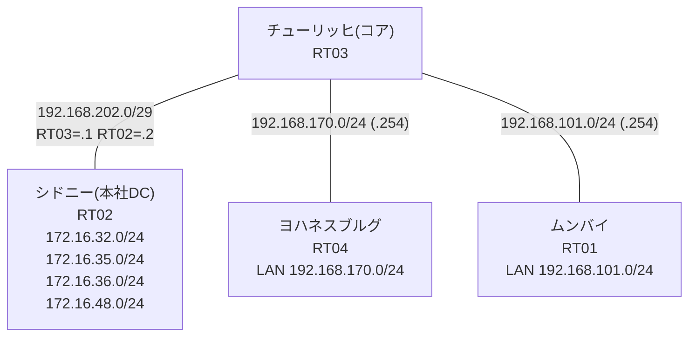

# 問題 20260802-003 : ポリシーベースルーティングの分析

> **本問は機器に接続せずに解答すること。追加の show 実行は認めない。**

## トポロジ

コアルータでポリシーベースルーティング(PBR)により、各拠点 LAN から本社データセンターの
サービス網への転送を制御しています。コアはサービス網への経路情報を持たず、
ポリシーに一致したトラフィックのみが next-hop へ転送されます。



## 要件

1. 本作業は日中帯のため、対象外機器への設定変更は行わないこと。
2. PBR の適用ポイント(インタフェース)と next-hop の設計は変更しないこと。
3. 検証・隔離網 `172.16.36.0/24`・`172.16.48.0/24` へは、ポリシー転送を行わないこと(到達不能が正)。
4. ポリシー対象の指定は、1つの ACL エントリでまかなうこと。
5. ヨハネスブルグ・ムンバイ の各拠点から、業務サービス網 `172.16.32.0/24`・`172.16.35.0/24` へ到達できること。

## 現在の状態

ヨハネスブルグ拠点のサービス到達性が要件どおりでないと報告されています。ムンバイ拠点は要件どおりに動作しています。意図した動作ではありません。示された出力を参照してください。

```
RT04# ping 172.16.32.1 repeat 5
Type escape sequence to abort.
Sending 5, 100-byte ICMP Echos to 172.16.32.1, timeout is 2 seconds:
U.U.U
Success rate is 0 percent (0/5)
```
```
RT04# ping 172.16.35.1 repeat 5
Type escape sequence to abort.
Sending 5, 100-byte ICMP Echos to 172.16.35.1, timeout is 2 seconds:
.U.U.
Success rate is 0 percent (0/5)
```
```
RT04# ping 172.16.36.1 repeat 5
Type escape sequence to abort.
Sending 5, 100-byte ICMP Echos to 172.16.36.1, timeout is 2 seconds:
U.U.U
Success rate is 0 percent (0/5)
```
```
RT04# ping 172.16.48.1 repeat 5
Type escape sequence to abort.
Sending 5, 100-byte ICMP Echos to 172.16.48.1, timeout is 2 seconds:
.U.U.
Success rate is 0 percent (0/5)
```
```
RT01# ping 172.16.35.1 repeat 5
Type escape sequence to abort.
Sending 5, 100-byte ICMP Echos to 172.16.35.1, timeout is 2 seconds:
!!!!!
Success rate is 100 percent (5/5), round-trip min/avg/max = 1/2/8 ms
```
```
RT01# ping 172.16.36.1 repeat 5
Type escape sequence to abort.
Sending 5, 100-byte ICMP Echos to 172.16.36.1, timeout is 2 seconds:
U.U.U
Success rate is 0 percent (0/5)
```
```
RT03# show route-map
route-map MAP-A, permit, sequence 10
  Match clauses:
    ip address (access-lists): ACL-A 
  Set clauses:
    ip next-hop 192.168.202.2
  Policy routing matches: 0 packets, 0 bytes
route-map MAP-B, permit, sequence 10
  Match clauses:
    ip address (access-lists): ACL-B 
  Set clauses:
    ip next-hop 192.168.202.2
  Policy routing matches: 5 packets, 570 bytes
```
```
RT03# show access-lists
Extended IP access list ACL-A
    10 permit ip 172.16.32.0 0.0.3.255 192.168.170.0 0.0.0.255
Extended IP access list ACL-B
    10 permit ip 192.168.101.0 0.0.0.255 172.16.32.0 0.0.3.255 (5 matches)
```

## 設定抜粋

```
RT03# show running-config | section interface
interface Ethernet0/0
 ip address 192.168.202.1 255.255.255.248
interface Ethernet0/1
 ip address 192.168.170.254 255.255.255.0
 ip policy route-map MAP-A
interface Ethernet0/2
 ip address 192.168.101.254 255.255.255.0
 ip policy route-map MAP-B
interface Ethernet0/3
 description === MGMT (Ansible) ===
 vrf forwarding MGMT
 ip address 10.1.10.36 255.255.255.192
```
```
RT03# show running-config | section route-map|access-list
ip policy route-map MAP-A
 ip policy route-map MAP-B
ip access-list extended ACL-A
 10 permit ip 172.16.32.0 0.0.3.255 192.168.170.0 0.0.0.255
ip access-list extended ACL-B
 10 permit ip 192.168.101.0 0.0.0.255 172.16.32.0 0.0.3.255
route-map MAP-A permit 10 
 match ip address ACL-A
 set ip next-hop 192.168.202.2
route-map MAP-B permit 10 
 match ip address ACL-B
 set ip next-hop 192.168.202.2
```
```
RT02# show running-config | section interface|ip route
interface Loopback0
 ip address 172.16.32.1 255.255.255.0
interface Loopback1
 ip address 172.16.35.1 255.255.255.0
interface Loopback2
 ip address 172.16.36.1 255.255.255.0
interface Loopback3
 ip address 172.16.48.1 255.255.255.0
interface Ethernet0/0
 ip address 192.168.202.2 255.255.255.248
interface Ethernet0/1
 no ip address
 shutdown
interface Ethernet0/2
 no ip address
 shutdown
interface Ethernet0/3
 description === MGMT (Ansible) ===
 vrf forwarding MGMT
 ip address 10.1.10.35 255.255.255.192
ip route 192.168.101.0 255.255.255.0 192.168.202.1
ip route 192.168.170.0 255.255.255.0 192.168.202.1
```
```
RT04# show running-config | section interface|ip route
interface Ethernet0/0
 ip address 192.168.170.1 255.255.255.0
interface Ethernet0/1
 no ip address
 shutdown
interface Ethernet0/2
 no ip address
 shutdown
interface Ethernet0/3
 description === MGMT (Ansible) ===
 vrf forwarding MGMT
 ip address 10.1.10.37 255.255.255.192
ip route 0.0.0.0 0.0.0.0 192.168.170.254
```
```
RT01# show running-config | section interface|ip route
interface Ethernet0/0
 ip address 192.168.101.1 255.255.255.0
interface Ethernet0/1
 no ip address
 shutdown
interface Ethernet0/2
 no ip address
 shutdown
interface Ethernet0/3
 description === MGMT (Ansible) ===
 vrf forwarding MGMT
 ip address 10.1.10.34 255.255.255.192
ip route 0.0.0.0 0.0.0.0 192.168.101.254
```

## 設問

この問題を解決し、下記の要件をすべて満たすために必要な手順はどれですか。(1つ選択)

## 選択肢

A. ACL-A を「permit ip 192.168.170.0 0.0.0.255 172.16.32.0 0.0.0.255」「permit ip 192.168.170.0 0.0.0.255 172.16.35.0 0.0.0.255」の2行に置き換える
B. MAP-A の match を「match ip address prefix-list PL-A」に変更する(PL-A: 172.16.32.0/24 と 172.16.35.0/24 を permit)
C. ACL-A を「permit ip 192.168.170.0 0.0.0.255 172.16.32.0 0.0.16.255」の1行に置き換える
D. MAP-A の match を「match ip address ACL-A」に設定し直す
E. ACL-A を「permit ip 192.168.170.0 0.0.0.255 172.16.32.0 0.0.1.255」の1行に置き換える
F. ACL-A を「permit ip 192.168.170.0 0.0.0.255 172.16.32.0 0.0.3.255」の1行に置き換える
G. ACL-A を「deny ip 192.168.170.0 0.0.0.255 172.16.36.0 0.0.0.255」「permit ip 192.168.170.0 0.0.0.255 172.16.32.0 0.0.7.255」の2行(deny 先行)に置き換える
