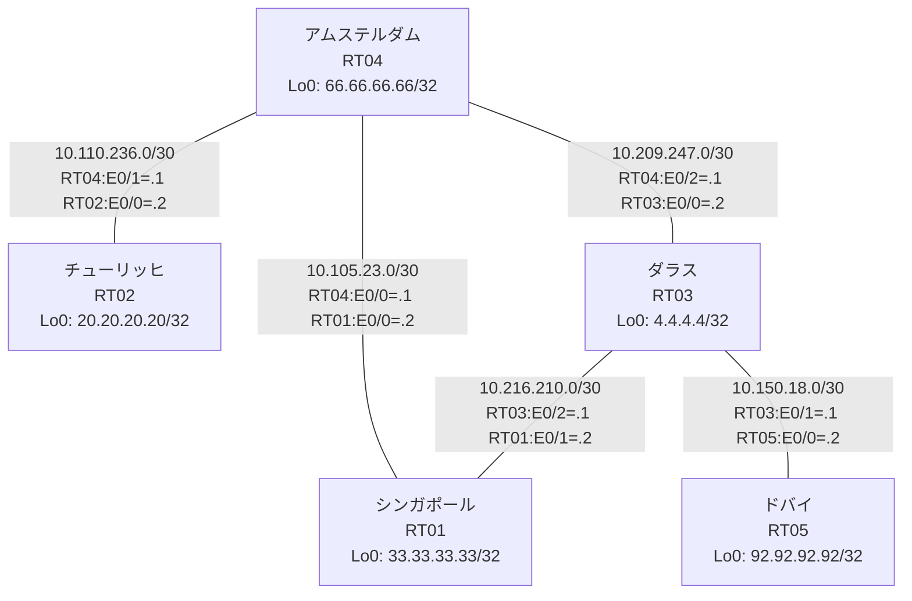

# 問題 20260802-010 : ルーティング到達性の分析

> **本問は機器に接続せずに解答すること。追加の show 実行は認めない。**

## トポロジ

あなたの会社のネットワークは、複数のルーティング・ドメインが、境界のルータによって接続され、
そして、相互の再配送という手段によって、すべての拠点の到達可能性が提供されている、というものです。
ルーティングの設計の詳細は、示されているところのコンフィギュレーションから、読み取られることが、期待されています。
各拠点のルータと、拠点の網との対応は、下記の表に示されているとおりです(拠点の網の代表は、当該ルータのループバック 0 です)。



| 拠点 | ルータ | 拠点網(代表アドレス) |
|------|--------|----------------------|
| アムステルダム | RT04 | `66.66.66.66/32` |
| シンガポール | RT01 | `33.33.33.33/32` |
| ダラス | RT03 | `4.4.4.4/32` |
| チューリッヒ | RT02 | `20.20.20.20/32` |
| ドバイ | RT05 | `92.92.92.92/32` |

リンク一覧(接続・アドレス):
```
  RT04:E0/0(.1) ── RT01:E0/0(.2)   10.105.23.0/30
  RT04:E0/1(.1) ── RT02:E0/0(.2)   10.110.236.0/30
  RT04:E0/2(.1) ── RT03:E0/0(.2)   10.209.247.0/30
  RT03:E0/1(.1) ── RT05:E0/0(.2)   10.150.18.0/30
  RT03:E0/2(.1) ── RT01:E0/1(.2)   10.216.210.0/30
```

## 要件

1. いずれのサイトからも、他のすべてのサイトのネットワークへの、IP リーチアビリティが、確保されていること。
2. 管理のための構成(SSH / SNMP / NTP)に対して、変更が加えられてはなりません。
3. 再配送に対するフィルタ(route-map / distribute-list)の適用は、禁止されているところのものです。
4. スタティック・ルートおよび既定のルートによる迂回は、実施されてはなりません。
5. redistribute の参照先は、実在する隣接のプロセス/AS に限定され、無効な参照のステートメントが、コンフィギュレーションに残されてはなりません。
6. シード・メトリック `10000 10 255 1 1500` の付与は、default-metric の方式に統一されなければなりません(redistribute のステートメントへの直接の記述は、認められていません)。

## 現在の状態

チューリッヒのサイトのユーザーが、ドバイのサイトへ到達することが、できない、ということが、報告されています。影響を受けている範囲の全体は、まだ把握されていません。これは、意図された動作ではありません。示されているところの出力を、参照してください。

```
RT02# show ip route
Gateway of last resort is not set
      10.0.0.0/8 is variably subnetted, 2 subnets, 2 masks
C        10.110.236.0/30 is directly connected, Ethernet0/0
L        10.110.236.2/32 is directly connected, Ethernet0/0
      20.0.0.0/32 is subnetted, 1 subnets
C        20.20.20.20 is directly connected, Loopback0
      66.0.0.0/32 is subnetted, 1 subnets
D        66.66.66.66 [90/409600] via 10.110.236.1, 00:04:26, Ethernet0/0
```
```
RT05# show ip route
Gateway of last resort is not set
      4.0.0.0/32 is subnetted, 1 subnets
D        4.4.4.4 [90/409600] via 10.150.18.1, 00:04:39, Ethernet0/0
      10.0.0.0/8 is variably subnetted, 6 subnets, 2 masks
D EX     10.105.23.0/30 [170/284160] via 10.150.18.1, 00:04:29, Ethernet0/0
D EX     10.110.236.0/30 [170/284160] via 10.150.18.1, 00:04:29, Ethernet0/0
C        10.150.18.0/30 is directly connected, Ethernet0/0
L        10.150.18.2/32 is directly connected, Ethernet0/0
D EX     10.209.247.0/30 [170/284160] via 10.150.18.1, 00:04:39, Ethernet0/0
D EX     10.216.210.0/30 [170/284160] via 10.150.18.1, 00:04:39, Ethernet0/0
      20.0.0.0/32 is subnetted, 1 subnets
D EX     20.20.20.20 [170/284160] via 10.150.18.1, 00:04:29, Ethernet0/0
      33.0.0.0/32 is subnetted, 1 subnets
D EX     33.33.33.33 [170/284160] via 10.150.18.1, 00:04:08, Ethernet0/0
      66.0.0.0/32 is subnetted, 1 subnets
D EX     66.66.66.66 [170/284160] via 10.150.18.1, 00:04:29, Ethernet0/0
      92.0.0.0/32 is subnetted, 1 subnets
C        92.92.92.92 is directly connected, Loopback0
```
```
RT01# show ip route
Gateway of last resort is not set
      4.0.0.0/32 is subnetted, 1 subnets
O        4.4.4.4 [110/11] via 10.216.210.1, 00:04:24, Ethernet0/1
      10.0.0.0/8 is variably subnetted, 7 subnets, 2 masks
C        10.105.23.0/30 is directly connected, Ethernet0/0
L        10.105.23.2/32 is directly connected, Ethernet0/0
O E2     10.110.236.0/30 [110/20] via 10.105.23.1, 00:04:22, Ethernet0/0
O E2     10.150.18.0/30 [110/20] via 10.216.210.1, 00:04:24, Ethernet0/1
O        10.209.247.0/30 [110/20] via 10.216.210.1, 00:04:24, Ethernet0/1
                         [110/20] via 10.105.23.1, 00:04:22, Ethernet0/0
C        10.216.210.0/30 is directly connected, Ethernet0/1
L        10.216.210.2/32 is directly connected, Ethernet0/1
      20.0.0.0/32 is subnetted, 1 subnets
O E2     20.20.20.20 [110/20] via 10.105.23.1, 00:04:22, Ethernet0/0
      33.0.0.0/32 is subnetted, 1 subnets
C        33.33.33.33 is directly connected, Loopback0
      66.0.0.0/32 is subnetted, 1 subnets
O        66.66.66.66 [110/11] via 10.105.23.1, 00:04:22, Ethernet0/0
      92.0.0.0/32 is subnetted, 1 subnets
O E2     92.92.92.92 [110/20] via 10.216.210.1, 00:04:24, Ethernet0/1
```
```
RT04# show route-map
route-map RM-LEGACY1, deny, sequence 10
  Match clauses:
    ip address prefix-lists: PL-LEGACY1 
  Set clauses:
  Policy routing matches: 0 packets, 0 bytes
route-map RM-LEGACY1, permit, sequence 20
  Match clauses:
  Set clauses:
  Policy routing matches: 0 packets, 0 bytes
```
```
RT04# show ip prefix-list
ip prefix-list PL-LEGACY1: 2 entries
   seq 5 deny 33.33.33.33/32
   seq 10 permit 0.0.0.0/0 le 32
```
```
RT04# show access-lists
Standard IP access list 19
    10 deny   33.33.33.33
    20 permit any
```

## 設定抜粋

```
RT01# show running-config | section router
router ospf 89
 router-id 33.33.33.33
 network 10.105.23.0 0.0.0.3 area 0
 network 10.216.210.0 0.0.0.3 area 0
 network 33.33.33.33 0.0.0.0 area 0
```
```
RT02# show running-config | section router
router eigrp 527
 network 10.110.236.0 0.0.0.3
 network 20.20.20.20 0.0.0.0
 passive-interface Loopback0
```
```
RT03# show running-config | section router
router eigrp 298
 default-metric 10000 10 255 1 1500
 network 4.4.4.4 0.0.0.0
 network 10.150.18.0 0.0.0.3
 redistribute ospf 89 match internal external 1 external 2
router ospf 89
 router-id 4.4.4.4
 redistribute eigrp 298
 passive-interface Loopback0
 network 4.4.4.4 0.0.0.0 area 0
 network 10.209.247.0 0.0.0.3 area 0
 network 10.216.210.0 0.0.0.3 area 0
```
```
RT04# show running-config | section router
router eigrp 527
 network 10.110.236.0 0.0.0.3
 network 66.66.66.66 0.0.0.0
 redistribute ospf 89 match internal external 1 external 2
router ospf 89
 router-id 66.66.66.66
 timers throttle spf 50 200 5000
 redistribute eigrp 527
 passive-interface Loopback0
 network 10.105.23.0 0.0.0.3 area 0
 network 10.209.247.0 0.0.0.3 area 0
 network 66.66.66.66 0.0.0.0 area 0
```
```
RT05# show running-config | section router
router eigrp 298
 network 10.150.18.0 0.0.0.3
 network 92.92.92.92 0.0.0.0
```

## 設問

この事象の原因である可能性が、最も高いものは、どれですか。(1つを選択してください)

## 選択肢

A. RT02 の router eigrp 527 に Loopback0 の network 文が設定されていない
B. RT04 の router eigrp 527 配下に redistribute が設定されていない
C. RT04 の route-map RM-LEGACY1 が対象の経路を拒否している
D. RT04 の router eigrp 527 に default-metric が設定されていない
E. RT04 の router eigrp 527 配下の redistribute が、実在しないプロセス/AS を参照している
F. RT02 の router eigrp 527 で、上流側インタフェースが passive-interface に設定されている
