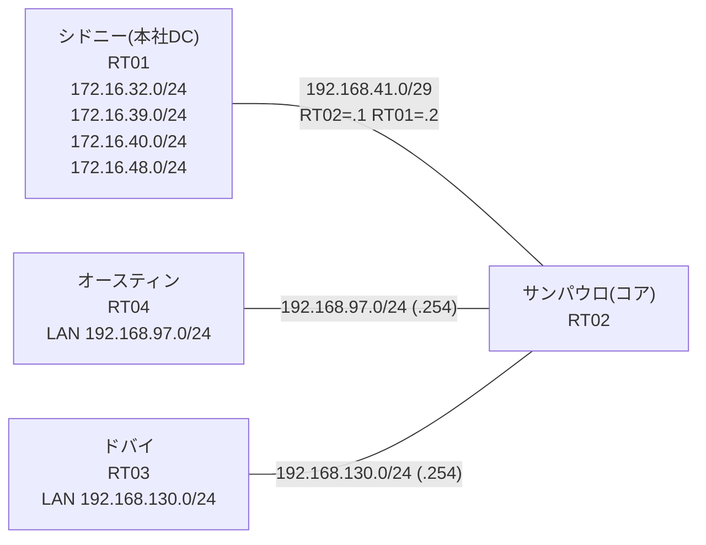

# 問題 20260803-001 : ポリシーによるルーティングのための分析

> **本問は機器に接続せずに解答すること。追加の show 実行は認めない。**

## トポロジ

コアのルータにおいて、ポリシー・ベース・ルーティング(PBR)という手段によって、
それぞれのサイトの LAN から、本社のデータ・センターのサービスのネットワークへの転送が、
制御されています。コアは、サービスのネットワークへのルーティングの情報を保持しておらず、
そして、ポリシーに一致したトラフィックのみが、ネクスト・ホップへ転送されます。



## 要件

1. 本作業は、日中の時間帯において実施されるという理由により、対象外であるところのデバイスに対する構成の変更は、許可されていません。
2. アクセス・リストは、対象であるところのネットワークのみに、一致させなければなりません(対象外を含む指定は、監査に適合しません)。
3. オースティン および ドバイ のそれぞれのサイトから、業務のサービスのネットワーク `172.16.32.0/24`・`172.16.39.0/24` へ、到達することができること。
4. 検証および隔離のためのネットワーク `172.16.40.0/24`・`172.16.48.0/24` へは、ポリシーによる転送が、実施されてはなりません(到達が不可能であることが、正しい状態です)。
5. PBR が適用されるポイント(インターフェイス)およびネクスト・ホップの設計は、変更されてはなりません。

## 現在の状態

オースティンのサイトのサービスへの到達可能性が、要件において示されているとおりではない、ということが、報告されています。ドバイのサイトは、要件のとおりに、動作しています。これは、意図された動作ではありません。示されているところの出力を、参照してください。

```
RT04# ping 172.16.32.1 repeat 5
Type escape sequence to abort.
Sending 5, 100-byte ICMP Echos to 172.16.32.1, timeout is 2 seconds:
U.U.U
Success rate is 0 percent (0/5)
```
```
RT04# ping 172.16.39.1 repeat 5
Type escape sequence to abort.
Sending 5, 100-byte ICMP Echos to 172.16.39.1, timeout is 2 seconds:
.U.U.
Success rate is 0 percent (0/5)
```
```
RT04# ping 172.16.40.1 repeat 5
Type escape sequence to abort.
Sending 5, 100-byte ICMP Echos to 172.16.40.1, timeout is 2 seconds:
U.U.U
Success rate is 0 percent (0/5)
```
```
RT04# ping 172.16.48.1 repeat 5
Type escape sequence to abort.
Sending 5, 100-byte ICMP Echos to 172.16.48.1, timeout is 2 seconds:
.U.U.
Success rate is 0 percent (0/5)
```
```
RT03# ping 172.16.39.1 repeat 5
Type escape sequence to abort.
Sending 5, 100-byte ICMP Echos to 172.16.39.1, timeout is 2 seconds:
!!!!!
Success rate is 100 percent (5/5), round-trip min/avg/max = 1/1/1 ms
```
```
RT03# ping 172.16.40.1 repeat 5
Type escape sequence to abort.
Sending 5, 100-byte ICMP Echos to 172.16.40.1, timeout is 2 seconds:
U.U.U
Success rate is 0 percent (0/5)
```
```
RT02# show route-map
route-map MAP-A, permit, sequence 10
  Match clauses:
    ip address (access-lists): ACL-A 
  Set clauses:
    ip next-hop 192.168.41.2
  Policy routing matches: 0 packets, 0 bytes
route-map MAP-B, permit, sequence 10
  Match clauses:
    ip address (access-lists): ACL-B 
  Set clauses:
    ip next-hop 192.168.41.2
  Policy routing matches: 5 packets, 570 bytes
```
```
RT02# show access-lists
Extended IP access list ACL-A
    10 permit ip 172.16.32.0 0.0.0.255 192.168.97.0 0.0.0.255
    20 permit ip 172.16.39.0 0.0.0.255 192.168.97.0 0.0.0.255
Extended IP access list ACL-B
    10 permit ip 192.168.130.0 0.0.0.255 172.16.32.0 0.0.0.255
    20 permit ip 192.168.130.0 0.0.0.255 172.16.39.0 0.0.0.255 (5 matches)
```

## 設定抜粋

```
RT02# show running-config | section interface
interface Ethernet0/0
 ip address 192.168.41.1 255.255.255.248
interface Ethernet0/1
 ip address 192.168.97.254 255.255.255.0
 ip policy route-map MAP-A
interface Ethernet0/2
 ip address 192.168.130.254 255.255.255.0
 ip policy route-map MAP-B
interface Ethernet0/3
 description === MGMT (Ansible) ===
 vrf forwarding MGMT
 ip address 10.1.10.20 255.255.255.192
```
```
RT02# show running-config | section route-map|access-list
ip policy route-map MAP-A
 ip policy route-map MAP-B
ip access-list extended ACL-A
 10 permit ip 172.16.32.0 0.0.0.255 192.168.97.0 0.0.0.255
 20 permit ip 172.16.39.0 0.0.0.255 192.168.97.0 0.0.0.255
ip access-list extended ACL-B
 10 permit ip 192.168.130.0 0.0.0.255 172.16.32.0 0.0.0.255
 20 permit ip 192.168.130.0 0.0.0.255 172.16.39.0 0.0.0.255
route-map MAP-A permit 10 
 match ip address ACL-A
 set ip next-hop 192.168.41.2
route-map MAP-B permit 10 
 match ip address ACL-B
 set ip next-hop 192.168.41.2
```
```
RT01# show running-config | section interface|ip route
interface Loopback0
 ip address 172.16.32.1 255.255.255.0
interface Loopback1
 ip address 172.16.39.1 255.255.255.0
interface Loopback2
 ip address 172.16.40.1 255.255.255.0
interface Loopback3
 ip address 172.16.48.1 255.255.255.0
interface Ethernet0/0
 ip address 192.168.41.2 255.255.255.248
interface Ethernet0/1
 no ip address
 shutdown
interface Ethernet0/2
 no ip address
 shutdown
interface Ethernet0/3
 description === MGMT (Ansible) ===
 vrf forwarding MGMT
 ip address 10.1.10.19 255.255.255.192
ip route 192.168.97.0 255.255.255.0 192.168.41.1
ip route 192.168.130.0 255.255.255.0 192.168.41.1
```
```
RT04# show running-config | section interface|ip route
interface Ethernet0/0
 ip address 192.168.97.1 255.255.255.0
interface Ethernet0/1
 no ip address
 shutdown
interface Ethernet0/2
 no ip address
 shutdown
interface Ethernet0/3
 description === MGMT (Ansible) ===
 vrf forwarding MGMT
 ip address 10.1.10.32 255.255.255.192
ip route 0.0.0.0 0.0.0.0 192.168.97.254
```
```
RT03# show running-config | section interface|ip route
interface Ethernet0/0
 ip address 192.168.130.1 255.255.255.0
interface Ethernet0/1
 no ip address
 shutdown
interface Ethernet0/2
 no ip address
 shutdown
interface Ethernet0/3
 description === MGMT (Ansible) ===
 vrf forwarding MGMT
 ip address 10.1.10.31 255.255.255.192
ip route 0.0.0.0 0.0.0.0 192.168.130.254
```

## 設問

この問題を解決し、そして、示されているところのすべての要件が満たされることを確実にするために、必要とされる手順は、どれですか。(1つを選択してください)

## 選択肢

A. MAP-A の match を「match ip address prefix-list PL-A」に変更する(PL-A: 172.16.32.0/24 と 172.16.39.0/24 を permit)
B. ACL-A を「permit ip 192.168.97.0 0.0.0.255 172.16.32.0 0.0.3.255」の1行に置き換える
C. ACL-A を「permit ip 192.168.97.0 0.0.0.255 172.16.32.0 0.0.0.255」「permit ip 192.168.97.0 0.0.0.255 172.16.39.0 0.0.0.255」の2行に置き換える
D. ACL-A を「permit ip 192.168.97.0 0.0.0.255 172.16.32.0 0.0.7.255」の1行に置き換える
E. MAP-A の match を「match ip address ACL-A」に設定し直す
F. ACL-A を「deny ip 192.168.97.0 0.0.0.255 172.16.40.0 0.0.0.255」「permit ip 192.168.97.0 0.0.0.255 172.16.32.0 0.0.15.255」の2行(deny 先行)に置き換える
G. ACL-A を「permit ip 192.168.97.0 0.0.0.255 172.16.32.0 0.0.16.255」の1行に置き換える
