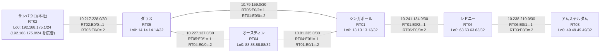

# 問題 20260803-002 : ルーティング到達性の分析

> **本問は機器に接続せずに解答すること。追加の show 実行は認めない。**

## トポロジ

本社(サンパウロ)の顧客のネットワークは、BGP AS 65206 の RT02 によって、広告されています。
あなたの会社の内部は、BGP / EIGRP / OSPF という 3 つのドメインから構成されており、そして、境界のいずれかにおいて、再配送が実施されています。
サイトと、ルータおよびアドレスとの対応は、下記の表に示されているとおりです。



| 拠点 | ルータ | 拠点網 / 広告網 |
|------|--------|------------------|
| アムステルダム | RT03 | 49.49.49.49/32 |
| オースティン | RT04 | 88.88.88.88/32 |
| サンパウロ(本社) | RT02 | 192.168.175.1/24 (`192.168.175.0/24` を広告) |
| シドニー | RT06 | 63.63.63.63/32 |
| シンガポール | RT01 | 13.13.13.13/32 |
| ダラス | RT05 | 14.14.14.14/32 |

リンク一覧(接続・アドレス):
```
  RT02:E0/0(.1) ── RT05:E0/0(.2)   10.217.228.0/30
  RT05:E0/1(.1) ── RT04:E0/0(.2)   10.227.137.0/30
  RT05:E0/2(.1) ── RT01:E0/0(.2)   10.79.159.0/30
  RT04:E0/1(.1) ── RT01:E0/1(.2)   10.81.235.0/30
  RT01:E0/2(.1) ── RT06:E0/0(.2)   10.241.134.0/30
  RT06:E0/1(.1) ── RT03:E0/0(.2)   10.238.219.0/30
```

## 要件

1. 管理のための構成(SSH / SNMP / NTP)に対して、変更が加えられてはなりません。
2. 管理距離(administrative distance)の変更は、監査のポリシーによって、禁止されているところのものです。
3. `192.168.175.0/24` 宛のパケットが、広告元である RT02 の方向へ転送され、そして、転送のループが存在していないこと。
4. 既存の再配送の設計(それぞれの境界の redistribute)が、変更または撤去されてはなりません。スタティック・ルートによる回避も、許可されていません。
5. すべてのルータが、`192.168.175.0/24` を含むところのすべての宛先(それぞれのループバック)へ、到達することができること。
6. スタティック・ルートおよび既定のルートによる迂回は、実施されてはなりません。

## 現在の状態

複数のサイトから、本社(サンパウロ)の顧客のネットワーク宛の通信が、タイムアウトする、ということが、報告されています。
サイトの間(サイトのネットワークどうし)の通信は、正常です。
これは、意図された動作ではありません。示されているところの出力を、参照してください。

```
RT05# show ip route
Gateway of last resort is not set
      10.0.0.0/8 is variably subnetted, 9 subnets, 2 masks
C        10.79.159.0/30 is directly connected, Ethernet0/2
L        10.79.159.1/32 is directly connected, Ethernet0/2
O        10.81.235.0/30 [110/20] via 10.79.159.2, 00:04:08, Ethernet0/2
C        10.217.228.0/30 is directly connected, Ethernet0/0
L        10.217.228.2/32 is directly connected, Ethernet0/0
C        10.227.137.0/30 is directly connected, Ethernet0/1
L        10.227.137.1/32 is directly connected, Ethernet0/1
O        10.238.219.0/30 [110/30] via 10.79.159.2, 00:04:14, Ethernet0/2
O        10.241.134.0/30 [110/20] via 10.79.159.2, 00:04:19, Ethernet0/2
      13.0.0.0/32 is subnetted, 1 subnets
O        13.13.13.13 [110/11] via 10.79.159.2, 00:04:40, Ethernet0/2
      14.0.0.0/32 is subnetted, 1 subnets
C        14.14.14.14 is directly connected, Loopback0
      49.0.0.0/32 is subnetted, 1 subnets
O        49.49.49.49 [110/31] via 10.79.159.2, 00:04:05, Ethernet0/2
      63.0.0.0/32 is subnetted, 1 subnets
O        63.63.63.63 [110/21] via 10.79.159.2, 00:04:14, Ethernet0/2
      88.0.0.0/32 is subnetted, 1 subnets
O        88.88.88.88 [110/21] via 10.79.159.2, 00:04:03, Ethernet0/2
D EX  192.168.175.0/24 [170/307200] via 10.227.137.2, 00:03:48, Ethernet0/1
```
```
RT05# show route-map
route-map RM-MIGR1, deny, sequence 10
  Match clauses:
    ip address prefix-lists: PL-MIGR1 
  Set clauses:
  Policy routing matches: 0 packets, 0 bytes
route-map RM-MIGR1, permit, sequence 20
  Match clauses:
  Set clauses:
  Policy routing matches: 0 packets, 0 bytes
```
```
RT05# show ip prefix-list
ip prefix-list PL-MIGR1: 2 entries
   seq 5 deny 49.49.49.49/32
   seq 10 permit 0.0.0.0/0 le 32
```
```
RT05# show access-lists
Standard IP access list 81
    10 deny   49.49.49.49
    20 permit any
```
```
RT05# show ip bgp
BGP table version is 12, local router ID is 14.14.14.14
Status codes: s suppressed, d damped, h history, * valid, > best, i - internal, 
              r RIB-failure, S Stale, m multipath, b backup-path, f RT-Filter, 
              x best-external, a additional-path, c RIB-compressed, 
              t secondary path, L long-lived-stale,
Origin codes: i - IGP, e - EGP, ? - incomplete
RPKI validation codes: V valid, I invalid, N Not found

     Network          Next Hop            Metric LocPrf Weight Path
 *>   10.79.159.0/30   0.0.0.0                  0         32768 ?
 *>   10.81.235.0/30   10.79.159.2             20         32768 ?
 *>   10.238.219.0/30  10.79.159.2             30         32768 ?
 *>   10.241.134.0/30  10.79.159.2             20         32768 ?
 *>   13.13.13.13/32   10.79.159.2             11         32768 ?
 *>   14.14.14.14/32   0.0.0.0                  0         32768 i
 *>   49.49.49.49/32   10.79.159.2             31         32768 ?
 *>   63.63.63.63/32   10.79.159.2             21         32768 ?
 *>   88.88.88.88/32   10.79.159.2             21         32768 ?
 r>i  192.168.175.0    10.217.228.1             0    100      0 i
```
```
RT03# traceroute 192.168.175.1 probe 1 timeout 1 ttl 1 8
Type escape sequence to abort.
Tracing the route to 192.168.175.1
VRF info: (vrf in name/id, vrf out name/id)
  1 10.238.219.1 1 msec
  2 10.241.134.1 1 msec
  3 10.79.159.1 34 msec
  4 10.227.137.2 2 msec
  5 10.81.235.2 4 msec
  6 10.79.159.1 2 msec
  7 10.227.137.2 2 msec
  8 10.81.235.2 2 msec
```

## 設定抜粋

```
RT05# show running-config | section router
router eigrp 637
 timers active-time 5
 network 10.227.137.0 0.0.0.3
 passive-interface Loopback0
router ospf 87
 router-id 14.14.14.14
 redistribute eigrp 637
 redistribute bgp 65206
 network 10.79.159.0 0.0.0.3 area 0
 network 14.14.14.14 0.0.0.0 area 0
router bgp 65206
 bgp router-id 14.14.14.14
 bgp log-neighbor-changes
 bgp redistribute-internal
 network 14.14.14.14 mask 255.255.255.255
 redistribute ospf 87
 neighbor 10.217.228.1 remote-as 65206
```
```
RT04# show running-config | section router
router eigrp 637
 network 10.227.137.0 0.0.0.3
 redistribute ospf 87 metric 100000 100 255 1 1500
router ospf 87
 router-id 88.88.88.88
 redistribute eigrp 637
 network 10.81.235.0 0.0.0.3 area 0
 network 88.88.88.88 0.0.0.0 area 0
```
```
RT01# show running-config | section router
router ospf 87
 router-id 13.13.13.13
 passive-interface Loopback0
 network 10.79.159.0 0.0.0.3 area 0
 network 10.81.235.0 0.0.0.3 area 0
 network 10.241.134.0 0.0.0.3 area 0
 network 13.13.13.13 0.0.0.0 area 0
```
```
RT02# show running-config | section router
router bgp 65206
 bgp router-id 192.168.175.1
 bgp log-neighbor-changes
 network 192.168.175.0
 neighbor 10.217.228.2 remote-as 65206
```

## 設問

この問題を解決し、上記の要件をすべて満たすために必要な手順はどれですか。(1つ選択)

## 選択肢

A. RT05 の router ospf 87 配下の「redistribute bgp 65206 ...」に `192.168.175.0/24` を deny する route-map を適用する
B. RT05 で「clear ip bgp *」および「clear ip route *」を実行する
C. RT05 で `192.168.175.0/24` のみ deny(他は permit)の prefix-list PL-BLOCK を作成し、router eigrp 637 配下に「distribute-list prefix PL-BLOCK in」を適用する
D. RT04 の相互再配送(redistribute)の両方向に `192.168.175.0/24` を deny する route-map を適用する
E. RT05 の router bgp 65206 配下に「distance bgp 20 165 165」を設定し、clear ip route * を実行する
F. RT05 の router bgp 65206 配下から「bgp redistribute-internal」を削除する
