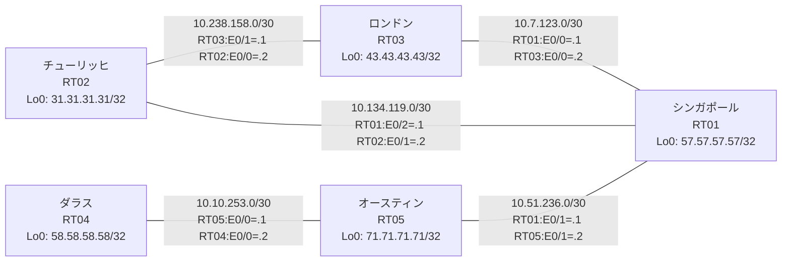

# 問題 20260803-003 : ルーティング到達性の分析

> **本問は機器に接続せずに解答すること。追加の show 実行は認めない。**

## トポロジ

あなたの会社のネットワークは、複数のルーティング・ドメインが、境界のルータによって接続され、
そして、相互の再配送という手段によって、すべての拠点のリーチアビリティが提供されている、というものです。
ルーティングの設計の詳細は、示されているところのコンフィギュレーションから、読み取られることが、期待されています。
各拠点のルータと、拠点の網との対応は、下記の表に示されているとおりです(拠点の網の代表は、当該ルータのループバック 0 です)。



| 拠点 | ルータ | 拠点網(代表アドレス) |
|------|--------|----------------------|
| オースティン | RT05 | `71.71.71.71/32` |
| シンガポール | RT01 | `57.57.57.57/32` |
| ダラス | RT04 | `58.58.58.58/32` |
| チューリッヒ | RT02 | `31.31.31.31/32` |
| ロンドン | RT03 | `43.43.43.43/32` |

リンク一覧(接続・アドレス):
```
  RT01:E0/0(.1) ── RT03:E0/0(.2)   10.7.123.0/30
  RT05:E0/0(.1) ── RT04:E0/0(.2)   10.10.253.0/30
  RT03:E0/1(.1) ── RT02:E0/0(.2)   10.238.158.0/30
  RT01:E0/1(.1) ── RT05:E0/1(.2)   10.51.236.0/30
  RT01:E0/2(.1) ── RT02:E0/1(.2)   10.134.119.0/30
```

## 要件

1. 各サイトのネットワーク(ループバック 0)は、ドメインをまたいで、すべてのサイトから、到達されることができること。
2. redistribute によって参照されるところのプロセス ID / AS 番号は、その境界に実在する隣接のドメインのものと一致させられ、そして、実在しないプロセスへの参照が、残置されてはなりません。
3. EIGRP へのルートの注入においては、redistribute のステートメントにおいて、シード・メトリック `100000 100 255 1 1500` が、直接に指定されなければなりません(default-metric による代替は、社内の標準の外にあるものです)。
4. 再配送に対するフィルタ(route-map / distribute-list)の適用は、禁止されているところのものです。
5. スタティック・ルートおよび既定のルートによる迂回は、実施されてはなりません。

## 現在の状態

シンガポールのサイトのユーザーが、ダラスのサイトへ到達することが、できない、ということが、報告されています。影響を受けている範囲の全体は、まだ把握されていません。これは、意図された動作ではありません。示されているところの出力を、参照してください。

```
RT01# show ip route
Gateway of last resort is not set
      10.0.0.0/8 is variably subnetted, 7 subnets, 2 masks
C        10.7.123.0/30 is directly connected, Ethernet0/0
L        10.7.123.1/32 is directly connected, Ethernet0/0
C        10.51.236.0/30 is directly connected, Ethernet0/1
L        10.51.236.1/32 is directly connected, Ethernet0/1
C        10.134.119.0/30 is directly connected, Ethernet0/2
L        10.134.119.1/32 is directly connected, Ethernet0/2
D        10.238.158.0/30 [90/307200] via 10.134.119.2, 00:04:23, Ethernet0/2
                         [90/307200] via 10.7.123.2, 00:04:23, Ethernet0/0
      31.0.0.0/32 is subnetted, 1 subnets
D        31.31.31.31 [90/409600] via 10.134.119.2, 00:04:23, Ethernet0/2
      43.0.0.0/32 is subnetted, 1 subnets
D        43.43.43.43 [90/409600] via 10.7.123.2, 00:04:23, Ethernet0/0
      57.0.0.0/32 is subnetted, 1 subnets
C        57.57.57.57 is directly connected, Loopback0
      71.0.0.0/32 is subnetted, 1 subnets
D        71.71.71.71 [90/409600] via 10.51.236.2, 00:04:31, Ethernet0/1
```
```
RT04# show ip route
Gateway of last resort is not set
      10.0.0.0/8 is variably subnetted, 6 subnets, 2 masks
O E2     10.7.123.0/30 [110/20] via 10.10.253.1, 00:04:01, Ethernet0/0
C        10.10.253.0/30 is directly connected, Ethernet0/0
L        10.10.253.2/32 is directly connected, Ethernet0/0
O E2     10.51.236.0/30 [110/20] via 10.10.253.1, 00:04:01, Ethernet0/0
O E2     10.134.119.0/30 [110/20] via 10.10.253.1, 00:04:01, Ethernet0/0
O E2     10.238.158.0/30 [110/20] via 10.10.253.1, 00:04:01, Ethernet0/0
      31.0.0.0/32 is subnetted, 1 subnets
O E2     31.31.31.31 [110/20] via 10.10.253.1, 00:04:01, Ethernet0/0
      43.0.0.0/32 is subnetted, 1 subnets
O E2     43.43.43.43 [110/20] via 10.10.253.1, 00:04:01, Ethernet0/0
      57.0.0.0/32 is subnetted, 1 subnets
O E2     57.57.57.57 [110/20] via 10.10.253.1, 00:04:01, Ethernet0/0
      58.0.0.0/32 is subnetted, 1 subnets
C        58.58.58.58 is directly connected, Loopback0
      71.0.0.0/32 is subnetted, 1 subnets
O        71.71.71.71 [110/11] via 10.10.253.1, 00:04:01, Ethernet0/0
```
```
RT03# show ip route
Gateway of last resort is not set
      10.0.0.0/8 is variably subnetted, 6 subnets, 2 masks
C        10.7.123.0/30 is directly connected, Ethernet0/0
L        10.7.123.2/32 is directly connected, Ethernet0/0
D EX     10.51.236.0/30 [170/307200] via 10.7.123.1, 00:05:02, Ethernet0/0
D        10.134.119.0/30 [90/307200] via 10.238.158.2, 00:05:02, Ethernet0/1
                         [90/307200] via 10.7.123.1, 00:05:02, Ethernet0/0
C        10.238.158.0/30 is directly connected, Ethernet0/1
L        10.238.158.1/32 is directly connected, Ethernet0/1
      31.0.0.0/32 is subnetted, 1 subnets
D        31.31.31.31 [90/409600] via 10.238.158.2, 00:05:00, Ethernet0/1
      43.0.0.0/32 is subnetted, 1 subnets
C        43.43.43.43 is directly connected, Loopback0
      57.0.0.0/32 is subnetted, 1 subnets
D        57.57.57.57 [90/409600] via 10.7.123.1, 00:05:02, Ethernet0/0
      71.0.0.0/32 is subnetted, 1 subnets
D EX     71.71.71.71 [170/307200] via 10.7.123.1, 00:05:02, Ethernet0/0
```
```
RT05# show route-map
route-map RM-BACKUP2, deny, sequence 10
  Match clauses:
    ip address prefix-lists: PL-BACKUP2 
  Set clauses:
  Policy routing matches: 0 packets, 0 bytes
route-map RM-BACKUP2, permit, sequence 20
  Match clauses:
  Set clauses:
  Policy routing matches: 0 packets, 0 bytes
route-map RM-LEGACY1, deny, sequence 10
  Match clauses:
    ip address prefix-lists: PL-LEGACY1 
  Set clauses:
  Policy routing matches: 0 packets, 0 bytes
route-map RM-LEGACY1, permit, sequence 20
  Match clauses:
  Set clauses:
  Policy routing matches: 0 packets, 0 bytes
```
```
RT05# show ip prefix-list
ip prefix-list PL-BACKUP2: 2 entries
   seq 5 deny 58.58.58.58/32
   seq 10 permit 0.0.0.0/0 le 32
ip prefix-list PL-LEGACY1: 2 entries
   seq 5 deny 43.43.43.43/32
   seq 10 permit 0.0.0.0/0 le 32
```
```
RT05# show access-lists
Standard IP access list 55
    10 deny   43.43.43.43
    20 permit any
Standard IP access list 63
    10 deny   58.58.58.58
    20 permit any
```

## 設定抜粋

```
RT01# show running-config | section router
router eigrp 847
 network 10.7.123.0 0.0.0.3
 network 10.134.119.0 0.0.0.3
 network 57.57.57.57 0.0.0.0
 redistribute eigrp 468 metric 100000 100 255 1 1500
router eigrp 468
 timers active-time 5
 network 10.51.236.0 0.0.0.3
 network 57.57.57.57 0.0.0.0
 redistribute eigrp 847 metric 100000 100 255 1 1500
 passive-interface Loopback0
```
```
RT02# show running-config | section router
router eigrp 847
 timers active-time 5
 network 10.134.119.0 0.0.0.3
 network 10.238.158.0 0.0.0.3
 network 31.31.31.31 0.0.0.0
 passive-interface Loopback0
```
```
RT03# show running-config | section router
router eigrp 847
 network 10.7.123.0 0.0.0.3
 network 10.238.158.0 0.0.0.3
 network 43.43.43.43 0.0.0.0
```
```
RT04# show running-config | section router
router ospf 87
 router-id 58.58.58.58
 passive-interface Loopback0
 network 10.10.253.0 0.0.0.3 area 0
 network 58.58.58.58 0.0.0.0 area 0
```
```
RT05# show running-config | section router
router eigrp 468
 network 10.51.236.0 0.0.0.3
 network 71.71.71.71 0.0.0.0
 redistribute ospf 87 match internal external 1 external 2
 passive-interface Loopback0
router ospf 87
 router-id 71.71.71.71
 redistribute eigrp 468
 network 10.10.253.0 0.0.0.3 area 0
 network 71.71.71.71 0.0.0.0 area 0
```

## 設問

この問題を解決し、そして、示されているところのすべての要件が満たされることを確実にするために、必要とされる手順は、どれですか。(1つを選択してください)

## 選択肢

A. RT05 で「clear ip route *」を実行する
B. RT05 の router eigrp 468 配下で「redistribute ospf 87 match internal external 1 external 2 metric 100000 100 255 1 1500」を設定する
C. RT05 の router eigrp 468 配下に「default-metric 100000 100 255 1 1500」を追加する
D. RT01 の router eigrp 468 配下で「no passive-interface <上流IF>」を設定する
E. RT05 の router ospf 87 配下の「redistribute eigrp 468」に metric 20 を追加する
F. RT05 の router eigrp 468 配下に「redistribute connected metric 100000 100 255 1 1500」を追加する
