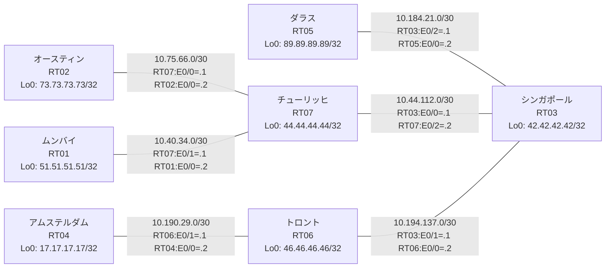

# 問題 20260803-005 : ルーティング到達性の分析

> **本問は機器に接続せずに解答すること。追加の show 実行は認めない。**

## トポロジ

あなたの会社のネットワークは、複数のルーティング・ドメインが、境界のルータによって接続され、
そして、相互の再配送という手段によって、すべてのサイトのリーチアビリティが提供されている、というものです。
ルーティングの設計の詳細は、示されているところのコンフィギュレーションから、読み取られることが、期待されています。
各サイトのルータと、サイトの網との対応は、下記の表に示されているとおりです(サイトの網の代表は、当該ルータのループバック 0 です)。



| 拠点 | ルータ | 拠点網(代表アドレス) |
|------|--------|----------------------|
| アムステルダム | RT04 | `17.17.17.17/32` |
| オースティン | RT02 | `73.73.73.73/32` |
| シンガポール | RT03 | `42.42.42.42/32` |
| ダラス | RT05 | `89.89.89.89/32` |
| チューリッヒ | RT07 | `44.44.44.44/32` |
| トロント | RT06 | `46.46.46.46/32` |
| ムンバイ | RT01 | `51.51.51.51/32` |

リンク一覧(接続・アドレス):
```
  RT07:E0/0(.1) ── RT02:E0/0(.2)   10.75.66.0/30
  RT07:E0/1(.1) ── RT01:E0/0(.2)   10.40.34.0/30
  RT03:E0/0(.1) ── RT07:E0/2(.2)   10.44.112.0/30
  RT03:E0/1(.1) ── RT06:E0/0(.2)   10.194.137.0/30
  RT03:E0/2(.1) ── RT05:E0/0(.2)   10.184.21.0/30
  RT06:E0/1(.1) ── RT04:E0/0(.2)   10.190.29.0/30
```

## 要件

1. スタティック・ルートおよび既定のルートによる迂回は、実施されてはなりません。
2. EIGRP へのルートの注入においては、redistribute のステートメントにおいて、シード・メトリック `10000 10 255 1 1500` が、直接に指定されなければなりません(default-metric による代替は、社内の標準の外にあるものです)。
3. 再配送される経路の、選択的な制限(route-map / distribute-list の適用)は、実施されてはなりません。
4. redistribute によって参照されるところのプロセス ID / AS 番号は、その境界に実在する隣接のドメインのものと一致させられ、そして、実在しないプロセスへの参照が、残置されてはなりません。
5. インタフェースの IP アドレッシングは、変更されてはなりません。
6. いずれのサイトからも、他のすべてのサイトのネットワークへの、IP リーチアビリティが、確保されていること。

## 現在の状態

ムンバイのサイトのユーザーが、ダラスのサイトへ到達することが、できない、ということが、報告されています。影響を受けている範囲の全体は、まだ把握されていません。これは、意図された動作ではありません。示されているところの出力を、参照してください。

```
RT01# show ip route
Gateway of last resort is not set
      10.0.0.0/8 is variably subnetted, 2 subnets, 2 masks
C        10.40.34.0/30 is directly connected, Ethernet0/0
L        10.40.34.2/32 is directly connected, Ethernet0/0
      51.0.0.0/32 is subnetted, 1 subnets
C        51.51.51.51 is directly connected, Loopback0
```
```
RT05# show ip route
Gateway of last resort is not set
      10.0.0.0/8 is variably subnetted, 7 subnets, 2 masks
D EX     10.40.34.0/30 [170/284160] via 10.184.21.1, 00:05:13, Ethernet0/0
D EX     10.44.112.0/30 [170/284160] via 10.184.21.1, 00:05:15, Ethernet0/0
D EX     10.75.66.0/30 [170/284160] via 10.184.21.1, 00:05:13, Ethernet0/0
C        10.184.21.0/30 is directly connected, Ethernet0/0
L        10.184.21.2/32 is directly connected, Ethernet0/0
D        10.190.29.0/30 [90/332800] via 10.184.21.1, 00:05:15, Ethernet0/0
D        10.194.137.0/30 [90/307200] via 10.184.21.1, 00:05:15, Ethernet0/0
      17.0.0.0/32 is subnetted, 1 subnets
D        17.17.17.17 [90/460800] via 10.184.21.1, 00:05:13, Ethernet0/0
      42.0.0.0/32 is subnetted, 1 subnets
D        42.42.42.42 [90/409600] via 10.184.21.1, 00:05:15, Ethernet0/0
      44.0.0.0/32 is subnetted, 1 subnets
D EX     44.44.44.44 [170/284160] via 10.184.21.1, 00:05:13, Ethernet0/0
      46.0.0.0/32 is subnetted, 1 subnets
D        46.46.46.46 [90/435200] via 10.184.21.1, 00:05:15, Ethernet0/0
      51.0.0.0/32 is subnetted, 1 subnets
D EX     51.51.51.51 [170/284160] via 10.184.21.1, 00:04:48, Ethernet0/0
      73.0.0.0/32 is subnetted, 1 subnets
D EX     73.73.73.73 [170/284160] via 10.184.21.1, 00:04:39, Ethernet0/0
      89.0.0.0/32 is subnetted, 1 subnets
C        89.89.89.89 is directly connected, Loopback0
```
```
RT06# show ip route
Gateway of last resort is not set
      10.0.0.0/8 is variably subnetted, 8 subnets, 2 masks
D EX     10.40.34.0/30 [170/284160] via 10.194.137.1, 00:05:31, Ethernet0/0
D EX     10.44.112.0/30 [170/284160] via 10.194.137.1, 00:05:48, Ethernet0/0
D EX     10.75.66.0/30 [170/284160] via 10.194.137.1, 00:05:31, Ethernet0/0
D        10.184.21.0/30 [90/307200] via 10.194.137.1, 00:05:48, Ethernet0/0
C        10.190.29.0/30 is directly connected, Ethernet0/1
L        10.190.29.1/32 is directly connected, Ethernet0/1
C        10.194.137.0/30 is directly connected, Ethernet0/0
L        10.194.137.2/32 is directly connected, Ethernet0/0
      17.0.0.0/32 is subnetted, 1 subnets
D        17.17.17.17 [90/409600] via 10.190.29.2, 00:05:32, Ethernet0/1
      42.0.0.0/32 is subnetted, 1 subnets
D        42.42.42.42 [90/409600] via 10.194.137.1, 00:05:48, Ethernet0/0
      44.0.0.0/32 is subnetted, 1 subnets
D EX     44.44.44.44 [170/284160] via 10.194.137.1, 00:05:31, Ethernet0/0
      46.0.0.0/32 is subnetted, 1 subnets
C        46.46.46.46 is directly connected, Loopback0
      51.0.0.0/32 is subnetted, 1 subnets
D EX     51.51.51.51 [170/284160] via 10.194.137.1, 00:05:06, Ethernet0/0
      73.0.0.0/32 is subnetted, 1 subnets
D EX     73.73.73.73 [170/284160] via 10.194.137.1, 00:04:58, Ethernet0/0
      89.0.0.0/32 is subnetted, 1 subnets
D        89.89.89.89 [90/435200] via 10.194.137.1, 00:05:28, Ethernet0/0
```
```
RT07# show route-map
route-map RM-MIGR1, deny, sequence 10
  Match clauses:
    ip address prefix-lists: PL-MIGR1 
  Set clauses:
  Policy routing matches: 0 packets, 0 bytes
route-map RM-MIGR1, permit, sequence 20
  Match clauses:
  Set clauses:
  Policy routing matches: 0 packets, 0 bytes
route-map RM-BACKUP2, deny, sequence 10
  Match clauses:
    ip address prefix-lists: PL-BACKUP2 
  Set clauses:
  Policy routing matches: 0 packets, 0 bytes
route-map RM-BACKUP2, permit, sequence 20
  Match clauses:
  Set clauses:
  Policy routing matches: 0 packets, 0 bytes
```
```
RT07# show ip prefix-list
ip prefix-list PL-BACKUP2: 2 entries
   seq 5 deny 46.46.46.46/32
   seq 10 permit 0.0.0.0/0 le 32
ip prefix-list PL-MIGR1: 2 entries
   seq 5 deny 51.51.51.51/32
   seq 10 permit 0.0.0.0/0 le 32
```
```
RT07# show access-lists
Standard IP access list 25
    10 deny   51.51.51.51
    20 permit any
Standard IP access list 56
    10 deny   46.46.46.46
    20 permit any
```

## 設定抜粋

```
RT01# show running-config | section router
router ospf 91
 router-id 51.51.51.51
 passive-interface Loopback0
 network 10.40.34.0 0.0.0.3 area 0
 network 51.51.51.51 0.0.0.0 area 0
```
```
RT02# show running-config | section router
router ospf 77
 router-id 73.73.73.73
 network 10.75.66.0 0.0.0.3 area 0
 network 73.73.73.73 0.0.0.0 area 0
```
```
RT03# show running-config | section router
router eigrp 337
 network 10.184.21.0 0.0.0.3
 network 10.194.137.0 0.0.0.3
 network 42.42.42.42 0.0.0.0
 redistribute ospf 77 match internal external 1 external 2 metric 10000 10 255 1 1500
router ospf 77
 router-id 42.42.42.42
 timers throttle spf 50 200 5000
 redistribute eigrp 337
 passive-interface Loopback0
 network 10.44.112.0 0.0.0.3 area 0
 network 42.42.42.42 0.0.0.0 area 0
```
```
RT04# show running-config | section router
router eigrp 337
 network 10.190.29.0 0.0.0.3
 network 17.17.17.17 0.0.0.0
```
```
RT05# show running-config | section router
router eigrp 337
 timers active-time 5
 network 10.184.21.0 0.0.0.3
 network 89.89.89.89 0.0.0.0
 passive-interface Loopback0
```
```
RT06# show running-config | section router
router eigrp 337
 network 10.190.29.0 0.0.0.3
 network 10.194.137.0 0.0.0.3
 network 46.46.46.46 0.0.0.0
```
```
RT07# show running-config | section router
router ospf 77
 router-id 44.44.44.44
 timers throttle spf 50 200 5000
 redistribute ospf 91 match internal external 1 external 2
 passive-interface Loopback0
 network 10.44.112.0 0.0.0.3 area 0
 network 10.75.66.0 0.0.0.3 area 0
 network 44.44.44.44 0.0.0.0 area 0
router ospf 91
 redistribute ospf 84 match internal external 1 external 2
 network 10.40.34.0 0.0.0.3 area 0
```

## 設問

示されているところのすべての要件が満たされることを確実にするために、適用されなければならない構成は、どれですか。(1つを選択してください)

## 選択肢

**A.**
```
router ospf 77
 redistribute ospf 91 match internal external 1 external 2
```
**B.**
```
router ospf 91
 default-metric 20
```
**C.**
```
clear ip route *
```
**D.**
```
router ospf 91
 no passive-interface <上流IF>
```
**E.**
```
router ospf 91
 redistribute ospf 77 match internal external 1 external 2 subnets
```
**F.**
```
router ospf 91
 no redistribute ospf 84
 redistribute ospf 77 match internal external 1 external 2 subnets
```
