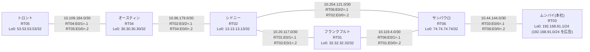

# 問題 20260803-006 : ルーティング到達性の分析

> **本問は機器に接続せずに解答すること。追加の show 実行は認めない。**

## トポロジ

本社(ムンバイ)の顧客のネットワークは、BGP AS 65134 の RT03 によって、広告されています。
あなたの会社の内部は、BGP / EIGRP / OSPF という 3 つのドメインから構成されており、そして、境界のいずれかにおいて、再配送が実施されています。
サイトと、ルータおよびアドレスとの対応は、下記の表に示されているとおりです。



| 拠点 | ルータ | 拠点網 / 広告網 |
|------|--------|------------------|
| オースティン | RT04 | 30.30.30.30/32 |
| サンパウロ | RT06 | 74.74.74.74/32 |
| シドニー | RT02 | 13.13.13.13/32 |
| トロント | RT05 | 53.53.53.53/32 |
| フランクフルト | RT01 | 32.32.32.32/32 |
| ムンバイ(本社) | RT03 | 192.168.91.1/24 (`192.168.91.0/24` を広告) |

リンク一覧(接続・アドレス):
```
  RT03:E0/0(.1) ── RT06:E0/0(.2)   10.44.144.0/30
  RT06:E0/1(.1) ── RT01:E0/0(.2)   10.119.4.0/30
  RT06:E0/2(.1) ── RT02:E0/0(.2)   10.254.121.0/30
  RT01:E0/1(.1) ── RT02:E0/1(.2)   10.20.117.0/30
  RT02:E0/2(.1) ── RT04:E0/0(.2)   10.96.179.0/30
  RT04:E0/1(.1) ── RT05:E0/0(.2)   10.109.184.0/30
```

## 要件

1. 管理のための構成(SSH / SNMP / NTP)に対して、変更が加えられてはなりません。
2. distance コマンドによる管理距離の操作は、監査のポリシー上、使用されることができません。
3. すべてのルータが、`192.168.91.0/24` を含むところのすべての宛先(それぞれのループバック)へ、到達することができること。
4. `192.168.91.0/24` 宛のパケットが、広告元である RT03 の方向へ転送され、そして、転送のループが存在していないこと。
5. 本作業は、日中の時間帯において実施されるという理由により、対象外であるところのデバイスに対する構成の変更は、許可されていません。
6. それぞれのドメインの間の再配送の設計は、維持されなければなりません(redistribute の削除・停止、または、スタティック・ルートによる回避は、許可されていません)。

## 現在の状態

複数のサイトから、本社(ムンバイ)の顧客のネットワーク宛の通信が、タイムアウトする、ということが、報告されています。
サイトの間(サイトのネットワークどうし)の通信は、正常です。
これは、意図された動作ではありません。示されているところの出力を、参照してください。

```
RT06# show ip route
Gateway of last resort is not set
      10.0.0.0/8 is variably subnetted, 9 subnets, 2 masks
O        10.20.117.0/30 [110/20] via 10.254.121.2, 00:04:17, Ethernet0/2
C        10.44.144.0/30 is directly connected, Ethernet0/0
L        10.44.144.2/32 is directly connected, Ethernet0/0
O        10.96.179.0/30 [110/20] via 10.254.121.2, 00:04:21, Ethernet0/2
O        10.109.184.0/30 [110/30] via 10.254.121.2, 00:04:10, Ethernet0/2
C        10.119.4.0/30 is directly connected, Ethernet0/1
L        10.119.4.1/32 is directly connected, Ethernet0/1
C        10.254.121.0/30 is directly connected, Ethernet0/2
L        10.254.121.1/32 is directly connected, Ethernet0/2
      13.0.0.0/32 is subnetted, 1 subnets
O        13.13.13.13 [110/11] via 10.254.121.2, 00:04:42, Ethernet0/2
      30.0.0.0/32 is subnetted, 1 subnets
O        30.30.30.30 [110/21] via 10.254.121.2, 00:04:16, Ethernet0/2
      32.0.0.0/32 is subnetted, 1 subnets
O        32.32.32.32 [110/21] via 10.254.121.2, 00:04:13, Ethernet0/2
      53.0.0.0/32 is subnetted, 1 subnets
O        53.53.53.53 [110/31] via 10.254.121.2, 00:04:06, Ethernet0/2
      74.0.0.0/32 is subnetted, 1 subnets
C        74.74.74.74 is directly connected, Loopback0
O E2  192.168.91.0/24 [110/20] via 10.254.121.2, 00:03:45, Ethernet0/2
```
```
RT06# show route-map
route-map RM-BACKUP1, deny, sequence 10
  Match clauses:
    ip address prefix-lists: PL-BACKUP1 
  Set clauses:
  Policy routing matches: 0 packets, 0 bytes
route-map RM-BACKUP1, permit, sequence 20
  Match clauses:
  Set clauses:
  Policy routing matches: 0 packets, 0 bytes
```
```
RT06# show ip prefix-list
ip prefix-list PL-BACKUP1: 2 entries
   seq 5 deny 13.13.13.13/32
   seq 10 permit 0.0.0.0/0 le 32
```
```
RT06# show access-lists
Standard IP access list 23
    10 deny   13.13.13.13
    20 permit any
```
```
RT06# show ip bgp
BGP table version is 12, local router ID is 74.74.74.74
Status codes: s suppressed, d damped, h history, * valid, > best, i - internal, 
              r RIB-failure, S Stale, m multipath, b backup-path, f RT-Filter, 
              x best-external, a additional-path, c RIB-compressed, 
              t secondary path, L long-lived-stale,
Origin codes: i - IGP, e - EGP, ? - incomplete
RPKI validation codes: V valid, I invalid, N Not found

     Network          Next Hop            Metric LocPrf Weight Path
 *>   10.20.117.0/30   10.254.121.2            20         32768 ?
 *>   10.96.179.0/30   10.254.121.2            20         32768 ?
 *>   10.109.184.0/30  10.254.121.2            30         32768 ?
 *>   10.254.121.0/30  0.0.0.0                  0         32768 ?
 *>   13.13.13.13/32   10.254.121.2            11         32768 ?
 *>   30.30.30.30/32   10.254.121.2            21         32768 ?
 *>   32.32.32.32/32   10.254.121.2            21         32768 ?
 *>   53.53.53.53/32   10.254.121.2            31         32768 ?
 *>   74.74.74.74/32   0.0.0.0                  0         32768 i
 r>i  192.168.91.0     10.44.144.1              0    100      0 i
```
```
RT04# traceroute 192.168.91.1 probe 1 timeout 1 ttl 1 8
Type escape sequence to abort.
Tracing the route to 192.168.91.1
VRF info: (vrf in name/id, vrf out name/id)
  1 10.96.179.1 1 msec
  2 10.20.117.1 32 msec
  3 10.119.4.1 2 msec
  4 10.254.121.2 2 msec
  5 10.20.117.1 2 msec
  6 10.119.4.1 2 msec
  7 10.254.121.2 4 msec
  8 10.20.117.1 2 msec
```

## 設定抜粋

```
RT06# show running-config | section router
router eigrp 347
 timers active-time 5
 network 10.119.4.0 0.0.0.3
 redistribute bgp 65134 metric 100000 100 255 1 1500
 redistribute ospf 15 metric 100000 100 255 1 1500
 passive-interface Loopback0
router ospf 15
 router-id 74.74.74.74
 network 10.254.121.0 0.0.0.3 area 0
 network 74.74.74.74 0.0.0.0 area 0
router bgp 65134
 bgp router-id 74.74.74.74
 bgp log-neighbor-changes
 bgp redistribute-internal
 network 74.74.74.74 mask 255.255.255.255
 redistribute ospf 15
 neighbor 10.44.144.1 remote-as 65134
```
```
RT01# show running-config | section router
router eigrp 347
 network 10.119.4.0 0.0.0.3
 redistribute ospf 15 metric 100000 100 255 1 1500
router ospf 15
 router-id 32.32.32.32
 redistribute eigrp 347
 network 10.20.117.0 0.0.0.3 area 0
 network 32.32.32.32 0.0.0.0 area 0
```
```
RT02# show running-config | section router
router ospf 15
 router-id 13.13.13.13
 timers throttle spf 50 200 5000
 passive-interface Loopback0
 network 10.20.117.0 0.0.0.3 area 0
 network 10.96.179.0 0.0.0.3 area 0
 network 10.254.121.0 0.0.0.3 area 0
 network 13.13.13.13 0.0.0.0 area 0
```
```
RT03# show running-config | section router
router bgp 65134
 bgp router-id 192.168.91.1
 bgp log-neighbor-changes
 network 192.168.91.0
 neighbor 10.44.144.2 remote-as 65134
```

## 設問

この問題を解決し、上記の要件をすべて満たすために必要な手順はどれですか。(1つ選択)

## 選択肢

A. RT06 で `192.168.91.0/24` のみ deny(他は permit)の prefix-list PL-BLOCK を作成し、router ospf 15 配下に「distribute-list prefix PL-BLOCK in」を適用する
B. RT06 の router bgp 65134 配下に「distance bgp 20 105 105」を設定し、clear ip route * を実行する
C. RT06 で「clear ip bgp *」および「clear ip route *」を実行する
D. RT06 の router eigrp 347 配下の「redistribute bgp 65134 ...」に `192.168.91.0/24` を deny する route-map を適用する
E. RT01 の相互再配送(redistribute)の両方向に `192.168.91.0/24` を deny する route-map を適用する
F. RT06 の router bgp 65134 配下から「bgp redistribute-internal」を削除する
