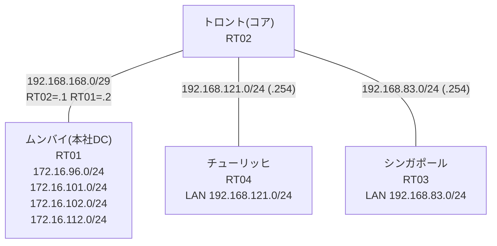

# 問題 20260804-001 : ポリシーによるルーティングのための分析

> **本問は機器に接続せずに解答すること。追加の show 実行は認めない。**

## トポロジ

コアのルータにおいて、ポリシー・ベース・ルーティング(PBR)という手段によって、
それぞれのサイトの LAN から、本社のデータ・センターのサービスのネットワークへの転送が、
制御されています。コアは、サービスのネットワークへのルーティングの情報を保持しておらず、
そして、ポリシーに一致したトラフィックのみが、ネクスト・ホップへ転送されます。



## 要件

1. アクセス・リストは、対象であるところのネットワークのみに、一致させなければなりません(対象外を含む指定は、監査に適合しません)。
2. チューリッヒ および シンガポール のそれぞれのサイトから、業務のサービスのネットワーク `172.16.96.0/24`・`172.16.101.0/24` へ、到達することができること。
3. 検証および隔離のためのネットワーク `172.16.102.0/24`・`172.16.112.0/24` へは、ポリシーによる転送が、実施されてはなりません(到達が不可能であることが、正しい状態です)。
4. PBR が適用されるポイント(インターフェイス)およびネクスト・ホップの設計は、変更されてはなりません。
5. インタフェースの IP アドレッシングは、変更されてはなりません。

## 現在の状態

チューリッヒのサイトのサービスへの到達可能性が、要件において示されているとおりではない、ということが、報告されています。シンガポールのサイトは、要件のとおりに、動作しています。これは、意図された動作ではありません。示されているところの出力を、参照してください。

```
RT04# ping 172.16.96.1 repeat 5
Type escape sequence to abort.
Sending 5, 100-byte ICMP Echos to 172.16.96.1, timeout is 2 seconds:
!!!!!
Success rate is 100 percent (5/5), round-trip min/avg/max = 1/1/2 ms
```
```
RT04# ping 172.16.101.1 repeat 5
Type escape sequence to abort.
Sending 5, 100-byte ICMP Echos to 172.16.101.1, timeout is 2 seconds:
!!!!!
Success rate is 100 percent (5/5), round-trip min/avg/max = 1/1/1 ms
```
```
RT04# ping 172.16.102.1 repeat 5
Type escape sequence to abort.
Sending 5, 100-byte ICMP Echos to 172.16.102.1, timeout is 2 seconds:
!!!!!
Success rate is 100 percent (5/5), round-trip min/avg/max = 1/1/2 ms
```
```
RT04# ping 172.16.112.1 repeat 5
Type escape sequence to abort.
Sending 5, 100-byte ICMP Echos to 172.16.112.1, timeout is 2 seconds:
!!!!!
Success rate is 100 percent (5/5), round-trip min/avg/max = 1/1/1 ms
```
```
RT03# ping 172.16.101.1 repeat 5
Type escape sequence to abort.
Sending 5, 100-byte ICMP Echos to 172.16.101.1, timeout is 2 seconds:
!!!!!
Success rate is 100 percent (5/5), round-trip min/avg/max = 1/1/1 ms
```
```
RT03# ping 172.16.102.1 repeat 5
Type escape sequence to abort.
Sending 5, 100-byte ICMP Echos to 172.16.102.1, timeout is 2 seconds:
U.U.U
Success rate is 0 percent (0/5)
```
```
RT02# show route-map
route-map MAP-A, permit, sequence 10
  Match clauses:
    ip address prefix-lists: PL-A 
  Set clauses:
    ip next-hop 192.168.168.2
  Policy routing matches: 20 packets, 2280 bytes
route-map MAP-B, permit, sequence 10
  Match clauses:
    ip address (access-lists): ACL-B 
  Set clauses:
    ip next-hop 192.168.168.2
  Policy routing matches: 5 packets, 570 bytes
```
```
RT02# show access-lists
Extended IP access list ACL-A
    10 permit ip 192.168.121.0 0.0.0.255 172.16.96.0 0.0.0.255
    20 permit ip 192.168.121.0 0.0.0.255 172.16.101.0 0.0.0.255
Extended IP access list ACL-B
    10 permit ip 192.168.83.0 0.0.0.255 172.16.96.0 0.0.0.255
    20 permit ip 192.168.83.0 0.0.0.255 172.16.101.0 0.0.0.255 (5 matches)
```
```
RT02# show ip prefix-list
ip prefix-list PL-A: 2 entries
   seq 5 permit 172.16.96.0/24
   seq 10 permit 172.16.101.0/24
```

## 設定抜粋

```
RT02# show running-config | section interface
interface Ethernet0/0
 ip address 192.168.168.1 255.255.255.248
interface Ethernet0/1
 ip address 192.168.121.254 255.255.255.0
 ip policy route-map MAP-A
interface Ethernet0/2
 ip address 192.168.83.254 255.255.255.0
 ip policy route-map MAP-B
interface Ethernet0/3
 description === MGMT (Ansible) ===
 vrf forwarding MGMT
 ip address 10.1.10.20 255.255.255.192
```
```
RT02# show running-config | section route-map|access-list
ip policy route-map MAP-A
 ip policy route-map MAP-B
ip access-list extended ACL-A
 10 permit ip 192.168.121.0 0.0.0.255 172.16.96.0 0.0.0.255
 20 permit ip 192.168.121.0 0.0.0.255 172.16.101.0 0.0.0.255
ip access-list extended ACL-B
 10 permit ip 192.168.83.0 0.0.0.255 172.16.96.0 0.0.0.255
 20 permit ip 192.168.83.0 0.0.0.255 172.16.101.0 0.0.0.255
route-map MAP-A permit 10 
 match ip address prefix-list PL-A
 set ip next-hop 192.168.168.2
route-map MAP-B permit 10 
 match ip address ACL-B
 set ip next-hop 192.168.168.2
```
```
RT01# show running-config | section interface|ip route
interface Loopback0
 ip address 172.16.96.1 255.255.255.0
interface Loopback1
 ip address 172.16.101.1 255.255.255.0
interface Loopback2
 ip address 172.16.102.1 255.255.255.0
interface Loopback3
 ip address 172.16.112.1 255.255.255.0
interface Ethernet0/0
 ip address 192.168.168.2 255.255.255.248
interface Ethernet0/1
 no ip address
 shutdown
interface Ethernet0/2
 no ip address
 shutdown
interface Ethernet0/3
 description === MGMT (Ansible) ===
 vrf forwarding MGMT
 ip address 10.1.10.19 255.255.255.192
ip route 192.168.83.0 255.255.255.0 192.168.168.1
ip route 192.168.121.0 255.255.255.0 192.168.168.1
```
```
RT04# show running-config | section interface|ip route
interface Ethernet0/0
 ip address 192.168.121.1 255.255.255.0
interface Ethernet0/1
 no ip address
 shutdown
interface Ethernet0/2
 no ip address
 shutdown
interface Ethernet0/3
 description === MGMT (Ansible) ===
 vrf forwarding MGMT
 ip address 10.1.10.32 255.255.255.192
ip route 0.0.0.0 0.0.0.0 192.168.121.254
```
```
RT03# show running-config | section interface|ip route
interface Ethernet0/0
 ip address 192.168.83.1 255.255.255.0
interface Ethernet0/1
 no ip address
 shutdown
interface Ethernet0/2
 no ip address
 shutdown
interface Ethernet0/3
 description === MGMT (Ansible) ===
 vrf forwarding MGMT
 ip address 10.1.10.31 255.255.255.192
ip route 0.0.0.0 0.0.0.0 192.168.83.254
```

## 設問

この事象の原因である可能性が、最も高いものは、どれですか。(1つを選択してください)

## 選択肢

A. LAN インタフェースに ip policy が適用されていない
B. MAP-A の match が prefix-list を参照している
C. ACL-A の宛先ワイルドカードが、対象ネットワークの一部に一致していない
D. 宛先ルータに戻り経路が無く、応答が返れない
E. ACL-A の宛先ワイルドカードが、隔離網まで一致している
F. ACL-A の宛先ワイルドカードが、対象外のネットワークに一致し、対象の一部に一致していない
