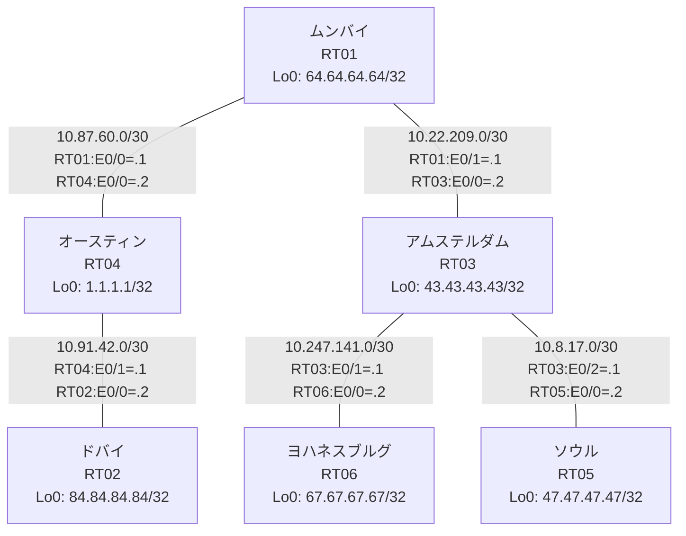

# 問題 20260804-002 : ルーティング到達性の分析

> **本問は機器に接続せずに解答すること。追加の show 実行は認めない。**

## トポロジ

あなたの会社のネットワークは、複数のルーティング・ドメインが、境界のルータによって接続され、
そして、相互の再配送という手段によって、すべてのサイトの到達可能性が提供されている、というものです。
ルーティングの設計の詳細は、示されているところの構成から、読み取られることが、期待されています。
各サイトのルータと、サイトの網との対応は、下記の表に示されているとおりです(サイトの網の代表は、当該ルータのループバック 0 です)。



| 拠点 | ルータ | 拠点網(代表アドレス) |
|------|--------|----------------------|
| アムステルダム | RT03 | `43.43.43.43/32` |
| オースティン | RT04 | `1.1.1.1/32` |
| ソウル | RT05 | `47.47.47.47/32` |
| ドバイ | RT02 | `84.84.84.84/32` |
| ムンバイ | RT01 | `64.64.64.64/32` |
| ヨハネスブルグ | RT06 | `67.67.67.67/32` |

リンク一覧(接続・アドレス):
```
  RT01:E0/0(.1) ── RT04:E0/0(.2)   10.87.60.0/30
  RT01:E0/1(.1) ── RT03:E0/0(.2)   10.22.209.0/30
  RT03:E0/1(.1) ── RT06:E0/0(.2)   10.247.141.0/30
  RT03:E0/2(.1) ── RT05:E0/0(.2)   10.8.17.0/30
  RT04:E0/1(.1) ── RT02:E0/0(.2)   10.91.42.0/30
```

## 要件

1. すべてのルータのループバック・インターフェイス 0 (/32) が、すべてのドメインの間で、相互に到達可能であること。
2. redistribute によって参照されるところのプロセス ID / AS 番号は、その境界に実在する隣接のドメインのものと一致させられ、そして、実在しないプロセスへの参照が、残置されてはなりません。
3. インタフェースの IP アドレッシングは、変更されてはなりません。
4. EIGRP へのルートの注入においては、redistribute のステートメントにおいて、シード・メトリック `100000 100 255 1 1500` が、直接に指定されなければなりません(default-metric による代替は、社内の標準の外にあるものです)。
5. 再配送に対するフィルタ(route-map / distribute-list)の適用は、禁止されているところのものです。

## 現在の状態

複数のサイトから、ヨハネスブルグのサイトへ到達することが、できない、ということが、報告されています。ヨハネスブルグのサイトが関与しないところのサイトの間の通信は、正常である、とのことです。これは、意図された動作ではありません。示されているところの出力を、参照してください。

```
RT01# show ip route
Gateway of last resort is not set
      1.0.0.0/32 is subnetted, 1 subnets
O        1.1.1.1 [110/11] via 10.87.60.2, 00:04:15, Ethernet0/0
      10.0.0.0/8 is variably subnetted, 7 subnets, 2 masks
O E2     10.8.17.0/30 [110/20] via 10.22.209.2, 00:04:16, Ethernet0/1
C        10.22.209.0/30 is directly connected, Ethernet0/1
L        10.22.209.1/32 is directly connected, Ethernet0/1
C        10.87.60.0/30 is directly connected, Ethernet0/0
L        10.87.60.1/32 is directly connected, Ethernet0/0
O        10.91.42.0/30 [110/20] via 10.87.60.2, 00:04:12, Ethernet0/0
O E2     10.247.141.0/30 [110/20] via 10.22.209.2, 00:04:16, Ethernet0/1
      43.0.0.0/32 is subnetted, 1 subnets
O        43.43.43.43 [110/11] via 10.22.209.2, 00:04:16, Ethernet0/1
      47.0.0.0/32 is subnetted, 1 subnets
O E2     47.47.47.47 [110/20] via 10.22.209.2, 00:04:16, Ethernet0/1
      64.0.0.0/32 is subnetted, 1 subnets
C        64.64.64.64 is directly connected, Loopback0
      84.0.0.0/32 is subnetted, 1 subnets
O        84.84.84.84 [110/21] via 10.87.60.2, 00:04:08, Ethernet0/0
```
```
RT05# show ip route
Gateway of last resort is not set
      1.0.0.0/32 is subnetted, 1 subnets
D EX     1.1.1.1 [170/307200] via 10.8.17.1, 00:04:34, Ethernet0/0
      10.0.0.0/8 is variably subnetted, 6 subnets, 2 masks
C        10.8.17.0/30 is directly connected, Ethernet0/0
L        10.8.17.2/32 is directly connected, Ethernet0/0
D EX     10.22.209.0/30 [170/307200] via 10.8.17.1, 00:05:06, Ethernet0/0
D EX     10.87.60.0/30 [170/307200] via 10.8.17.1, 00:04:35, Ethernet0/0
D EX     10.91.42.0/30 [170/307200] via 10.8.17.1, 00:04:34, Ethernet0/0
D        10.247.141.0/30 [90/307200] via 10.8.17.1, 00:05:06, Ethernet0/0
      43.0.0.0/32 is subnetted, 1 subnets
D        43.43.43.43 [90/409600] via 10.8.17.1, 00:05:06, Ethernet0/0
      47.0.0.0/32 is subnetted, 1 subnets
C        47.47.47.47 is directly connected, Loopback0
      64.0.0.0/32 is subnetted, 1 subnets
D EX     64.64.64.64 [170/307200] via 10.8.17.1, 00:04:35, Ethernet0/0
      67.0.0.0/32 is subnetted, 1 subnets
D        67.67.67.67 [90/435200] via 10.8.17.1, 00:04:59, Ethernet0/0
      84.0.0.0/32 is subnetted, 1 subnets
D EX     84.84.84.84 [170/307200] via 10.8.17.1, 00:04:27, Ethernet0/0
```
```
RT02# show ip route
Gateway of last resort is not set
      1.0.0.0/32 is subnetted, 1 subnets
O        1.1.1.1 [110/11] via 10.91.42.1, 00:04:48, Ethernet0/0
      10.0.0.0/8 is variably subnetted, 6 subnets, 2 masks
O E2     10.8.17.0/30 [110/20] via 10.91.42.1, 00:04:48, Ethernet0/0
O E2     10.22.209.0/30 [110/10] via 10.91.42.1, 00:04:48, Ethernet0/0
O        10.87.60.0/30 [110/20] via 10.91.42.1, 00:04:48, Ethernet0/0
C        10.91.42.0/30 is directly connected, Ethernet0/0
L        10.91.42.2/32 is directly connected, Ethernet0/0
O E2     10.247.141.0/30 [110/20] via 10.91.42.1, 00:04:48, Ethernet0/0
      43.0.0.0/32 is subnetted, 1 subnets
O E2     43.43.43.43 [110/11] via 10.91.42.1, 00:04:48, Ethernet0/0
      47.0.0.0/32 is subnetted, 1 subnets
O E2     47.47.47.47 [110/20] via 10.91.42.1, 00:04:48, Ethernet0/0
      64.0.0.0/32 is subnetted, 1 subnets
O        64.64.64.64 [110/21] via 10.91.42.1, 00:04:48, Ethernet0/0
      84.0.0.0/32 is subnetted, 1 subnets
C        84.84.84.84 is directly connected, Loopback0
```
```
RT03# show route-map
route-map RM-SVC, deny, sequence 10
  Match clauses:
    ip address prefix-lists: PL-SVC 
  Set clauses:
  Policy routing matches: 0 packets, 0 bytes
route-map RM-SVC, permit, sequence 20
  Match clauses:
  Set clauses:
  Policy routing matches: 0 packets, 0 bytes
route-map RM-STG2, deny, sequence 10
  Match clauses:
    ip address prefix-lists: PL-STG2 
  Set clauses:
  Policy routing matches: 0 packets, 0 bytes
route-map RM-STG2, permit, sequence 20
  Match clauses:
  Set clauses:
  Policy routing matches: 0 packets, 0 bytes
route-map RM-BACKUP1, deny, sequence 10
  Match clauses:
    ip address prefix-lists: PL-BACKUP1 
  Set clauses:
  Policy routing matches: 0 packets, 0 bytes
route-map RM-BACKUP1, permit, sequence 20
  Match clauses:
  Set clauses:
  Policy routing matches: 0 packets, 0 bytes
```
```
RT03# show ip prefix-list
ip prefix-list PL-BACKUP1: 2 entries
   seq 5 deny 84.84.84.84/32
   seq 10 permit 0.0.0.0/0 le 32
ip prefix-list PL-STG2: 2 entries
   seq 5 deny 43.43.43.43/32
   seq 10 permit 0.0.0.0/0 le 32
ip prefix-list PL-SVC: 1 entries
   seq 5 permit 67.67.67.67/32
```
```
RT03# show access-lists
Standard IP access list 20
    10 deny   43.43.43.43
    20 permit any
Standard IP access list 60
    10 deny   84.84.84.84
    20 permit any
```

## 設定抜粋

```
RT01# show running-config | section router
router ospf 42
 router-id 64.64.64.64
 timers throttle spf 50 200 5000
 redistribute ospf 65 match internal external 1 external 2
 passive-interface Loopback0
 network 10.87.60.0 0.0.0.3 area 0
 network 64.64.64.64 0.0.0.0 area 0
router ospf 65
 redistribute ospf 42 match internal external 1 external 2
 network 10.22.209.0 0.0.0.3 area 0
```
```
RT02# show running-config | section router
router ospf 42
 router-id 84.84.84.84
 network 10.91.42.0 0.0.0.3 area 0
 network 84.84.84.84 0.0.0.0 area 0
```
```
RT03# show running-config | section router
router eigrp 301
 timers active-time 5
 network 10.8.17.0 0.0.0.3
 network 10.247.141.0 0.0.0.3
 network 43.43.43.43 0.0.0.0
 redistribute ospf 65 match internal external 1 external 2 metric 100000 100 255 1 1500
 passive-interface Loopback0
router ospf 65
 router-id 43.43.43.43
 redistribute eigrp 301 route-map RM-SVC
 network 10.22.209.0 0.0.0.3 area 0
 network 43.43.43.43 0.0.0.0 area 0
```
```
RT04# show running-config | section router
router ospf 42
 router-id 1.1.1.1
 passive-interface Loopback0
 network 1.1.1.1 0.0.0.0 area 0
 network 10.87.60.0 0.0.0.3 area 0
 network 10.91.42.0 0.0.0.3 area 0
```
```
RT05# show running-config | section router
router eigrp 301
 network 10.8.17.0 0.0.0.3
 network 47.47.47.47 0.0.0.0
```
```
RT06# show running-config | section router
router eigrp 301
 timers active-time 5
 network 10.247.141.0 0.0.0.3
 network 67.67.67.67 0.0.0.0
 passive-interface Loopback0
```

## 設問

この事象の原因である可能性が、最も高いものは、どれですか。(1つを選択してください)

## 選択肢

A. RT01 の router ospf 65 で、上流側インタフェースが passive-interface に設定されている
B. RT01 と隣接ルータの間で OSPF のネイバー(隣接関係)が確立していない
C. RT03 の router ospf 65 配下の redistribute が、実在しないプロセス/AS を参照している
D. RT03 の redistribute に適用された route-map が特定の拠点網を deny している
E. RT01 の router ospf 65 に Loopback0 の network 文が設定されていない
F. RT03 の router ospf 65 配下に redistribute が設定されていない
