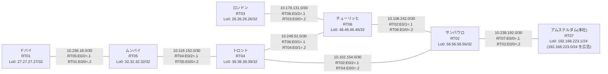

# 問題 20260804-003 : ルーティング到達性の分析

> **本問は機器に接続せずに解答すること。追加の show 実行は認めない。**

## トポロジ

本社(アムステルダム)の顧客のネットワークは、BGP AS 65415 の RT07 によって、広告されています。
あなたの会社の内部は、BGP / EIGRP / OSPF という 3 つのドメインから構成されており、そして、境界のいずれかにおいて、再配送が実施されています。
サイトと、ルータおよびアドレスとの対応は、下記の表に示されているとおりです。



| 拠点 | ルータ | 拠点網 / 広告網 |
|------|--------|------------------|
| アムステルダム(本社) | RT07 | 192.168.223.1/24 (`192.168.223.0/24` を広告) |
| サンパウロ | RT02 | 56.56.56.56/32 |
| チューリッヒ | RT06 | 46.46.46.46/32 |
| トロント | RT04 | 39.39.39.39/32 |
| ドバイ | RT01 | 27.27.27.27/32 |
| ムンバイ | RT05 | 32.32.32.32/32 |
| ロンドン | RT03 | 26.26.26.26/32 |

リンク一覧(接続・アドレス):
```
  RT07:E0/0(.1) ── RT02:E0/0(.2)   10.238.192.0/30
  RT02:E0/1(.1) ── RT06:E0/0(.2)   10.108.242.0/30
  RT02:E0/2(.1) ── RT04:E0/0(.2)   10.102.154.0/30
  RT06:E0/1(.1) ── RT04:E0/1(.2)   10.248.52.0/30
  RT04:E0/2(.1) ── RT05:E0/0(.2)   10.118.152.0/30
  RT05:E0/2(.1) ── RT01:E0/0(.2)   10.236.18.0/30
  RT06:E0/2(.1) ── RT03:E0/0(.2)   10.178.131.0/30
```

## 要件

1. `192.168.223.0/24` 宛のトラフィックが RT07 へ配送され、経路の周回(転送のループ)が、発生していないこと。
2. インタフェースの IP アドレッシングは、変更されてはなりません。
3. 管理のための構成(SSH / SNMP / NTP)に対して、変更が加えられてはなりません。
4. 顧客のネットワーク `192.168.223.0/24` を含むすべての宛先への到達可能性が、すべてのサイトにおいて、確保されていること。
5. それぞれのドメインの間の再配送の設計は、維持されなければなりません(redistribute の削除・停止、または、スタティック・ルートによる回避は、許可されていません)。

## 現在の状態

複数のサイトから、本社(アムステルダム)の顧客のネットワーク宛の通信が、タイムアウトする、ということが、報告されています。
サイトの間(サイトのネットワークどうし)の通信は、正常です。
これは、意図された動作ではありません。示されているところの出力を、参照してください。

```
RT02# show ip route
Gateway of last resort is not set
      10.0.0.0/8 is variably subnetted, 10 subnets, 2 masks
C        10.102.154.0/30 is directly connected, Ethernet0/2
L        10.102.154.1/32 is directly connected, Ethernet0/2
C        10.108.242.0/30 is directly connected, Ethernet0/1
L        10.108.242.1/32 is directly connected, Ethernet0/1
O        10.118.152.0/30 [110/20] via 10.102.154.2, 00:05:01, Ethernet0/2
O        10.178.131.0/30 [110/30] via 10.102.154.2, 00:04:55, Ethernet0/2
O        10.236.18.0/30 [110/30] via 10.102.154.2, 00:04:34, Ethernet0/2
C        10.238.192.0/30 is directly connected, Ethernet0/0
L        10.238.192.2/32 is directly connected, Ethernet0/0
O        10.248.52.0/30 [110/20] via 10.102.154.2, 00:04:59, Ethernet0/2
      26.0.0.0/32 is subnetted, 1 subnets
O        26.26.26.26 [110/31] via 10.102.154.2, 00:04:25, Ethernet0/2
      27.0.0.0/32 is subnetted, 1 subnets
O        27.27.27.27 [110/31] via 10.102.154.2, 00:04:30, Ethernet0/2
      32.0.0.0/32 is subnetted, 1 subnets
O        32.32.32.32 [110/21] via 10.102.154.2, 00:04:34, Ethernet0/2
      39.0.0.0/32 is subnetted, 1 subnets
O        39.39.39.39 [110/11] via 10.102.154.2, 00:05:01, Ethernet0/2
      46.0.0.0/32 is subnetted, 1 subnets
O        46.46.46.46 [110/21] via 10.102.154.2, 00:04:55, Ethernet0/2
      56.0.0.0/32 is subnetted, 1 subnets
C        56.56.56.56 is directly connected, Loopback0
D EX  192.168.223.0/24 [170/307200] via 10.108.242.2, 00:04:07, Ethernet0/1
```
```
RT02# show route-map
route-map RM-MIGR1, deny, sequence 10
  Match clauses:
    ip address prefix-lists: PL-MIGR1 
  Set clauses:
  Policy routing matches: 0 packets, 0 bytes
route-map RM-MIGR1, permit, sequence 20
  Match clauses:
  Set clauses:
  Policy routing matches: 0 packets, 0 bytes
```
```
RT02# show ip prefix-list
ip prefix-list PL-MIGR1: 2 entries
   seq 5 deny 192.168.223.0/24
   seq 10 permit 0.0.0.0/0 le 32
```
```
RT02# show access-lists
Standard IP access list 71
    10 deny   192.168.223.0
    20 permit any
```
```
RT02# show ip bgp
BGP table version is 14, local router ID is 56.56.56.56
Status codes: s suppressed, d damped, h history, * valid, > best, i - internal, 
              r RIB-failure, S Stale, m multipath, b backup-path, f RT-Filter, 
              x best-external, a additional-path, c RIB-compressed, 
              t secondary path, L long-lived-stale,
Origin codes: i - IGP, e - EGP, ? - incomplete
RPKI validation codes: V valid, I invalid, N Not found

     Network          Next Hop            Metric LocPrf Weight Path
 *>   10.102.154.0/30  0.0.0.0                  0         32768 ?
 *>   10.118.152.0/30  10.102.154.2            20         32768 ?
 *>   10.178.131.0/30  10.102.154.2            30         32768 ?
 *>   10.236.18.0/30   10.102.154.2            30         32768 ?
 *>   10.248.52.0/30   10.102.154.2            20         32768 ?
 *>   26.26.26.26/32   10.102.154.2            31         32768 ?
 *>   27.27.27.27/32   10.102.154.2            31         32768 ?
 *>   32.32.32.32/32   10.102.154.2            21         32768 ?
 *>   39.39.39.39/32   10.102.154.2            11         32768 ?
 *>   46.46.46.46/32   10.102.154.2            21         32768 ?
 *>   56.56.56.56/32   0.0.0.0                  0         32768 i
 r>i  192.168.223.0    10.238.192.1             0    100      0 i
```
```
RT01# traceroute 192.168.223.1 probe 1 timeout 1 ttl 1 8
Type escape sequence to abort.
Tracing the route to 192.168.223.1
VRF info: (vrf in name/id, vrf out name/id)
  1 10.236.18.1 1 msec
  2 10.118.152.1 9 msec
  3 10.102.154.1 1 msec
  4 10.108.242.2 2 msec
  5 10.248.52.2 2 msec
  6 10.102.154.1 2 msec
  7 10.108.242.2 138 msec
  8 10.248.52.2 22 msec
```

## 設定抜粋

```
RT02# show running-config | section router
router eigrp 883
 timers active-time 5
 network 10.108.242.0 0.0.0.3
 passive-interface Loopback0
router ospf 88
 router-id 56.56.56.56
 redistribute eigrp 883
 redistribute bgp 65415
 network 10.102.154.0 0.0.0.3 area 0
 network 56.56.56.56 0.0.0.0 area 0
router bgp 65415
 bgp router-id 56.56.56.56
 bgp log-neighbor-changes
 bgp redistribute-internal
 network 56.56.56.56 mask 255.255.255.255
 redistribute ospf 88
 neighbor 10.238.192.1 remote-as 65415
```
```
RT06# show running-config | section router
router eigrp 883
 network 10.108.242.0 0.0.0.3
 redistribute ospf 88 metric 100000 100 255 1 1500
router ospf 88
 router-id 46.46.46.46
 redistribute eigrp 883
 network 10.178.131.0 0.0.0.3 area 0
 network 10.248.52.0 0.0.0.3 area 0
 network 46.46.46.46 0.0.0.0 area 0
```
```
RT04# show running-config | section router
router ospf 88
 router-id 39.39.39.39
 timers throttle spf 50 200 5000
 passive-interface Loopback0
 network 10.102.154.0 0.0.0.3 area 0
 network 10.118.152.0 0.0.0.3 area 0
 network 10.248.52.0 0.0.0.3 area 0
 network 39.39.39.39 0.0.0.0 area 0
```
```
RT07# show running-config | section router
router bgp 65415
 bgp router-id 192.168.223.1
 bgp log-neighbor-changes
 network 192.168.223.0
 neighbor 10.238.192.2 remote-as 65415
```

## 設問

示されているところの事象を説明しているものとして、最も適切なものは、どれですか。(1つを選択してください)

## 選択肢

A. RT02 が、一周して戻ってきた外部経路を iBGP の経路より優先して採用している
B. RT06 の相互再配送において経路が収束せず、振動している
C. RT06 と RT04 の間で等コストの複数経路が成立し、パケットが分散されている
D. RT07 からの広告が RT02 に到達していない
E. RT02 の BGP テーブルにおいて当該経路が RIB-failure となり、ベストパスが選出できていない
F. RT02 において当該プレフィックスの外部経路タイプが E2 であり、内部コストが加算されていない
