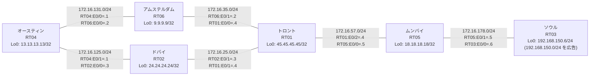

# 問題 20260805-001 : ルーティング到達性の分析

> **本問は機器に接続せずに解答すること。追加の show 実行は認めない。**

## トポロジ

あなたの会社のネットワークは、OSPF のドメインと EIGRP のドメインとが、2 つの境界のルータによって接続され、そして、それぞれの境界において、相互の再配送が実施されている、というものです。
顧客のネットワーク `192.168.150.0/24` は、ソウル のサイトにおいて、別のルーティング・プロトコルによって学習され、そして、再配送によって、社内へ持ち込まれています。
ルーティングの設計の詳細は、示されているところのコンフィギュレーションから、読み取られることが、期待されています。



| 拠点 | ルータ | 拠点網 / 広告網 |
|------|--------|------------------|
| アムステルダム | RT06 | 9.9.9.9/32 |
| オースティン | RT04 | 13.13.13.13/32 |
| ソウル | RT03 | 192.168.150.6/24 (`192.168.150.0/24` を広告) |
| トロント | RT01 | 45.45.45.45/32 |
| ドバイ | RT02 | 24.24.24.24/32 |
| ムンバイ | RT05 | 18.18.18.18/32 |

リンク一覧(接続・アドレス):
```
  RT04:E0/0(.1) ── RT06:E0/0(.2)   172.16.131.0/24
  RT04:E0/1(.1) ── RT02:E0/0(.3)   172.16.125.0/24
  RT06:E0/1(.2) ── RT01:E0/0(.4)   172.16.35.0/24
  RT02:E0/1(.3) ── RT01:E0/1(.4)   172.16.25.0/24
  RT01:E0/2(.4) ── RT05:E0/0(.5)   172.16.57.0/24
  RT05:E0/1(.5) ── RT03:E0/0(.6)   172.16.178.0/24
```

## 要件

1. 本作業は、日中の時間帯において実施されるという理由により、対象外であるところのデバイスに対する構成の変更は、許可されていません。
2. 既存の相互再配送の設計(それぞれの境界の redistribute)が、削除または停止されてはなりません。
3. 管理のための構成(SSH / SNMP / NTP)に対して、変更が加えられてはなりません。
4. スタティック・ルートおよび既定のルートによる迂回は、実施されてはなりません。
5. 是正は、経路の出自に対するマーキング(タグ)によって、実装されなければなりません(distribute-list / prefix-list、および管理距離の変更は、使用することができません)。
6. `192.168.150.0/24` 宛のパケットが、広告元である RT03 の方向へ転送され、そして、転送のループが存在していないこと。
7. すべてのサイトから、`192.168.150.0/24` を含むところのすべての宛先へ、到達することができること。

## 現在の状態

複数のサイトから、`192.168.150.0/24` 宛の通信が、タイムアウトする、ということが、報告されています。
サイトの間(それぞれのループバック宛)の通信は、正常です。
これは、意図された動作ではありません。示されているところの出力を、参照してください。

```
RT01# show ip route
Gateway of last resort is not set
      9.0.0.0/32 is subnetted, 1 subnets
D EX     9.9.9.9 [170/281856] via 172.16.35.2, 00:04:04, Ethernet0/0
                 [170/281856] via 172.16.25.3, 00:04:04, Ethernet0/1
      13.0.0.0/32 is subnetted, 1 subnets
D EX     13.13.13.13 [170/281856] via 172.16.35.2, 00:04:06, Ethernet0/0
                     [170/281856] via 172.16.25.3, 00:04:06, Ethernet0/1
      18.0.0.0/32 is subnetted, 1 subnets
D        18.18.18.18 [90/409600] via 172.16.57.5, 00:04:51, Ethernet0/2
      24.0.0.0/32 is subnetted, 1 subnets
D EX     24.24.24.24 [170/281856] via 172.16.35.2, 00:04:06, Ethernet0/0
                     [170/281856] via 172.16.25.3, 00:04:06, Ethernet0/1
      45.0.0.0/32 is subnetted, 1 subnets
C        45.45.45.45 is directly connected, Loopback0
      172.16.0.0/16 is variably subnetted, 9 subnets, 2 masks
C        172.16.25.0/24 is directly connected, Ethernet0/1
L        172.16.25.4/32 is directly connected, Ethernet0/1
C        172.16.35.0/24 is directly connected, Ethernet0/0
L        172.16.35.4/32 is directly connected, Ethernet0/0
C        172.16.57.0/24 is directly connected, Ethernet0/2
L        172.16.57.4/32 is directly connected, Ethernet0/2
D EX     172.16.125.0/24 [170/281856] via 172.16.35.2, 00:04:06, Ethernet0/0
                         [170/281856] via 172.16.25.3, 00:04:06, Ethernet0/1
D EX     172.16.131.0/24 [170/281856] via 172.16.35.2, 00:04:09, Ethernet0/0
                         [170/281856] via 172.16.25.3, 00:04:09, Ethernet0/1
D        172.16.178.0/24 [90/307200] via 172.16.57.5, 00:04:51, Ethernet0/2
D EX  192.168.150.0/24 [170/281856] via 172.16.35.2, 00:04:06, Ethernet0/0
```
```
RT01# show ip eigrp topology 192.168.150.0 255.255.255.0
EIGRP-IPv4 Topology Entry for AS(34)/ID(45.45.45.45) for 192.168.150.0/24
  State is Passive, Query origin flag is 1, 1 Successor(s), FD is 281856
  Descriptor Blocks:
  172.16.35.2 (Ethernet0/0), from 172.16.35.2, Send flag is 0x0
      Composite metric is (281856/2816), route is External
      Vector metric:
        Minimum bandwidth is 10000 Kbit
        Total delay is 1010 microseconds
        Reliability is 255/255
        Load is 1/255
        Minimum MTU is 1500
        Hop count is 1
        Originating router is 9.9.9.9
      External data:
        AS number of route is 66
        External protocol is OSPF, external metric is 20
        Administrator tag is 0 (0x00000000)
  172.16.57.5 (Ethernet0/2), from 172.16.57.5, Send flag is 0x0
      Composite metric is (307456/281856), route is External
      Vector metric:
        Minimum bandwidth is 10000 Kbit
        Total delay is 2010 microseconds
        Reliability is 255/255
        Load is 1/255
        Minimum MTU is 1500
        Hop count is 2
        Originating router is 192.168.150.6
      External data:
        AS number of route is 0
        External protocol is RIP, external metric is 0
        Administrator tag is 0 (0x00000000)
```
```
RT05# show ip route
Gateway of last resort is not set
      9.0.0.0/32 is subnetted, 1 subnets
D EX     9.9.9.9 [170/307456] via 172.16.57.4, 00:04:21, Ethernet0/0
      13.0.0.0/32 is subnetted, 1 subnets
D EX     13.13.13.13 [170/307456] via 172.16.57.4, 00:04:27, Ethernet0/0
      18.0.0.0/32 is subnetted, 1 subnets
C        18.18.18.18 is directly connected, Loopback0
      24.0.0.0/32 is subnetted, 1 subnets
D EX     24.24.24.24 [170/307456] via 172.16.57.4, 00:05:05, Ethernet0/0
      45.0.0.0/32 is subnetted, 1 subnets
D        45.45.45.45 [90/409600] via 172.16.57.4, 00:05:14, Ethernet0/0
      172.16.0.0/16 is variably subnetted, 8 subnets, 2 masks
D        172.16.25.0/24 [90/307200] via 172.16.57.4, 00:05:14, Ethernet0/0
D        172.16.35.0/24 [90/307200] via 172.16.57.4, 00:05:14, Ethernet0/0
C        172.16.57.0/24 is directly connected, Ethernet0/0
L        172.16.57.5/32 is directly connected, Ethernet0/0
D EX     172.16.125.0/24 [170/307456] via 172.16.57.4, 00:05:05, Ethernet0/0
D EX     172.16.131.0/24 [170/307456] via 172.16.57.4, 00:04:27, Ethernet0/0
C        172.16.178.0/24 is directly connected, Ethernet0/1
L        172.16.178.5/32 is directly connected, Ethernet0/1
D EX  192.168.150.0/24 [170/281856] via 172.16.178.6, 00:04:24, Ethernet0/1
```
```
RT04# show ip route
Gateway of last resort is not set
      9.0.0.0/32 is subnetted, 1 subnets
O        9.9.9.9 [110/11] via 172.16.131.2, 00:04:41, Ethernet0/0
      13.0.0.0/32 is subnetted, 1 subnets
C        13.13.13.13 is directly connected, Loopback0
      18.0.0.0/32 is subnetted, 1 subnets
O E2     18.18.18.18 [110/20] via 172.16.131.2, 00:04:41, Ethernet0/0
                     [110/20] via 172.16.125.3, 00:04:44, Ethernet0/1
      24.0.0.0/32 is subnetted, 1 subnets
O        24.24.24.24 [110/11] via 172.16.125.3, 00:04:44, Ethernet0/1
      45.0.0.0/32 is subnetted, 1 subnets
O E2     45.45.45.45 [110/20] via 172.16.131.2, 00:04:41, Ethernet0/0
                     [110/20] via 172.16.125.3, 00:04:44, Ethernet0/1
      172.16.0.0/16 is variably subnetted, 8 subnets, 2 masks
O E2     172.16.25.0/24 [110/20] via 172.16.131.2, 00:04:41, Ethernet0/0
                        [110/20] via 172.16.125.3, 00:04:44, Ethernet0/1
O E2     172.16.35.0/24 [110/20] via 172.16.131.2, 00:04:41, Ethernet0/0
                        [110/20] via 172.16.125.3, 00:04:44, Ethernet0/1
O E2     172.16.57.0/24 [110/20] via 172.16.131.2, 00:04:41, Ethernet0/0
                        [110/20] via 172.16.125.3, 00:04:44, Ethernet0/1
C        172.16.125.0/24 is directly connected, Ethernet0/1
L        172.16.125.1/32 is directly connected, Ethernet0/1
C        172.16.131.0/24 is directly connected, Ethernet0/0
L        172.16.131.1/32 is directly connected, Ethernet0/0
O E2     172.16.178.0/24 [110/20] via 172.16.131.2, 00:04:41, Ethernet0/0
                         [110/20] via 172.16.125.3, 00:04:44, Ethernet0/1
O E2  192.168.150.0/24 [110/20] via 172.16.125.3, 00:04:44, Ethernet0/1
```
```
RT04# traceroute 192.168.150.6 probe 1 timeout 1 ttl 1 8
Type escape sequence to abort.
Tracing the route to 192.168.150.6
VRF info: (vrf in name/id, vrf out name/id)
  1 172.16.125.3 1 msec
  2 172.16.25.4 1 msec
  3 172.16.35.2 6 msec
  4 172.16.131.1 1 msec
  5 172.16.125.3 2 msec
  6 172.16.25.4 2 msec
  7 172.16.35.2 2 msec
  8 172.16.131.1 2 msec
```

## 設定抜粋

```
RT04# show running-config | section router
router ospf 66
 router-id 13.13.13.13
 network 13.13.13.13 0.0.0.0 area 0
 network 172.16.125.0 0.0.0.255 area 0
 network 172.16.131.0 0.0.0.255 area 0
```
```
RT06# show running-config | section router
router eigrp 34
 network 172.16.35.0 0.0.0.255
 redistribute ospf 66 metric 1000000 1 255 1 1500
router ospf 66
 router-id 9.9.9.9
 redistribute eigrp 34
 network 9.9.9.9 0.0.0.0 area 0
 network 172.16.131.0 0.0.0.255 area 0
```
```
RT02# show running-config | section router
router eigrp 34
 network 172.16.25.0 0.0.0.255
 redistribute ospf 66 metric 1000000 1 255 1 1500
router ospf 66
 router-id 24.24.24.24
 redistribute eigrp 34
 network 24.24.24.24 0.0.0.0 area 0
 network 172.16.125.0 0.0.0.255 area 0
```
```
RT01# show running-config | section router
router eigrp 34
 network 45.45.45.45 0.0.0.0
 network 172.16.25.0 0.0.0.255
 network 172.16.35.0 0.0.0.255
 network 172.16.57.0 0.0.0.255
```
```
RT05# show running-config | section router
router eigrp 34
 network 18.18.18.18 0.0.0.0
 network 172.16.57.0 0.0.0.255
 network 172.16.178.0 0.0.0.255
```
```
RT03# show running-config | section router
router eigrp 34
 network 172.16.178.0 0.0.0.255
 redistribute rip metric 1000000 1 255 1 1500
router rip
 version 2
 network 192.168.150.0
 no auto-summary
```

## 設問

この問題を解決し、そして、示されているところのすべての要件が満たされることを確実にするために、適用されなければならない構成は、どれですか。(1つを選択してください)

## 選択肢

A. RT06 と RT02 の両方で、EIGRP→OSPF 再配送で `set tag 677` を付与し、OSPF→EIGRP 再配送で `match tag 677` を deny する
B. RT06 でのみ、EIGRP→OSPF 再配送で `set tag 677` を付与し、OSPF→EIGRP 再配送で `match tag 677` を deny する
C. RT06 と RT02 の両方で、`PL-NO-FEEDBACK` に `192.168.150.0/24` を deny・他を permit で作成し、router eigrp 34 配下に `distribute-list prefix PL-NO-FEEDBACK out ospf 66` を適用する
D. RT03 の router eigrp 34 配下の `redistribute rip` の seed metric をより小さい値へ変更する
E. RT01 の router eigrp 34 配下に `distance eigrp 90 200` を設定する
F. RT01 で `clear ip route *` を実行する
