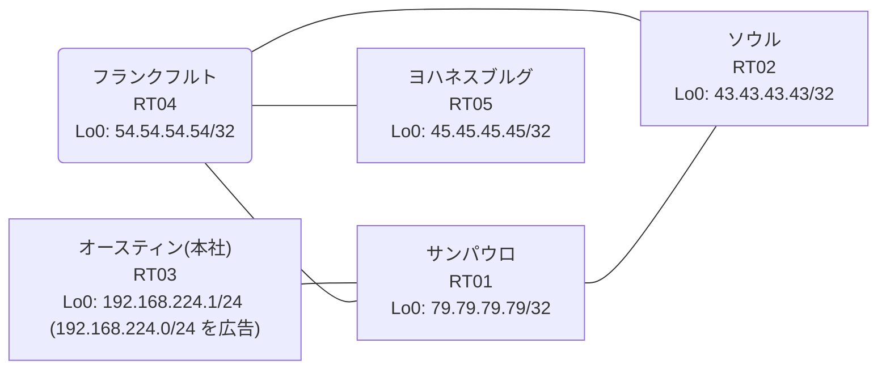

# 問題 20260805-002 : ルーティング到達性の分析

> **本問は機器に接続せずに解答すること。追加の show 実行は認めない。**

## トポロジ

本社(オースティン)の顧客のネットワークは、BGP AS 64795 の RT03 によって、広告されています。
あなたの会社の内部は、BGP / EIGRP / OSPF という 3 つのドメインから構成されており、そして、境界のいずれかにおいて、再配送が実施されています。
サイトと、ルータおよびアドレスとの対応は、下記の表に示されているとおりです。



| 拠点 | ルータ | 拠点網 / 広告網 |
|------|--------|------------------|
| オースティン(本社) | RT03 | 192.168.224.1/24 (`192.168.224.0/24` を広告) |
| サンパウロ | RT01 | 79.79.79.79/32 |
| ソウル | RT02 | 43.43.43.43/32 |
| フランクフルト | RT04 | 54.54.54.54/32 |
| ヨハネスブルグ | RT05 | 45.45.45.45/32 |

リンク一覧(接続・アドレス):
```
  RT03:E0/0(.1) ── RT01:E0/0(.2)   10.107.197.0/30
  RT01:E0/1(.1) ── RT04:E0/0(.2)   10.34.25.0/30
  RT01:E0/2(.1) ── RT02:E0/0(.2)   10.124.220.0/30
  RT04:E0/1(.1) ── RT02:E0/1(.2)   10.141.129.0/30
  RT04:E0/2(.1) ── RT05:E0/0(.2)   10.197.134.0/30
```

## 要件

1. すべてのルータが、`192.168.224.0/24` を含むところのすべての宛先(それぞれのループバック)へ、到達することができること。
2. 管理のための構成(SSH / SNMP / NTP)に対して、変更が加えられてはなりません。
3. 既存の再配送の設計(それぞれの境界の redistribute)が、変更または撤去されてはなりません。スタティック・ルートによる回避も、許可されていません。
4. 本作業は、日中の時間帯において実施されるという理由により、対象外であるところのデバイスに対する構成の変更は、許可されていません。
5. `192.168.224.0/24` 宛のトラフィックが RT03 へ配送され、経路の周回(転送のループ)が、発生していないこと。

## 現在の状態

複数のサイトから、本社(オースティン)の顧客のネットワーク宛の通信が、タイムアウトする、ということが、報告されています。
サイトの間(サイトのネットワークどうし)の通信は、正常です。
これは、意図された動作ではありません。示されているところの出力を、参照してください。

```
RT01# show ip route
Gateway of last resort is not set
      10.0.0.0/8 is variably subnetted, 8 subnets, 2 masks
C        10.34.25.0/30 is directly connected, Ethernet0/1
L        10.34.25.1/32 is directly connected, Ethernet0/1
C        10.107.197.0/30 is directly connected, Ethernet0/0
L        10.107.197.2/32 is directly connected, Ethernet0/0
C        10.124.220.0/30 is directly connected, Ethernet0/2
L        10.124.220.1/32 is directly connected, Ethernet0/2
O        10.141.129.0/30 [110/20] via 10.124.220.2, 00:03:55, Ethernet0/2
O        10.197.134.0/30 [110/30] via 10.124.220.2, 00:03:55, Ethernet0/2
      43.0.0.0/32 is subnetted, 1 subnets
O        43.43.43.43 [110/11] via 10.124.220.2, 00:03:55, Ethernet0/2
      45.0.0.0/32 is subnetted, 1 subnets
O        45.45.45.45 [110/31] via 10.124.220.2, 00:03:42, Ethernet0/2
      54.0.0.0/32 is subnetted, 1 subnets
O        54.54.54.54 [110/21] via 10.124.220.2, 00:03:55, Ethernet0/2
      79.0.0.0/32 is subnetted, 1 subnets
C        79.79.79.79 is directly connected, Loopback0
O E2  192.168.224.0/24 [110/20] via 10.124.220.2, 00:03:38, Ethernet0/2
```
```
RT01# show route-map
route-map RM-STG1, deny, sequence 10
  Match clauses:
    ip address prefix-lists: PL-STG1 
  Set clauses:
  Policy routing matches: 0 packets, 0 bytes
route-map RM-STG1, permit, sequence 20
  Match clauses:
  Set clauses:
  Policy routing matches: 0 packets, 0 bytes
```
```
RT01# show ip prefix-list
ip prefix-list PL-STG1: 2 entries
   seq 5 deny 45.45.45.45/32
   seq 10 permit 0.0.0.0/0 le 32
```
```
RT01# show access-lists
Standard IP access list 77
    10 deny   45.45.45.45
    20 permit any
```
```
RT01# show ip bgp
BGP table version is 10, local router ID is 79.79.79.79
Status codes: s suppressed, d damped, h history, * valid, > best, i - internal, 
              r RIB-failure, S Stale, m multipath, b backup-path, f RT-Filter, 
              x best-external, a additional-path, c RIB-compressed, 
              t secondary path, L long-lived-stale,
Origin codes: i - IGP, e - EGP, ? - incomplete
RPKI validation codes: V valid, I invalid, N Not found

     Network          Next Hop            Metric LocPrf Weight Path
 *>   10.124.220.0/30  0.0.0.0                  0         32768 ?
 *>   10.141.129.0/30  10.124.220.2            20         32768 ?
 *>   10.197.134.0/30  10.124.220.2            30         32768 ?
 *>   43.43.43.43/32   10.124.220.2            11         32768 ?
 *>   45.45.45.45/32   10.124.220.2            31         32768 ?
 *>   54.54.54.54/32   10.124.220.2            21         32768 ?
 *>   79.79.79.79/32   0.0.0.0                  0         32768 i
 r>i  192.168.224.0    10.107.197.1             0    100      0 i
```
```
RT05# traceroute 192.168.224.1 probe 1 timeout 1 ttl 1 8
Type escape sequence to abort.
Tracing the route to 192.168.224.1
VRF info: (vrf in name/id, vrf out name/id)
  1 10.197.134.1 1 msec
  2 10.34.25.1 2 msec
  3 10.124.220.2 1 msec
  4 10.141.129.1 2 msec
  5 10.34.25.1 2 msec
  6 10.124.220.2 2 msec
  7 10.141.129.1 2 msec
  8 10.34.25.1 3 msec
```

## 設定抜粋

```
RT01# show running-config | section router
router eigrp 493
 network 10.34.25.0 0.0.0.3
 redistribute bgp 64795 metric 100000 100 255 1 1500
 redistribute ospf 83 metric 100000 100 255 1 1500
 passive-interface Loopback0
router ospf 83
 router-id 79.79.79.79
 network 10.124.220.0 0.0.0.3 area 0
 network 79.79.79.79 0.0.0.0 area 0
router bgp 64795
 bgp router-id 79.79.79.79
 bgp log-neighbor-changes
 bgp redistribute-internal
 network 79.79.79.79 mask 255.255.255.255
 redistribute ospf 83
 neighbor 10.107.197.1 remote-as 64795
```
```
RT04# show running-config | section router
router eigrp 493
 network 10.34.25.0 0.0.0.3
 redistribute ospf 83 metric 100000 100 255 1 1500
router ospf 83
 router-id 54.54.54.54
 redistribute eigrp 493
 network 10.141.129.0 0.0.0.3 area 0
 network 10.197.134.0 0.0.0.3 area 0
 network 54.54.54.54 0.0.0.0 area 0
```
```
RT02# show running-config | section router
router ospf 83
 router-id 43.43.43.43
 timers throttle spf 50 200 5000
 passive-interface Loopback0
 network 10.124.220.0 0.0.0.3 area 0
 network 10.141.129.0 0.0.0.3 area 0
 network 43.43.43.43 0.0.0.0 area 0
```
```
RT03# show running-config | section router
router bgp 64795
 bgp router-id 192.168.224.1
 bgp log-neighbor-changes
 network 192.168.224.0
 neighbor 10.107.197.2 remote-as 64795
```

## 設問

示されているところの事象を説明しているものとして、最も適切なものは、どれですか。(1つを選択してください)

## 選択肢

A. RT04 の相互再配送において経路が収束せず、振動している
B. RT04 と RT02 の間で等コストの複数経路が成立し、パケットが分散されている
C. RT01 が、一周して戻ってきた外部経路を iBGP の経路より優先して採用している
D. RT01 の BGP テーブルにおいて当該経路が RIB-failure となり、ベストパスが選出できていない
E. RT03 からの広告が RT01 に到達していない
F. BGP から EIGRP への再配送に seed metric が指定されておらず、経路が広告されていない
