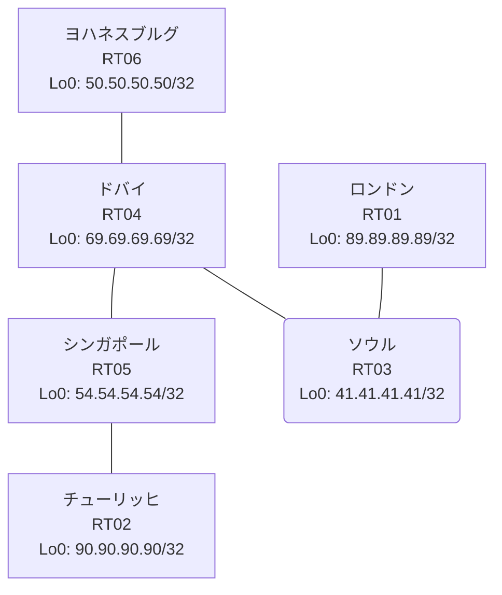

# 問題 20260805-003 : ルーティング到達性の分析

> **本問は機器に接続せずに解答すること。追加の show 実行は認めない。**

## トポロジ

あなたの会社のネットワークは、複数のルーティング・ドメインが、境界のルータによって接続され、
そして、相互の再配送という手段によって、すべての拠点のリーチアビリティが提供されている、というものです。
ルーティングの設計の詳細は、示されているところのコンフィギュレーションから、読み取られることが、期待されています。
各拠点のルータと、拠点のネットワークとの対応は、下記の表に示されているとおりです(拠点のネットワークの代表は、当該ルータのループバック 0 です)。



| 拠点 | ルータ | 拠点網(代表アドレス) |
|------|--------|----------------------|
| シンガポール | RT05 | `54.54.54.54/32` |
| ソウル | RT03 | `41.41.41.41/32` |
| チューリッヒ | RT02 | `90.90.90.90/32` |
| ドバイ | RT04 | `69.69.69.69/32` |
| ヨハネスブルグ | RT06 | `50.50.50.50/32` |
| ロンドン | RT01 | `89.89.89.89/32` |

リンク一覧(接続・アドレス):
```
  RT05:E0/0(.1) ── RT02:E0/0(.2)   10.80.129.0/30
  RT04:E0/0(.1) ── RT06:E0/0(.2)   10.116.78.0/30
  RT04:E0/1(.1) ── RT03:E0/0(.2)   10.214.221.0/30
  RT04:E0/2(.1) ── RT05:E0/1(.2)   10.170.43.0/30
  RT03:E0/1(.1) ── RT01:E0/0(.2)   10.72.87.0/30
```

## 要件

1. redistribute の参照先は、実在する隣接のプロセス/AS に限定され、無効な参照のステートメントが、コンフィギュレーションに残されてはなりません。
2. すべてのルータのループバック・インターフェイス 0 (/32) が、すべてのドメインの間で、相互に到達可能であること。
3. 管理のための構成(SSH / SNMP / NTP)に対して、変更が加えられてはなりません。
4. シード・メトリック `1000000 100 255 1 1500` の付与は、default-metric の方式に統一されなければなりません(redistribute のステートメントへの直接の記述は、認められていません)。
5. 再配送に対するフィルタ(route-map / distribute-list)の適用は、禁止されているところのものです。
6. インタフェースの IP アドレッシングは、変更されてはなりません。

## 現在の状態

複数のサイトから、ロンドンのサイトへ到達することが、できない、ということが、報告されています。ロンドンのサイトが関与しないところのサイトの間の通信は、正常である、とのことです。これは、意図された動作ではありません。示されているところの出力を、参照してください。

```
RT06# show ip route
Gateway of last resort is not set
      10.0.0.0/8 is variably subnetted, 6 subnets, 2 masks
O E2     10.72.87.0/30 [110/20] via 10.116.78.1, 00:04:00, Ethernet0/0
O E2     10.80.129.0/30 [110/20] via 10.116.78.1, 00:04:00, Ethernet0/0
C        10.116.78.0/30 is directly connected, Ethernet0/0
L        10.116.78.2/32 is directly connected, Ethernet0/0
O E2     10.170.43.0/30 [110/20] via 10.116.78.1, 00:04:00, Ethernet0/0
O        10.214.221.0/30 [110/20] via 10.116.78.1, 00:04:00, Ethernet0/0
      41.0.0.0/32 is subnetted, 1 subnets
O        41.41.41.41 [110/21] via 10.116.78.1, 00:04:00, Ethernet0/0
      50.0.0.0/32 is subnetted, 1 subnets
C        50.50.50.50 is directly connected, Loopback0
      54.0.0.0/32 is subnetted, 1 subnets
O E2     54.54.54.54 [110/20] via 10.116.78.1, 00:04:00, Ethernet0/0
      69.0.0.0/32 is subnetted, 1 subnets
O        69.69.69.69 [110/11] via 10.116.78.1, 00:04:00, Ethernet0/0
      90.0.0.0/32 is subnetted, 1 subnets
O E2     90.90.90.90 [110/20] via 10.116.78.1, 00:04:00, Ethernet0/0
```
```
RT01# show ip route
Gateway of last resort is not set
      10.0.0.0/8 is variably subnetted, 6 subnets, 2 masks
C        10.72.87.0/30 is directly connected, Ethernet0/0
L        10.72.87.2/32 is directly connected, Ethernet0/0
D EX     10.80.129.0/30 [170/307200] via 10.72.87.1, 00:04:35, Ethernet0/0
D EX     10.116.78.0/30 [170/307200] via 10.72.87.1, 00:04:35, Ethernet0/0
D EX     10.170.43.0/30 [170/307200] via 10.72.87.1, 00:04:35, Ethernet0/0
D EX     10.214.221.0/30 [170/307200] via 10.72.87.1, 00:05:09, Ethernet0/0
      41.0.0.0/32 is subnetted, 1 subnets
D        41.41.41.41 [90/409600] via 10.72.87.1, 00:05:09, Ethernet0/0
      50.0.0.0/32 is subnetted, 1 subnets
D EX     50.50.50.50 [170/307200] via 10.72.87.1, 00:04:16, Ethernet0/0
      54.0.0.0/32 is subnetted, 1 subnets
D EX     54.54.54.54 [170/307200] via 10.72.87.1, 00:04:35, Ethernet0/0
      69.0.0.0/32 is subnetted, 1 subnets
D EX     69.69.69.69 [170/307200] via 10.72.87.1, 00:04:35, Ethernet0/0
      89.0.0.0/32 is subnetted, 1 subnets
C        89.89.89.89 is directly connected, Loopback0
      90.0.0.0/32 is subnetted, 1 subnets
D EX     90.90.90.90 [170/307200] via 10.72.87.1, 00:04:35, Ethernet0/0
```
```
RT05# show ip route
Gateway of last resort is not set
      10.0.0.0/8 is variably subnetted, 7 subnets, 2 masks
D EX     10.72.87.0/30 [170/307200] via 10.170.43.1, 00:04:53, Ethernet0/1
C        10.80.129.0/30 is directly connected, Ethernet0/0
L        10.80.129.1/32 is directly connected, Ethernet0/0
D EX     10.116.78.0/30 [170/307200] via 10.170.43.1, 00:05:31, Ethernet0/1
C        10.170.43.0/30 is directly connected, Ethernet0/1
L        10.170.43.2/32 is directly connected, Ethernet0/1
D EX     10.214.221.0/30 [170/307200] via 10.170.43.1, 00:05:31, Ethernet0/1
      41.0.0.0/32 is subnetted, 1 subnets
D EX     41.41.41.41 [170/307200] via 10.170.43.1, 00:04:53, Ethernet0/1
      50.0.0.0/32 is subnetted, 1 subnets
D EX     50.50.50.50 [170/307200] via 10.170.43.1, 00:04:39, Ethernet0/1
      54.0.0.0/32 is subnetted, 1 subnets
C        54.54.54.54 is directly connected, Loopback0
      69.0.0.0/32 is subnetted, 1 subnets
D        69.69.69.69 [90/409600] via 10.170.43.1, 00:05:31, Ethernet0/1
      90.0.0.0/32 is subnetted, 1 subnets
D        90.90.90.90 [90/409600] via 10.80.129.2, 00:05:21, Ethernet0/0
```
```
RT03# show route-map
route-map RM-SVC, deny, sequence 10
  Match clauses:
    ip address prefix-lists: PL-SVC 
  Set clauses:
  Policy routing matches: 0 packets, 0 bytes
route-map RM-SVC, permit, sequence 20
  Match clauses:
  Set clauses:
  Policy routing matches: 0 packets, 0 bytes
route-map RM-BACKUP1, deny, sequence 10
  Match clauses:
    ip address prefix-lists: PL-BACKUP1 
  Set clauses:
  Policy routing matches: 0 packets, 0 bytes
route-map RM-BACKUP1, permit, sequence 20
  Match clauses:
  Set clauses:
  Policy routing matches: 0 packets, 0 bytes
```
```
RT03# show ip prefix-list
ip prefix-list PL-BACKUP1: 2 entries
   seq 5 deny 89.89.89.89/32
   seq 10 permit 0.0.0.0/0 le 32
ip prefix-list PL-SVC: 1 entries
   seq 5 permit 89.89.89.89/32
```
```
RT03# show access-lists
Standard IP access list 42
    10 deny   89.89.89.89
    20 permit any
```

## 設定抜粋

```
RT01# show running-config | section router
router eigrp 525
 timers active-time 5
 network 10.72.87.0 0.0.0.3
 network 89.89.89.89 0.0.0.0
 passive-interface Loopback0
```
```
RT02# show running-config | section router
router eigrp 413
 network 10.80.129.0 0.0.0.3
 network 90.90.90.90 0.0.0.0
```
```
RT03# show running-config | section router
router eigrp 525
 default-metric 1000000 100 255 1 1500
 network 10.72.87.0 0.0.0.3
 network 41.41.41.41 0.0.0.0
 redistribute ospf 67 match internal external 1 external 2
 passive-interface Loopback0
router ospf 67
 router-id 41.41.41.41
 redistribute eigrp 525 route-map RM-SVC
 network 10.214.221.0 0.0.0.3 area 0
 network 41.41.41.41 0.0.0.0 area 0
```
```
RT04# show running-config | section router
router eigrp 413
 timers active-time 5
 default-metric 1000000 100 255 1 1500
 network 10.170.43.0 0.0.0.3
 network 69.69.69.69 0.0.0.0
 redistribute ospf 67 match internal external 1 external 2
 passive-interface Loopback0
router ospf 67
 router-id 69.69.69.69
 redistribute eigrp 413
 network 10.116.78.0 0.0.0.3 area 0
 network 10.214.221.0 0.0.0.3 area 0
 network 69.69.69.69 0.0.0.0 area 0
```
```
RT05# show running-config | section router
router eigrp 413
 network 10.80.129.0 0.0.0.3
 network 10.170.43.0 0.0.0.3
 network 54.54.54.54 0.0.0.0
```
```
RT06# show running-config | section router
router ospf 67
 router-id 50.50.50.50
 network 10.116.78.0 0.0.0.3 area 0
 network 50.50.50.50 0.0.0.0 area 0
```

## 設問

この事象の原因である可能性が、最も高いものは、どれですか。(1つを選択してください)

## 選択肢

A. RT06 と隣接ルータの間で OSPF のネイバー(隣接関係)が確立していない
B. RT03 と RT06 側ドメインの間のリンクで MTU が一致していない
C. RT06 の router ospf 67 に Loopback0 の network 文が設定されていない
D. RT03 の router ospf 67 配下に redistribute が設定されていない
E. RT03 の router ospf 67 配下の redistribute が、実在しないプロセス/AS を参照している
F. RT03 の redistribute に適用された route-map が特定の拠点網を deny している
