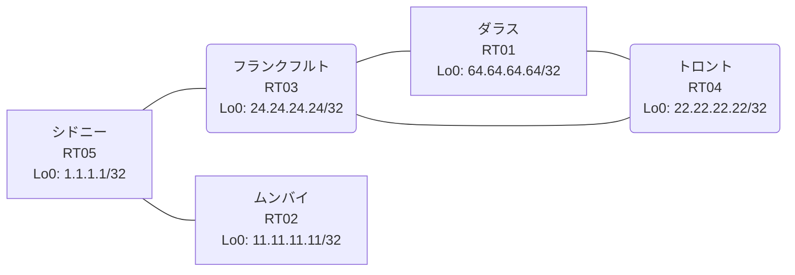

# 問題 20260806-003 : ルーティング到達性の分析

> **本問は機器に接続せずに解答すること。追加の show 実行は認めない。**

## トポロジ

あなたの会社のネットワークは、複数のルーティング・ドメインが、境界のルータによって接続され、
そして、相互の再配送という手段によって、すべてのサイトの到達可能性が提供されている、というものです。
ルーティングの設計の詳細は、示されているところのコンフィギュレーションから、読み取られることが、期待されています。
各サイトのルータと、サイトのネットワークとの対応は、下記の表に示されているとおりです(サイトのネットワークの代表は、当該ルータのループバック 0 です)。



| 拠点 | ルータ | 拠点網(代表アドレス) |
|------|--------|----------------------|
| シドニー | RT05 | `1.1.1.1/32` |
| ダラス | RT01 | `64.64.64.64/32` |
| トロント | RT04 | `22.22.22.22/32` |
| フランクフルト | RT03 | `24.24.24.24/32` |
| ムンバイ | RT02 | `11.11.11.11/32` |

リンク一覧(接続・アドレス):
```
  RT05:E0/0(.1) ── RT03:E0/0(.2)   10.93.220.0/30
  RT03:E0/1(.1) ── RT04:E0/0(.2)   10.113.116.0/30
  RT05:E0/1(.1) ── RT02:E0/0(.2)   10.97.235.0/30
  RT01:E0/0(.1) ── RT04:E0/1(.2)   10.181.215.0/30
  RT03:E0/2(.1) ── RT01:E0/1(.2)   10.76.78.0/30
```

## 要件

1. シード・メトリック `10000 10 255 1 1500` は、redistribute のステートメントごとに、個別に指定されなければなりません(default-metric への集約は、監査に適合しません)。
2. すべてのルータのループバック・インターフェイス 0 (/32) が、すべてのドメインの間で、相互に到達可能であること。
3. ルートの再配送に対して、フィルタ(route-map / distribute-list)が、適用されてはなりません。
4. インタフェースの IP アドレッシングは、変更されてはなりません。
5. redistribute によって参照されるところのプロセス ID / AS 番号は、その境界に実在する隣接のドメインのものと一致させられ、そして、実在しないプロセスへの参照が、残置されてはなりません。

## 現在の状態

複数のサイトから、ダラスのサイトへ到達することが、できない、ということが、報告されています。ダラスのサイトが関与しないところのサイトの間の通信は、正常である、とのことです。これは、意図された動作ではありません。示されているところの出力を、参照してください。

```
RT05# show ip route
Gateway of last resort is not set
      1.0.0.0/32 is subnetted, 1 subnets
C        1.1.1.1 is directly connected, Loopback0
      10.0.0.0/8 is variably subnetted, 7 subnets, 2 masks
O E2     10.76.78.0/30 [110/20] via 10.93.220.2, 00:04:00, Ethernet0/0
C        10.93.220.0/30 is directly connected, Ethernet0/0
L        10.93.220.1/32 is directly connected, Ethernet0/0
C        10.97.235.0/30 is directly connected, Ethernet0/1
L        10.97.235.1/32 is directly connected, Ethernet0/1
O E2     10.113.116.0/30 [110/20] via 10.93.220.2, 00:04:00, Ethernet0/0
O E2     10.181.215.0/30 [110/20] via 10.93.220.2, 00:04:00, Ethernet0/0
      11.0.0.0/32 is subnetted, 1 subnets
D        11.11.11.11 [90/409600] via 10.97.235.2, 00:04:29, Ethernet0/1
      22.0.0.0/32 is subnetted, 1 subnets
O E2     22.22.22.22 [110/20] via 10.93.220.2, 00:04:00, Ethernet0/0
      24.0.0.0/32 is subnetted, 1 subnets
O        24.24.24.24 [110/11] via 10.93.220.2, 00:04:00, Ethernet0/0
```
```
RT04# show ip route
Gateway of last resort is not set
      1.0.0.0/32 is subnetted, 1 subnets
D EX     1.1.1.1 [170/284160] via 10.113.116.1, 00:04:18, Ethernet0/0
      10.0.0.0/8 is variably subnetted, 7 subnets, 2 masks
D        10.76.78.0/30 [90/307200] via 10.181.215.1, 00:04:48, Ethernet0/1
                       [90/307200] via 10.113.116.1, 00:04:48, Ethernet0/0
D EX     10.93.220.0/30 [170/284160] via 10.113.116.1, 00:04:48, Ethernet0/0
D EX     10.97.235.0/30 [170/284160] via 10.113.116.1, 00:04:18, Ethernet0/0
C        10.113.116.0/30 is directly connected, Ethernet0/0
L        10.113.116.2/32 is directly connected, Ethernet0/0
C        10.181.215.0/30 is directly connected, Ethernet0/1
L        10.181.215.2/32 is directly connected, Ethernet0/1
      11.0.0.0/32 is subnetted, 1 subnets
D EX     11.11.11.11 [170/284160] via 10.113.116.1, 00:04:18, Ethernet0/0
      22.0.0.0/32 is subnetted, 1 subnets
C        22.22.22.22 is directly connected, Loopback0
      24.0.0.0/32 is subnetted, 1 subnets
D        24.24.24.24 [90/409600] via 10.113.116.1, 00:04:48, Ethernet0/0
      64.0.0.0/32 is subnetted, 1 subnets
D        64.64.64.64 [90/409600] via 10.181.215.1, 00:04:48, Ethernet0/1
```
```
RT01# show ip route
Gateway of last resort is not set
      1.0.0.0/32 is subnetted, 1 subnets
D EX     1.1.1.1 [170/284160] via 10.76.78.1, 00:04:35, Ethernet0/1
      10.0.0.0/8 is variably subnetted, 7 subnets, 2 masks
C        10.76.78.0/30 is directly connected, Ethernet0/1
L        10.76.78.2/32 is directly connected, Ethernet0/1
D EX     10.93.220.0/30 [170/284160] via 10.76.78.1, 00:05:01, Ethernet0/1
D EX     10.97.235.0/30 [170/284160] via 10.76.78.1, 00:04:35, Ethernet0/1
D        10.113.116.0/30 [90/307200] via 10.181.215.2, 00:05:01, Ethernet0/0
                         [90/307200] via 10.76.78.1, 00:05:01, Ethernet0/1
C        10.181.215.0/30 is directly connected, Ethernet0/0
L        10.181.215.1/32 is directly connected, Ethernet0/0
      11.0.0.0/32 is subnetted, 1 subnets
D EX     11.11.11.11 [170/284160] via 10.76.78.1, 00:04:35, Ethernet0/1
      22.0.0.0/32 is subnetted, 1 subnets
D        22.22.22.22 [90/409600] via 10.181.215.2, 00:05:01, Ethernet0/0
      24.0.0.0/32 is subnetted, 1 subnets
D        24.24.24.24 [90/409600] via 10.76.78.1, 00:05:01, Ethernet0/1
      64.0.0.0/32 is subnetted, 1 subnets
C        64.64.64.64 is directly connected, Loopback0
```
```
RT03# show route-map
route-map RM-SVC, deny, sequence 10
  Match clauses:
    ip address prefix-lists: PL-SVC 
  Set clauses:
  Policy routing matches: 0 packets, 0 bytes
route-map RM-SVC, permit, sequence 20
  Match clauses:
  Set clauses:
  Policy routing matches: 0 packets, 0 bytes
route-map RM-OLD2, deny, sequence 10
  Match clauses:
    ip address prefix-lists: PL-OLD2 
  Set clauses:
  Policy routing matches: 0 packets, 0 bytes
route-map RM-OLD2, permit, sequence 20
  Match clauses:
  Set clauses:
  Policy routing matches: 0 packets, 0 bytes
route-map RM-LEGACY1, deny, sequence 10
  Match clauses:
    ip address prefix-lists: PL-LEGACY1 
  Set clauses:
  Policy routing matches: 0 packets, 0 bytes
route-map RM-LEGACY1, permit, sequence 20
  Match clauses:
  Set clauses:
  Policy routing matches: 0 packets, 0 bytes
```
```
RT03# show ip prefix-list
ip prefix-list PL-LEGACY1: 2 entries
   seq 5 deny 64.64.64.64/32
   seq 10 permit 0.0.0.0/0 le 32
ip prefix-list PL-OLD2: 2 entries
   seq 5 deny 11.11.11.11/32
   seq 10 permit 0.0.0.0/0 le 32
ip prefix-list PL-SVC: 1 entries
   seq 5 permit 64.64.64.64/32
```
```
RT03# show access-lists
Standard IP access list 44
    10 deny   64.64.64.64
    20 permit any
Standard IP access list 52
    10 deny   11.11.11.11
    20 permit any
```

## 設定抜粋

```
RT01# show running-config | section router
router eigrp 654
 network 10.76.78.0 0.0.0.3
 network 10.181.215.0 0.0.0.3
 network 64.64.64.64 0.0.0.0
 passive-interface Loopback0
```
```
RT02# show running-config | section router
router eigrp 402
 network 10.97.235.0 0.0.0.3
 network 11.11.11.11 0.0.0.0
```
```
RT03# show running-config | section router
router eigrp 654
 network 10.76.78.0 0.0.0.3
 network 10.113.116.0 0.0.0.3
 network 24.24.24.24 0.0.0.0
 redistribute ospf 21 match internal external 1 external 2 metric 10000 10 255 1 1500
 passive-interface Loopback0
router ospf 21
 router-id 24.24.24.24
 redistribute eigrp 654 route-map RM-SVC
 network 10.93.220.0 0.0.0.3 area 0
 network 24.24.24.24 0.0.0.0 area 0
```
```
RT04# show running-config | section router
router eigrp 654
 timers active-time 5
 network 10.113.116.0 0.0.0.3
 network 10.181.215.0 0.0.0.3
 network 22.22.22.22 0.0.0.0
 passive-interface Loopback0
```
```
RT05# show running-config | section router
router eigrp 402
 network 1.1.1.1 0.0.0.0
 network 10.97.235.0 0.0.0.3
 redistribute ospf 21 match internal external 1 external 2 metric 10000 10 255 1 1500
router ospf 21
 router-id 1.1.1.1
 redistribute eigrp 402
 passive-interface Loopback0
 network 1.1.1.1 0.0.0.0 area 0
 network 10.93.220.0 0.0.0.3 area 0
```

## 設問

この事象の原因である可能性が、最も高いものは、どれですか。(1つを選択してください)

## 選択肢

A. RT05 の router ospf 21 で、上流側インタフェースが passive-interface に設定されている
B. RT03 の router ospf 21 配下に redistribute が設定されていない
C. RT03 と RT05 側ドメインの間のリンクで MTU が一致していない
D. RT03 の router ospf 21 配下の redistribute が、実在しないプロセス/AS を参照している
E. RT05 の router ospf 21 に Loopback0 の network 文が設定されていない
F. RT03 の redistribute に適用された route-map が特定の拠点網を deny している
