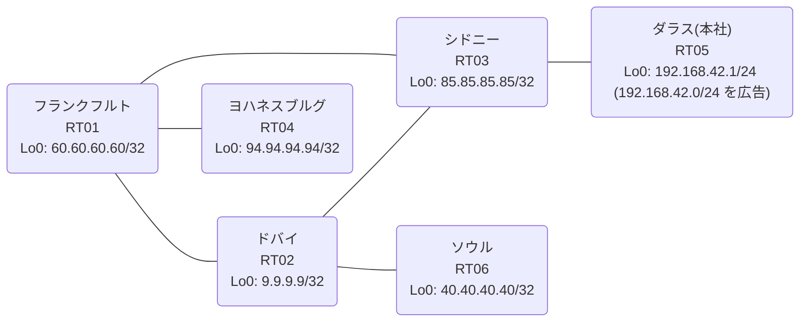

# 問題 20260807-002

> **本問は機器に接続せずに解答すること。追加の show 実行は認めない。**

## トポロジ

あなたは、ネットワークの運用を担当しています。本社の顧客のネットワークは、BGP AS 65056 の RT05 によって、広告されています。あなたの会社の内部は、BGP / EIGRP / OSPF という 3 つのドメインから構成されています。サイトと、ルーターおよびアドレスとの対応は、下記の表に示されているとおりです。



| 拠点 | ルータ | 拠点網 / 広告網 |
|------|--------|------------------|
| シドニー | RT03 | 85.85.85.85/32 |
| ソウル | RT06 | 40.40.40.40/32 |
| ダラス(本社) | RT05 | 192.168.42.1/24 (`192.168.42.0/24` を広告) |
| ドバイ | RT02 | 9.9.9.9/32 |
| フランクフルト | RT01 | 60.60.60.60/32 |
| ヨハネスブルグ | RT04 | 94.94.94.94/32 |

リンク一覧:
```
  RT05:E0/0(.1) ── RT03:E0/0(.2)   10.57.112.0/30
  RT03:E0/1(.1) ── RT02:E0/0(.2)   10.86.131.0/30
  RT03:E0/2(.1) ── RT01:E0/0(.2)   10.44.64.0/30
  RT02:E0/1(.1) ── RT01:E0/1(.2)   10.210.82.0/30
  RT01:E0/2(.1) ── RT04:E0/0(.2)   10.55.108.0/30
  RT02:E0/2(.1) ── RT06:E0/0(.2)   10.23.43.0/30
```

## 要件

1. 既存の再配送の設計が、変更または撤去されることはできません。スタティック ルートによる回避も、許可されていません。
2. `192.168.42.0/24` 宛のパケットが、広告元である RT05 の方向へ転送され、そして、転送のループが存在していないこと。
3. スタティック・ルートおよび既定のルートによる迂回は、実施されてはなりません。
4. すべてのルーターが、`192.168.42.0/24` を含むところのすべての宛先へ、到達することができること。
5. 本作業は、日中の時間帯において実施されるという理由により、対象外であるところのデバイスに対する構成の変更は、許可されていません。

## 現在の状態

いくつかの宛先への通信について、報告が上がっています。あなたは、示されているところの出力および構成に基づいて、その構成が、下記において記述されているとおりに動作していない理由を、判断する必要があります。

```
RT03# show route-map
route-map RM-OLD1, deny, sequence 10
  Match clauses:
    ip address prefix-lists: PL-OLD1 
  Set clauses:
  Policy routing matches: 0 packets, 0 bytes
route-map RM-OLD1, permit, sequence 20
  Match clauses:
  Set clauses:
  Policy routing matches: 0 packets, 0 bytes
```
```
RT03# show ip prefix-list
ip prefix-list PL-OLD1: 2 entries
   seq 5 deny 40.40.40.40/32
   seq 10 permit 0.0.0.0/0 le 32
```
```
RT03# show ip route
Gateway of last resort is not set
      9.0.0.0/32 is subnetted, 1 subnets
O        9.9.9.9 [110/21] via 10.44.64.2, 00:04:34, Ethernet0/2
      10.0.0.0/8 is variably subnetted, 9 subnets, 2 masks
O        10.23.43.0/30 [110/30] via 10.44.64.2, 00:04:05, Ethernet0/2
C        10.44.64.0/30 is directly connected, Ethernet0/2
L        10.44.64.1/32 is directly connected, Ethernet0/2
O        10.55.108.0/30 [110/20] via 10.44.64.2, 00:04:13, Ethernet0/2
C        10.57.112.0/30 is directly connected, Ethernet0/0
L        10.57.112.2/32 is directly connected, Ethernet0/0
C        10.86.131.0/30 is directly connected, Ethernet0/1
L        10.86.131.1/32 is directly connected, Ethernet0/1
O        10.210.82.0/30 [110/20] via 10.44.64.2, 00:04:34, Ethernet0/2
      40.0.0.0/32 is subnetted, 1 subnets
O        40.40.40.40 [110/31] via 10.44.64.2, 00:04:01, Ethernet0/2
      60.0.0.0/32 is subnetted, 1 subnets
O        60.60.60.60 [110/11] via 10.44.64.2, 00:04:34, Ethernet0/2
      85.0.0.0/32 is subnetted, 1 subnets
C        85.85.85.85 is directly connected, Loopback0
      94.0.0.0/32 is subnetted, 1 subnets
O        94.94.94.94 [110/21] via 10.44.64.2, 00:04:08, Ethernet0/2
O E2  192.168.42.0/24 [110/20] via 10.44.64.2, 00:03:54, Ethernet0/2
```
```
RT03# show access-lists
Standard IP access list 93
    10 deny   40.40.40.40
    20 permit any
```
```
RT04# traceroute 192.168.42.1 probe 1 timeout 1 ttl 1 8
Type escape sequence to abort.
Tracing the route to 192.168.42.1
VRF info: (vrf in name/id, vrf out name/id)
  1 10.55.108.1 1 msec
  2 10.210.82.1 1 msec
  3 10.86.131.1 2 msec
  4 10.44.64.2 1 msec
  5 10.210.82.1 3 msec
  6 10.86.131.1 3 msec
  7 10.44.64.2 1 msec
  8 10.210.82.1 4 msec
```
```
RT03# show ip bgp
BGP table version is 12, local router ID is 85.85.85.85
Status codes: s suppressed, d damped, h history, * valid, > best, i - internal, 
              r RIB-failure, S Stale, m multipath, b backup-path, f RT-Filter, 
              x best-external, a additional-path, c RIB-compressed, 
              t secondary path, L long-lived-stale,
Origin codes: i - IGP, e - EGP, ? - incomplete
RPKI validation codes: V valid, I invalid, N Not found

     Network          Next Hop            Metric LocPrf Weight Path
 *>   9.9.9.9/32       10.44.64.2              21         32768 ?
 *>   10.23.43.0/30    10.44.64.2              30         32768 ?
 *>   10.44.64.0/30    0.0.0.0                  0         32768 ?
 *>   10.55.108.0/30   10.44.64.2              20         32768 ?
 *>   10.210.82.0/30   10.44.64.2              20         32768 ?
 *>   40.40.40.40/32   10.44.64.2              31         32768 ?
 *>   60.60.60.60/32   10.44.64.2              11         32768 ?
 *>   85.85.85.85/32   0.0.0.0                  0         32768 i
 *>   94.94.94.94/32   10.44.64.2              21         32768 ?
 r>i  192.168.42.0     10.57.112.1              0    100      0 i
```

## 設定抜粋

```
RT03# show running-config | section router
router eigrp 800
 network 10.86.131.0 0.0.0.3
 redistribute bgp 65056 metric 100000 100 255 1 1500
 redistribute ospf 69 metric 100000 100 255 1 1500
 passive-interface Loopback0
router ospf 69
 router-id 85.85.85.85
 network 10.44.64.0 0.0.0.3 area 0
 network 85.85.85.85 0.0.0.0 area 0
router bgp 65056
 bgp router-id 85.85.85.85
 bgp log-neighbor-changes
 bgp redistribute-internal
 network 85.85.85.85 mask 255.255.255.255
 redistribute ospf 69
 neighbor 10.57.112.1 remote-as 65056
```
```
RT02# show running-config | section router
router eigrp 800
 network 10.86.131.0 0.0.0.3
 redistribute ospf 69 metric 100000 100 255 1 1500
router ospf 69
 router-id 9.9.9.9
 redistribute eigrp 800
 network 9.9.9.9 0.0.0.0 area 0
 network 10.23.43.0 0.0.0.3 area 0
 network 10.210.82.0 0.0.0.3 area 0
```
```
RT01# show running-config | section router
router ospf 69
 router-id 60.60.60.60
 passive-interface Loopback0
 network 10.44.64.0 0.0.0.3 area 0
 network 10.55.108.0 0.0.0.3 area 0
 network 10.210.82.0 0.0.0.3 area 0
 network 60.60.60.60 0.0.0.0 area 0
```
```
RT05# show running-config | section router
router bgp 65056
 bgp router-id 192.168.42.1
 bgp log-neighbor-changes
 network 192.168.42.0
 neighbor 10.57.112.2 remote-as 65056
```

## 設問

次のうち、正しいものは、どれですか。

## 選択肢
A. RT02 の相互再配送において経路が収束せず、振動している
B. RT03 が、一周して戻ってきた外部経路を iBGP の経路より優先して採用している
C. RT02 と RT01 の間で等コストの複数経路が成立し、パケットが分散されている
D. 当該プレフィックスの next-hop が最適でなく、遠回りの経路が選択されている
E. RT03 において当該プレフィックスの外部経路タイプが E2 であり、内部コストが加算されていない
F. RT05 からの広告が RT03 に到達していない
