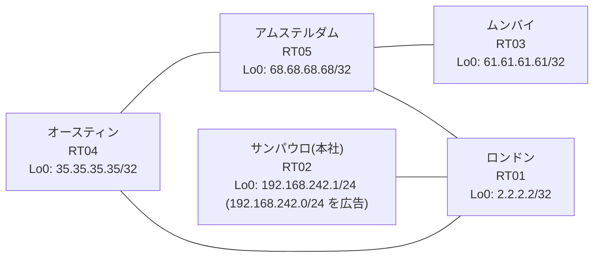

# 問題 20260808-007

> **本問は機器に接続せずに解答すること。追加の show 実行は認めない。**

## シナリオ

あなたは、下記のネットワークの保守を担当する技術者です。本社の顧客のネットワークは、BGP AS 65298 の RT02 によって、広告されています。あなたの会社の内部は、BGP / EIGRP / OSPF という 3 つのドメインから構成されています。サイトと、ルーターおよびアドレスとの対応は、下記の表に示されているとおりです。通信の一部において、想定されていない挙動が、観測されています。あなたは、示されているところの出力および構成に基づいて、その構成が、下記において記述されているとおりに動作していない理由を、判断する必要があります。インタフェースの IP アドレッシングは、変更されてはなりません。本作業は、日中の時間帯において実施されるという理由により、対象外であるところのデバイスに対する構成の変更は、許可されていません。それぞれのドメインの間の再配送の設計は、維持されなければなりません。すべてのルータが、`192.168.242.0/24` を含むところのすべての宛先へ、到達することができること。`192.168.242.0/24` 宛のパケットが、広告元である RT02 の方向へ転送され、そして、転送のループが存在していないこと。



| 拠点 | ルータ | 拠点網 / 広告網 |
|------|--------|------------------|
| アムステルダム | RT05 | 68.68.68.68/32 |
| オースティン | RT04 | 35.35.35.35/32 |
| サンパウロ(本社) | RT02 | 192.168.242.1/24 (`192.168.242.0/24` を広告) |
| ムンバイ | RT03 | 61.61.61.61/32 |
| ロンドン | RT01 | 2.2.2.2/32 |

リンク一覧:
```
  RT02:E0/0(.1) ── RT01:E0/0(.2)   10.66.36.0/30
  RT01:E0/1(.1) ── RT04:E0/0(.2)   10.93.102.0/30
  RT01:E0/2(.1) ── RT05:E0/0(.2)   10.204.106.0/30
  RT04:E0/1(.1) ── RT05:E0/1(.2)   10.140.171.0/30
  RT05:E0/2(.1) ── RT03:E0/0(.2)   10.11.26.0/30
```

## 出力

```
RT01# show ip route
Gateway of last resort is not set
      2.0.0.0/32 is subnetted, 1 subnets
C        2.2.2.2 is directly connected, Loopback0
      10.0.0.0/8 is variably subnetted, 8 subnets, 2 masks
O        10.11.26.0/30 [110/20] via 10.204.106.2, 00:04:17, Ethernet0/2
C        10.66.36.0/30 is directly connected, Ethernet0/0
L        10.66.36.2/32 is directly connected, Ethernet0/0
C        10.93.102.0/30 is directly connected, Ethernet0/1
L        10.93.102.1/32 is directly connected, Ethernet0/1
O        10.140.171.0/30 [110/20] via 10.204.106.2, 00:04:17, Ethernet0/2
C        10.204.106.0/30 is directly connected, Ethernet0/2
L        10.204.106.1/32 is directly connected, Ethernet0/2
      35.0.0.0/32 is subnetted, 1 subnets
O        35.35.35.35 [110/21] via 10.204.106.2, 00:03:40, Ethernet0/2
      61.0.0.0/32 is subnetted, 1 subnets
O        61.61.61.61 [110/21] via 10.204.106.2, 00:03:45, Ethernet0/2
      68.0.0.0/32 is subnetted, 1 subnets
O        68.68.68.68 [110/11] via 10.204.106.2, 00:04:17, Ethernet0/2
D EX  192.168.242.0/24 [170/307200] via 10.93.102.2, 00:03:44, Ethernet0/1
```
```
RT01# show route-map
route-map RM-LEGACY1, deny, sequence 10
  Match clauses:
    ip address prefix-lists: PL-LEGACY1 
  Set clauses:
  Policy routing matches: 0 packets, 0 bytes
route-map RM-LEGACY1, permit, sequence 20
  Match clauses:
  Set clauses:
  Policy routing matches: 0 packets, 0 bytes
```
```
RT01# show ip prefix-list
ip prefix-list PL-LEGACY1: 2 entries
   seq 5 deny 61.61.61.61/32
   seq 10 permit 0.0.0.0/0 le 32
```
```
RT01# show access-lists
Standard IP access list 59
    10 deny   61.61.61.61
    20 permit any
```
```
RT01# show ip bgp
BGP table version is 10, local router ID is 2.2.2.2
Status codes: s suppressed, d damped, h history, * valid, > best, i - internal, 
              r RIB-failure, S Stale, m multipath, b backup-path, f RT-Filter, 
              x best-external, a additional-path, c RIB-compressed, 
              t secondary path, L long-lived-stale,
Origin codes: i - IGP, e - EGP, ? - incomplete
RPKI validation codes: V valid, I invalid, N Not found

     Network          Next Hop            Metric LocPrf Weight Path
 *>   2.2.2.2/32       0.0.0.0                  0         32768 i
 *>   10.11.26.0/30    10.204.106.2            20         32768 ?
 *>   10.140.171.0/30  10.204.106.2            20         32768 ?
 *>   10.204.106.0/30  0.0.0.0                  0         32768 ?
 *>   35.35.35.35/32   10.204.106.2            21         32768 ?
 *>   61.61.61.61/32   10.204.106.2            21         32768 ?
 *>   68.68.68.68/32   10.204.106.2            11         32768 ?
 r>i  192.168.242.0    10.66.36.1               0    100      0 i
```
```
RT03# traceroute 192.168.242.1 probe 1 timeout 1 ttl 1 8
Type escape sequence to abort.
Tracing the route to 192.168.242.1
VRF info: (vrf in name/id, vrf out name/id)
  1 10.11.26.1 1 msec
  2 10.204.106.1 2 msec
  3 10.93.102.2 2 msec
  4 10.140.171.2 2 msec
  5 10.204.106.1 26 msec
  6 10.93.102.2 4 msec
  7 10.140.171.2 2 msec
  8 10.204.106.1 2 msec
```
```
RT01# show running-config | section router
router eigrp 115
 network 10.93.102.0 0.0.0.3
 passive-interface Loopback0
router ospf 62
 router-id 2.2.2.2
 redistribute eigrp 115
 redistribute bgp 65298
 network 2.2.2.2 0.0.0.0 area 0
 network 10.204.106.0 0.0.0.3 area 0
router bgp 65298
 bgp router-id 2.2.2.2
 bgp log-neighbor-changes
 bgp redistribute-internal
 network 2.2.2.2 mask 255.255.255.255
 redistribute ospf 62
 neighbor 10.66.36.1 remote-as 65298
```
```
RT04# show running-config | section router
router eigrp 115
 network 10.93.102.0 0.0.0.3
 redistribute ospf 62 metric 100000 100 255 1 1500
router ospf 62
 router-id 35.35.35.35
 redistribute eigrp 115
 network 10.140.171.0 0.0.0.3 area 0
 network 35.35.35.35 0.0.0.0 area 0
```
```
RT05# show running-config | section router
router ospf 62
 router-id 68.68.68.68
 timers throttle spf 50 200 5000
 passive-interface Loopback0
 network 10.11.26.0 0.0.0.3 area 0
 network 10.140.171.0 0.0.0.3 area 0
 network 10.204.106.0 0.0.0.3 area 0
 network 68.68.68.68 0.0.0.0 area 0
```
```
RT02# show running-config | section router
router bgp 65298
 bgp router-id 192.168.242.1
 bgp log-neighbor-changes
 network 192.168.242.0
 neighbor 10.66.36.2 remote-as 65298
```

## 設問

次のうち、正しいものは、どれですか。

## 選択肢
A. 当該プレフィックスの next-hop が最適でなく、遠回りの経路が選択されている

B. RT02 からの広告が RT01 に到達していない

C. RT01 が、一周して戻ってきた外部経路を iBGP の経路より優先して採用している

D. RT04 の相互再配送において経路が収束せず、振動している

E. RT04 と RT05 の間で等コストの複数経路が成立し、パケットが分散されている

F. BGP から OSPF への再配送に seed metric が指定されておらず、経路が広告されていない
