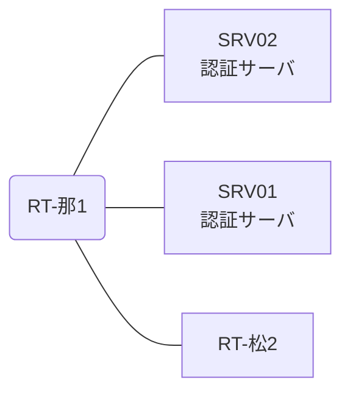

# 問題 20260808-011

> **本問は機器に接続せずに解答すること。追加の show 実行は認めない。**

## シナリオ

あなたの組織は、下記に示されているところのネットワークを運用しています。2 つの拠点のルータが、共通の認証サーバ群を用いて、管理者の認証を行うように構成されています。一方のルータはサーバと直結しており、他方はそのルーターを経由してサーバに到達します。いくつかの宛先への通信について、報告が上がっています。示されているところの出力および構成に基づいて、要求されているところの動作が得られていない理由が、判断されなければなりません。那覇・松山 の両拠点で、利用者 noc-taro が権限レベル 15 で機器を操作できること。作業の途中で運用者の接続が切れないこと。認証は認証サーバ群 AAA-SRV を用いること。



### 認証サーバの仕様

| 項目 | SRV01 | SRV02 |
|---|---|---|
| アドレス | 10.99.47.2 | 10.99.48.2 |
| 待受ポート | 1812 / 1813 | 1645 / 1646 |
| 共有鍵 | K-9931 | K-9931 |
| 受理する送信元 | 10.5.0.1 ・ 10.8.0.2 | 同左 |
| 台帳 | noc-taro(15) ・ monitor-op(1) ・ SUZUKI(15) | 同左 |
| 現在の稼働状態 | 保守作業のため停止中 | 稼働中 |

## 出力

```
那覇: User was successfully authenticated. (約 6 秒)
松山: User was successfully authenticated. (約 6 秒)
```
```
RT-那1# show running-config | section aaa
aaa new-model
!
radius server RAD1
 address ipv4 10.99.47.2 auth-port 1812 acct-port 1813
 key K-9931
!
radius server RAD2
 address ipv4 10.99.48.2 auth-port 1645 acct-port 1646
 key K-9931
!
aaa group server radius AAA-SRV
 server name RAD1
 server name RAD2
 deadtime 5
!
aaa authentication login default group AAA-SRV local
aaa authorization exec default group AAA-SRV local
!
ip radius source-interface Loopback0
radius-server timeout 2
radius-server retransmit 2
!
username local-admin privilege 15 secret 5 $1$xxxx
username SUZUKI privilege 15 secret 5 $1$yyyy
!
line vty 0 4
 exec-timeout 0 0
 transport input ssh
```
```
RT-松2# show running-config | section aaa
aaa new-model
!
radius server RAD1
 address ipv4 10.99.47.2 auth-port 1812 acct-port 1813
 key K-9931
!
radius server RAD2
 address ipv4 10.99.48.2 auth-port 1645 acct-port 1646
 key K-9931
!
aaa group server radius AAA-SRV
 server name RAD1
 server name RAD2
 deadtime 5
!
aaa authentication login default group AAA-SRV local
aaa authorization exec default group AAA-SRV
!
ip radius source-interface Loopback0
radius-server timeout 2
radius-server retransmit 2
!
username local-admin privilege 15 secret 5 $1$xxxx
username SUZUKI privilege 15 secret 5 $1$yyyy
!
line vty 0 4
 exec-timeout 0 0
 transport input ssh
```

## 設問

次のうち、正しいものは、どれですか。

## 選択肢
**A.**
```
| 拠点 | ユーザ | 結果 |
|---|---|---|
| 那覇 | noc-taro | ログイン可(権限レベル 15) |
| 那覇 | monitor-op | ログイン可(権限レベル 1) |
| 那覇 | local-admin | ログイン不可 |
| 那覇 | monitor-op からの特権昇格 | 昇格可(15) |
| 松山 | noc-taro | ログイン不可 |
| 松山 | monitor-op | ログイン不可 |
| 松山 | local-admin | ログイン可(権限レベル 15) |
| 松山 | monitor-op からの特権昇格 | 昇格可(15) |
```
**B.**
```
| 拠点 | ユーザ | 結果 |
|---|---|---|
| 那覇 | noc-taro | ログイン可(権限レベル 15) |
| 那覇 | monitor-op | ログイン可(権限レベル 1) |
| 那覇 | local-admin | ログイン不可 |
| 那覇 | monitor-op からの特権昇格 | 昇格可(15) |
| 松山 | noc-taro | ログイン不可 |
| 松山 | monitor-op | ログイン不可 |
| 松山 | local-admin | ログインは通るが exec 拒否 |
| 松山 | monitor-op からの特権昇格 | 昇格可(15) |
```
**C.**
```
| 拠点 | ユーザ | 結果 |
|---|---|---|
| 那覇 | noc-taro | ログイン可(権限レベル 15) |
| 那覇 | monitor-op | ログイン可(権限レベル 1) |
| 那覇 | local-admin | ログイン不可 |
| 那覇 | monitor-op からの特権昇格 | 昇格可(15) |
| 松山 | noc-taro | ログイン可(権限レベル 15) |
| 松山 | monitor-op | ログイン可(権限レベル 1) |
| 松山 | local-admin | ログイン不可 |
| 松山 | monitor-op からの特権昇格 | 昇格不可 |
```
**D.**
```
| 拠点 | ユーザ | 結果 |
|---|---|---|
| 那覇 | noc-taro | ログイン可(権限レベル 15) |
| 那覇 | monitor-op | ログイン可(権限レベル 1) |
| 那覇 | local-admin | ログイン不可 |
| 那覇 | monitor-op からの特権昇格 | 昇格可(15) |
| 松山 | noc-taro | ログイン可(権限レベル 15) |
| 松山 | monitor-op | ログイン可(権限レベル 1) |
| 松山 | local-admin | ログイン不可 |
| 松山 | monitor-op からの特権昇格 | 昇格可(15) |
```
