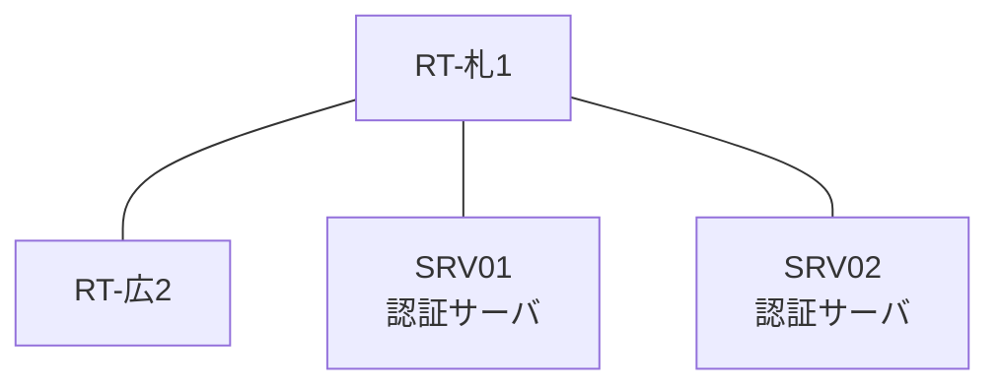

# 問題 20260808-012

> **本問は機器に接続せずに解答すること。追加の show 実行は認めない。**

## シナリオ

あなたの組織は、下記に示されているところのネットワークを運用しています。2 つの拠点のルータが、共通の認証サーバ群を用いて、管理者の認証を行うように構成されています。一方のルータはサーバと直結しており、他方はそのルーターを経由してサーバに到達します。利用者の認証が、意図されたとおりに行われていない、ということが、報告されています。原因として、**ルータと認証サーバの共有鍵が一致していない。** と **認証要求の送信元アドレスが、サーバ側で許可された値になっていない。** の 2 つが、想定されています。機器の構成は、まだ取得されていません。札幌・広島 の両拠点で、利用者 ope-suzuki が権限レベル 15 で機器を操作できること。認証サーバが全て停止した場合でも、コンソールからは操作できること。認証は認証サーバ群 AUTH-GRP を用いること。



### 認証サーバの仕様

| 項目 | SRV01 | SRV02 |
|---|---|---|
| アドレス | 10.99.177.2 | 10.99.178.2 |
| 待受ポート | 1812 / 1813 | 1912 / 1913 |
| 共有鍵 | Ccnp-Aaa-77 | Ccnp-Aaa-77 |
| 受理する送信元 | 10.4.0.1 ・ 10.0.0.2 | 同左 |
| 台帳 | ope-suzuki(15) ・ monitor-op(1) ・ SUZUKI(15) | 同左 |
| 現在の稼働状態 | 稼働中 | 稼働中 |

## 出力

| 拠点 | ユーザ | 結果 |
|---|---|---|
| 札幌 | ope-suzuki | ログイン可(権限レベル 15) |
| 札幌 | monitor-op | ログイン可(権限レベル 1) |
| 札幌 | break-glass | ログイン不可 |
| 札幌 | monitor-op からの特権昇格 | 昇格可(15) |
| 広島 | ope-suzuki | ログイン不可 |
| 広島 | monitor-op | ログイン不可 |
| 広島 | break-glass | ログイン可(権限レベル 15) |
| 広島 | monitor-op からの特権昇格 | 昇格可(15) |

```
札幌: User was successfully authenticated. (即時)
広島: No authoritative response from any server. (約 18 秒)
```

## 設問

2 つの原因の、いずれであるかを、判断するために、次に取得されなければならない出力は、どれですか。(1つを選択してください)

## 選択肢
A. 各ルータの `show running-config | include radius source-interface`

B. 各ルータの `show running-config | section line vty`

C. 各ルータの `show aaa servers`

D. 各ルータでの `test aaa group AUTH-GRP <利用者> <パスワード> legacy`
