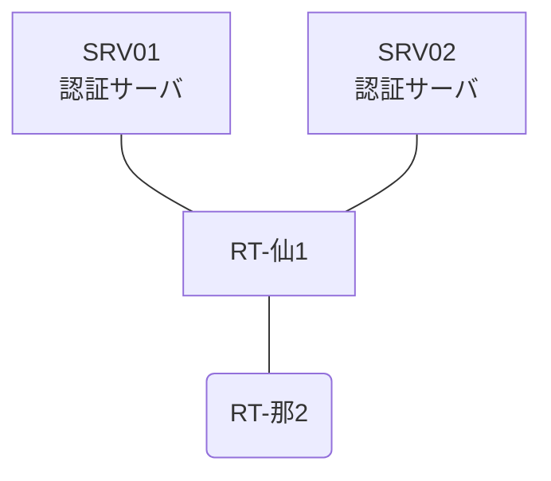

# 問題 20260808-013

> **本問は機器に接続せずに解答すること。追加の show 実行は認めない。**

## シナリオ

あなたは、ネットワークの運用を担当しています。2 つの拠点のルータが、共通の認証サーバ群を用いて、管理者の認証を行うように構成されています。一方のルータはサーバと直結しており、他方はそのルーターを経由してサーバに到達します。利用者の認証が、意図されたとおりに行われていない、ということが、報告されています。原因として、**ルーターと認証サーバの共有鍵が一致していない。** と **認証要求の送信元アドレスが、サーバ側で許可された値になっていない。** と **ルーターが指定している待受ポートがサーバの実際の値と異なる。** の 3 つが、想定されています。機器の構成は、まだ取得されていません。仙台・那覇 の両拠点で、利用者 adm-kato が権限レベル 15 で機器を操作できること。認証サーバが全て停止した場合でも、コンソールからは操作できること。認証は認証サーバ群 NOC-RADIUS を用いること。



### 認証サーバの仕様

| 項目 | SRV01 | SRV02 |
|---|---|---|
| アドレス | 10.99.118.2 | 10.99.119.2 |
| 待受ポート | 1812 / 1813 | 1645 / 1646 |
| 共有鍵 | Ccnp-Aaa-77 | Ccnp-Aaa-77 |
| 受理する送信元 | 10.0.0.1 ・ 10.6.0.2 | 同左 |
| 台帳 | adm-kato(15) ・ helpdesk(1) ・ SUZUKI(15) | 同左 |
| 現在の稼働状態 | 保守作業のため停止中 | 稼働中 |

## 出力

| 拠点 | ユーザ | 結果 |
|---|---|---|
| 仙台 | adm-kato | ログイン可(権限レベル 15) |
| 仙台 | helpdesk | ログイン可(権限レベル 1) |
| 仙台 | backup-adm | ログイン不可 |
| 仙台 | helpdesk からの特権昇格 | 昇格可(15) |
| 仙台 | backup-adm(コンソールから) | ログイン可(権限レベル 15) |
| 那覇 | adm-kato | ログイン不可 |
| 那覇 | helpdesk | ログイン不可 |
| 那覇 | backup-adm | ログイン可(権限レベル 15) |
| 那覇 | helpdesk からの特権昇格 | 昇格可(15) |
| 那覇 | backup-adm(コンソールから) | ログイン可(権限レベル 15) |

```
仙台: User was successfully authenticated. (約 9 秒)
那覇: No authoritative response from any server. (約 18 秒)
```

## 設問

想定されているところの原因の、いずれであるかを、判断するために、**最も多くの候補を除外できる**出力は、どれですか。(1つを選択してください)

## 選択肢
A. 各ルータでの `test aaa group NOC-RADIUS <利用者> <パスワード> legacy`

B. 各ルータの `show running-config | section line con`

C. 認証サーバの `/var/log/freeradius/radius.log`

D. 各ルータの `show aaa servers`
