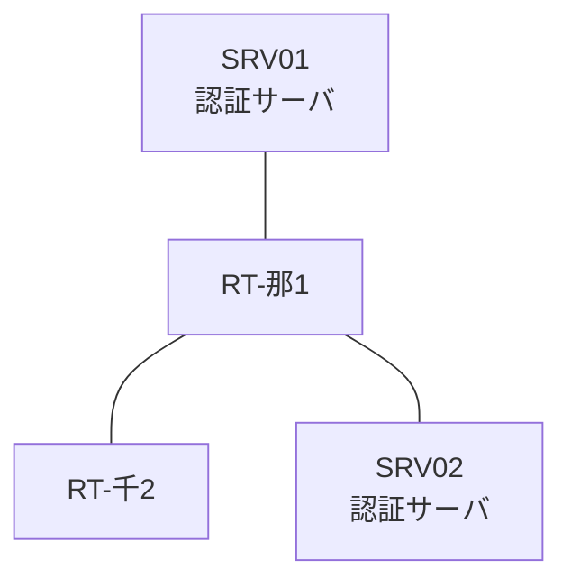

# 問題 20260808-014

> **本問は機器に接続せずに解答すること。追加の show 実行は認めない。**

## シナリオ

あなたは、下記のネットワークの保守を担当する技術者です。2 つの拠点のルータが、共通の認証サーバ群を用いて、管理者の認証を行うように構成されています。一方のルータはサーバと直結しており、他方はそのルーターを経由してサーバに到達します。一部の通信が、意図されているとおりに動作していない、という報告があります。あなたは、提示されているところの情報のみを使用して、要求されている状態が満たされていない理由を、特定しなければなりません。那覇・千葉 の両拠点で、利用者 noc-taro が権限レベル 15 で機器を操作できること。認証は認証サーバ群 RAD-GROUP を用いること。既定の方式リストは変更しないこと。



### 認証サーバの仕様

| 項目 | SRV01 | SRV02 |
|---|---|---|
| アドレス | 10.99.191.2 | 10.99.192.2 |
| 待受ポート | 1812 / 1813 | 11812 / 11813 |
| 共有鍵 | K-9931 | K-9931 |
| 受理する送信元 | 10.8.0.1 ・ 10.9.0.2 | 同左 |
| 台帳 | noc-taro(15) ・ helpdesk(1) ・ SUZUKI(15) | 同左 |
| 現在の稼働状態 | 保守作業のため停止中 | 稼働中 |

## 出力

```
那覇: User was successfully authenticated. (約 15 秒)
千葉: User was successfully authenticated. (約 15 秒)
```
```
RT-那1# show running-config | section aaa
aaa new-model
!
radius server RAD1
 address ipv4 10.99.191.2 auth-port 1812 acct-port 1813
 key K-9931
!
radius server RAD2
 address ipv4 10.99.192.2 auth-port 11812 acct-port 11813
 key K-9931
!
aaa group server radius RAD-GROUP
 server name RAD1
 server name RAD2
 deadtime 5
!
aaa authentication login default group RAD-GROUP local
aaa authentication login CONSOLE local
aaa authorization exec default group RAD-GROUP local
aaa authorization exec CONSOLE local
!
ip radius source-interface Loopback0
radius-server timeout 5
radius-server retransmit 2
!
username break-glass privilege 15 secret 5 $1$xxxx
username SUZUKI privilege 15 secret 5 $1$yyyy
!
line con 0
 exec-timeout 0 0
 logging synchronous
 login authentication CONSOLE
 authorization exec CONSOLE
line vty 0 4
 exec-timeout 0 0
 transport input ssh
```
```
RT-千2# show running-config | section aaa
aaa new-model
!
radius server RAD1
 address ipv4 10.99.191.2 auth-port 1812 acct-port 1813
 key K-9931
!
radius server RAD2
 address ipv4 10.99.192.2 auth-port 11812 acct-port 11813
 key K-9931
!
aaa group server radius RAD-GROUP
 server name RAD1
 server name RAD2
 deadtime 5
!
aaa authentication login default group RAD-GROUP local
aaa authorization exec default group RAD-GROUP local
!
ip radius source-interface Loopback0
radius-server timeout 5
radius-server retransmit 2
!
username break-glass privilege 15 secret 5 $1$xxxx
username SUZUKI privilege 15 secret 5 $1$yyyy
!
line con 0
 exec-timeout 0 0
 logging synchronous
line vty 0 4
 exec-timeout 0 0
 transport input ssh
```

## 設問

次のうち、正しいものは、どれですか。

## 選択肢
**A.**
```
| 拠点 | ユーザ | 結果 |
|---|---|---|
| 那覇 | noc-taro | ログイン可(権限レベル 15) |
| 那覇 | helpdesk | ログイン可(権限レベル 1) |
| 那覇 | break-glass | ログイン不可 |
| 那覇 | helpdesk からの特権昇格 | 昇格可(15) |
| 那覇 | break-glass(コンソールから) | ログイン可(権限レベル 15) |
| 千葉 | noc-taro | ログイン可(権限レベル 15) |
| 千葉 | helpdesk | ログイン可(権限レベル 1) |
| 千葉 | break-glass | ログイン不可 |
| 千葉 | helpdesk からの特権昇格 | 昇格可(15) |
| 千葉 | break-glass(コンソールから) | ログイン不可 |
```
**B.**
```
| 拠点 | ユーザ | 結果 |
|---|---|---|
| 那覇 | noc-taro | ログイン可(権限レベル 15) |
| 那覇 | helpdesk | ログイン可(権限レベル 1) |
| 那覇 | break-glass | ログイン不可 |
| 那覇 | helpdesk からの特権昇格 | 昇格可(15) |
| 那覇 | break-glass(コンソールから) | ログイン可(権限レベル 15) |
| 千葉 | noc-taro | ログイン不可 |
| 千葉 | helpdesk | ログイン不可 |
| 千葉 | break-glass | ログイン可(権限レベル 15) |
| 千葉 | helpdesk からの特権昇格 | 昇格可(15) |
| 千葉 | break-glass(コンソールから) | ログイン可(権限レベル 15) |
```
**C.**
```
| 拠点 | ユーザ | 結果 |
|---|---|---|
| 那覇 | noc-taro | ログイン可(権限レベル 15) |
| 那覇 | helpdesk | ログイン可(権限レベル 1) |
| 那覇 | break-glass | ログイン不可 |
| 那覇 | helpdesk からの特権昇格 | 昇格可(15) |
| 那覇 | break-glass(コンソールから) | ログイン可(権限レベル 15) |
| 千葉 | noc-taro | ログイン可(権限レベル 15) |
| 千葉 | helpdesk | ログイン可(権限レベル 1) |
| 千葉 | break-glass | ログイン不可 |
| 千葉 | helpdesk からの特権昇格 | 昇格可(15) |
| 千葉 | break-glass(コンソールから) | ログイン可(権限レベル 15) |
```
**D.**
```
| 拠点 | ユーザ | 結果 |
|---|---|---|
| 那覇 | noc-taro | ログイン可(権限レベル 15) |
| 那覇 | helpdesk | ログイン可(権限レベル 1) |
| 那覇 | break-glass | ログイン不可 |
| 那覇 | helpdesk からの特権昇格 | 昇格可(15) |
| 那覇 | break-glass(コンソールから) | ログイン可(権限レベル 15) |
| 千葉 | noc-taro | ログイン可(権限レベル 1) |
| 千葉 | helpdesk | ログイン可(権限レベル 1) |
| 千葉 | break-glass | ログイン不可 |
| 千葉 | helpdesk からの特権昇格 | 昇格可(15) |
| 千葉 | break-glass(コンソールから) | ログイン可(権限レベル 1) |
```
