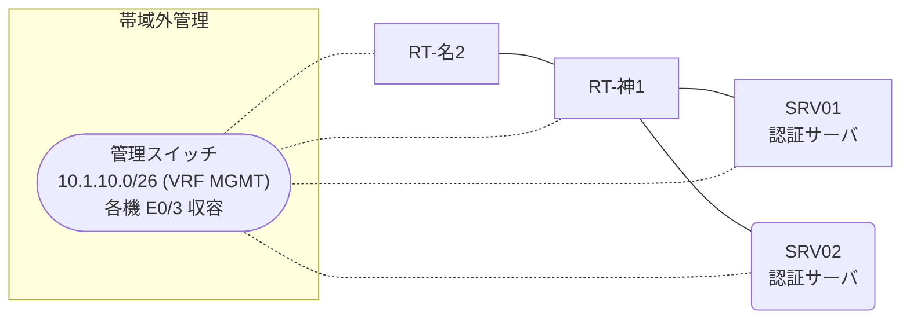

# 問題 20260808-015

> **本問は機器に接続せずに解答すること。追加の show 実行は認めない。**

## シナリオ

あなたの組織は、下記に示されているところのネットワークを運用しています。2 つの拠点のルータが、共通の認証サーバ群を用いて、管理者の認証を行うように構成されています。一方のルータはサーバと直結しており、他方はそのルーターを経由してサーバに到達します。一部の通信が、意図されているとおりに動作していない、という報告があります。あなたは、提示されているところの情報のみを使用して、要求されている状態が満たされていない理由を、特定しなければなりません。神戸・名古屋 の両拠点で、利用者 adm-kato が権限レベル 15 で機器を操作できること。認証は認証サーバ群 AAA-SRV を用いること。既定の方式リストは変更しないこと。



### 認証サーバの仕様

| 項目 | SRV01 | SRV02 |
|---|---|---|
| アドレス | 10.99.124.2 | 10.99.125.2 |
| 待受ポート | 1812 / 1813 | 1645 / 1646 |
| 共有鍵 | Ccnp-Aaa-77 | Ccnp-Aaa-77 |
| 受理する送信元 | 10.8.0.1 ・ 10.9.0.2 | 同左 |
| 台帳 | adm-kato(15) ・ watch-op(1) ・ SUZUKI(15) | 同左 |
| 現在の稼働状態 | 稼働中 | 稼働中 |

## 出力

| 拠点 | ユーザ | 結果 |
|---|---|---|
| 神戸 | adm-kato | ログイン不可 |
| 神戸 | watch-op | ログイン可(権限レベル 1) |
| 神戸 | local-admin | ログイン不可 |
| 神戸 | watch-op からの特権昇格 | 昇格可(15) |
| 神戸 | local-admin(コンソールから) | ログイン可(権限レベル 15) |
| 名古屋 | adm-kato | ログイン不可 |
| 名古屋 | watch-op | ログイン可(権限レベル 1) |
| 名古屋 | local-admin | ログイン不可 |
| 名古屋 | watch-op からの特権昇格 | 昇格可(15) |
| 名古屋 | local-admin(コンソールから) | ログイン可(権限レベル 15) |

```
RT-神1# show running-config | section aaa
aaa new-model
!
radius server RAD1
 address ipv4 10.99.124.2 auth-port 1812 acct-port 1813
 key Ccnp-Aaa-77
!
radius server RAD2
 address ipv4 10.99.125.2 auth-port 1645 acct-port 1646
 key Ccnp-Aaa-77
!
aaa group server radius AAA-SRV
 server name RAD1
 server name RAD2
 deadtime 5
!
aaa authentication login default group AAA-SRV local
aaa authentication login CONSOLE local
aaa authorization exec default group AAA-SRV local
aaa authorization exec CONSOLE local
!
ip radius source-interface Loopback0
radius-server timeout 5
radius-server retransmit 2
!
username local-admin privilege 15 secret 5 $1$xxxx
username SUZUKI privilege 15 secret 5 $1$yyyy
!
line con 0
 exec-timeout 0 0
 logging synchronous
 login authentication CONSOLE
 authorization exec CONSOLE
line vty 0 4
 exec-timeout 0 0
 transport input ssh
```
```
神戸: User authentication request was rejected by server. (即時)
名古屋: User authentication request was rejected by server. (即時)
```
```
RT-名2# show running-config | section aaa
aaa new-model
!
radius server RAD1
 address ipv4 10.99.124.2 auth-port 1812 acct-port 1813
 key Ccnp-Aaa-77
!
radius server RAD2
 address ipv4 10.99.125.2 auth-port 1645 acct-port 1646
 key Ccnp-Aaa-77
!
aaa group server radius AAA-SRV
 server name RAD1
 server name RAD2
 deadtime 5
!
aaa authentication login default group AAA-SRV local
aaa authentication login CONSOLE local
aaa authorization exec default group AAA-SRV local
aaa authorization exec CONSOLE local
!
ip radius source-interface Loopback0
radius-server timeout 5
radius-server retransmit 2
!
username local-admin privilege 15 secret 5 $1$xxxx
username SUZUKI privilege 15 secret 5 $1$yyyy
!
line con 0
 exec-timeout 0 0
 logging synchronous
 login authentication CONSOLE
 authorization exec CONSOLE
line vty 0 4
 exec-timeout 0 0
 transport input ssh
```

## 設問

次のうち、正しいものは、どれですか。

## 選択肢
A. 認証要求の送信元アドレスが、サーバ側で許可された値になっていない。

B. 認証サーバの利用者台帳に当該利用者が登録されていない。

C. 作成した方式リストが回線に適用されていない。

D. ルータと認証サーバの共有鍵が一致していない。
