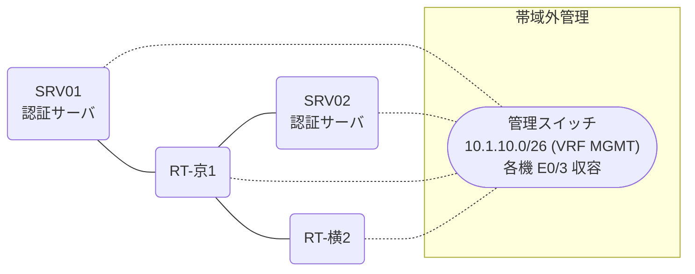

# 問題 20260808-016

> **本問は機器に接続せずに解答すること。追加の show 実行は認めない。**

## シナリオ

あなたは、ネットワークの運用を担当しています。2 つの拠点のルータが、共通の認証サーバ群を用いて、管理者の認証を行うように構成されています。一方のルータはサーバと直結しており、他方はそのルーターを経由してサーバに到達します。一部の通信が、意図されているとおりに動作していない、という報告があります。あなたは、提示されているところの情報のみを使用して、要求されている状態が満たされていない理由を、特定しなければなりません。京都・横浜 の両拠点で、利用者 adm-kato が権限レベル 15 で機器を操作できること。既定の方式リストは変更しないこと。認証は認証サーバ群 AAA-SRV を用いること。



### 認証サーバの仕様

| 項目 | SRV01 | SRV02 |
|---|---|---|
| アドレス | 10.99.78.2 | 10.99.79.2 |
| 待受ポート | 1812 / 1813 | 1912 / 1913 |
| 共有鍵 | Ccnp-Aaa-77 | Ccnp-Aaa-77 |
| 受理する送信元 | 10.2.0.1 ・ 10.9.0.2 | 同左 |
| 台帳 | adm-kato(15) ・ watch-op(1) ・ SUZUKI(15) | 同左 |
| 現在の稼働状態 | 稼働中 | 稼働中 |

### ルータのアドレス

| ルータ | Loopback0 | 認証サーバ方向のインタフェース |
|---|---|---|
| RT-京1(京都) | 10.2.0.1 | Ethernet0/0 = 10.99.78.1 |
| RT-横2(横浜) | 10.9.0.2 | Ethernet0/0 = 10.62.12.2 |

## 出力

| 拠点 | ユーザ | 結果 |
|---|---|---|
| 京都 | adm-kato | ログイン可(権限レベル 15) |
| 京都 | watch-op | ログイン可(権限レベル 1) |
| 京都 | backup-adm | ログイン不可 |
| 京都 | watch-op からの特権昇格 | 昇格不可 |
| 京都 | backup-adm(コンソールから) | ログイン可(権限レベル 15) |
| 横浜 | adm-kato | ログイン可(権限レベル 15) |
| 横浜 | watch-op | ログイン可(権限レベル 1) |
| 横浜 | backup-adm | ログイン不可 |
| 横浜 | watch-op からの特権昇格 | 昇格可(15) |
| 横浜 | backup-adm(コンソールから) | ログイン可(権限レベル 15) |

```
京都: User was successfully authenticated. (即時)
横浜: User was successfully authenticated. (即時)
```
```
RT-京1# show running-config | section aaa
aaa new-model
!
radius server RAD1
 address ipv4 10.99.78.2 auth-port 1812 acct-port 1813
 key Ccnp-Aaa-77
!
radius server RAD2
 address ipv4 10.99.79.2 auth-port 1912 acct-port 1913
 key Ccnp-Aaa-77
!
aaa group server radius AAA-SRV
 server name RAD1
 server name RAD2
 deadtime 5
!
aaa authentication login default group AAA-SRV local
aaa authentication login CONSOLE local
aaa authentication enable default group AAA-SRV enable
aaa authorization exec default group AAA-SRV local
aaa authorization exec CONSOLE local
!
ip radius source-interface Loopback0
radius-server timeout 5
radius-server retransmit 2
!
username backup-adm privilege 15 secret 5 $1$xxxx
username SUZUKI privilege 15 secret 5 $1$yyyy
!
line con 0
 exec-timeout 0 0
 logging synchronous
 login authentication CONSOLE
 authorization exec CONSOLE
line vty 0 4
 exec-timeout 0 0
 transport input ssh
```
```
RT-横2# show running-config | section aaa
aaa new-model
!
radius server RAD1
 address ipv4 10.99.78.2 auth-port 1812 acct-port 1813
 key Ccnp-Aaa-77
!
radius server RAD2
 address ipv4 10.99.79.2 auth-port 1912 acct-port 1913
 key Ccnp-Aaa-77
!
aaa group server radius AAA-SRV
 server name RAD1
 server name RAD2
 deadtime 5
!
aaa authentication login default group AAA-SRV local
aaa authentication login CONSOLE local
aaa authorization exec default group AAA-SRV local
aaa authorization exec CONSOLE local
!
ip radius source-interface Loopback0
radius-server timeout 5
radius-server retransmit 2
!
username backup-adm privilege 15 secret 5 $1$xxxx
username SUZUKI privilege 15 secret 5 $1$yyyy
!
line con 0
 exec-timeout 0 0
 logging synchronous
 login authentication CONSOLE
 authorization exec CONSOLE
line vty 0 4
 exec-timeout 0 0
 transport input ssh
```

## 設問

次のうち、正しいものは、どれですか。

## 選択肢
A. 特権レベルへの昇格の認証が認証サーバ経由になっている。

B. ルータが指定している待受ポートがサーバの実際の値と異なる。

C. exec の認可に代替手段が構成されていない。

D. exec の認可が構成されていない。
