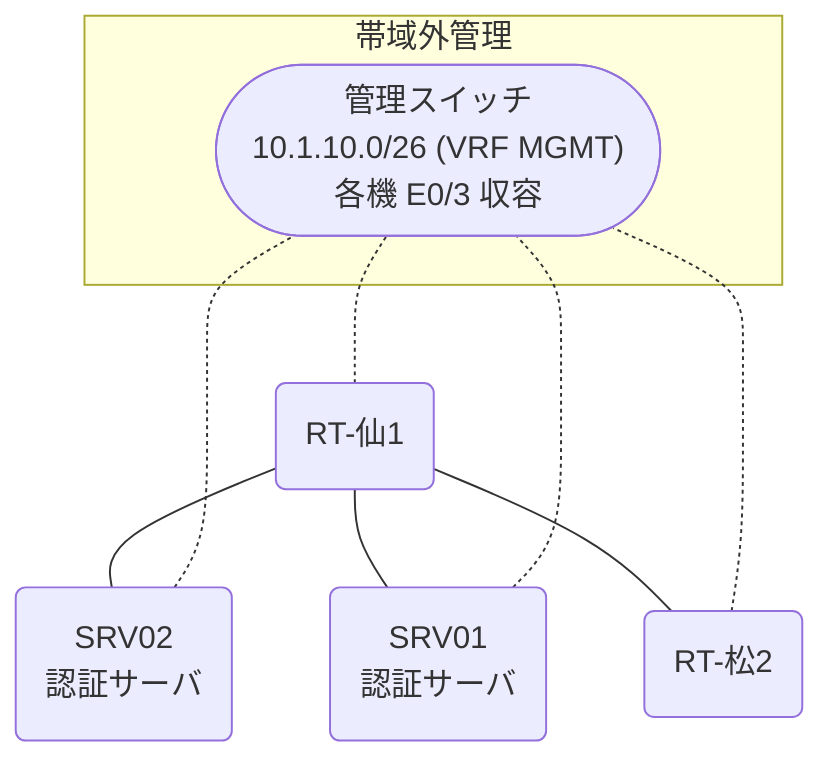

# 問題 20260808-017

> **本問は機器に接続せずに解答すること。追加の show 実行は認めない。**

## トポロジ

あなたは、ネットワークの運用を担当しています。2 つの拠点のルータが、共通の認証サーバ群を用いて、管理者の認証を行うように構成されています。一方のルータはサーバと直結しており、他方はそのルーターを経由してサーバに到達します。



### 認証サーバの仕様

| 項目 | SRV01 | SRV02 |
|---|---|---|
| アドレス | 10.99.189.2 | 10.99.190.2 |
| 待受ポート | 1812 / 1813 | 1645 / 1646 |
| 共有鍵 | Rad-8102 | Rad-8102 |
| 受理する送信元 | 10.7.0.1 ・ 10.1.0.2 | 同左 |
| 台帳 | noc-hanako(15) ・ watch-op(1) ・ SUZUKI(15) | 同左 |
| 現在の稼働状態 | 保守作業のため停止中 | 稼働中 |

### ルータのアドレス

| ルータ | Loopback0 | 認証サーバ方向のインタフェース |
|---|---|---|
| RT-仙1(仙台) | 10.7.0.1 | Ethernet0/0 = 10.99.189.1 |
| RT-松2(松山) | 10.1.0.2 | Ethernet0/0 = 10.82.12.2 |

## 要件

1. 仙台・松山 の両拠点で、利用者 noc-hanako が権限レベル 15 で機器を操作できること。
2. 認証は認証サーバ群 AUTH-GRP を用いること。
3. 作業の途中で運用者の接続が切れないこと。

## 現在の状態

利用者の認証が、意図されたとおりに行われていない、ということが、報告されています。原因として、**ルータが指定している待受ポートがサーバの実際の値と異なる。** と **認証要求の送信元アドレスが、サーバ側で許可された値になっていない。** と **ルータと認証サーバの共有鍵が一致していない。** の 3 つが、想定されています。機器の構成は、まだ取得されていません。

| 拠点 | ユーザ | 結果 |
|---|---|---|
| 仙台 | noc-hanako | ログイン可(権限レベル 15) |
| 仙台 | watch-op | ログイン可(権限レベル 1) |
| 仙台 | emg-admin | ログイン不可 |
| 仙台 | watch-op からの特権昇格 | 昇格可(15) |
| 仙台 | emg-admin(コンソールから) | ログイン可(権限レベル 15) |
| 松山 | noc-hanako | ログイン不可 |
| 松山 | watch-op | ログイン不可 |
| 松山 | emg-admin | ログイン可(権限レベル 15) |
| 松山 | watch-op からの特権昇格 | 昇格可(15) |
| 松山 | emg-admin(コンソールから) | ログイン可(権限レベル 15) |

```
仙台: User was successfully authenticated. (約 6 秒)
松山: No authoritative response from any server. (約 12 秒)
```

## 設問

想定されているところの原因の、いずれであるかを、判断するために、**最も多くの候補を除外できる**出力は、どれですか。(1つを選択してください)

## 選択肢
A. 各ルータの `show running-config | section line vty`

B. 各ルータでの `debug radius authentication`

C. 各ルータの `show aaa servers`

D. 各ルータの `show running-config | section line con`
