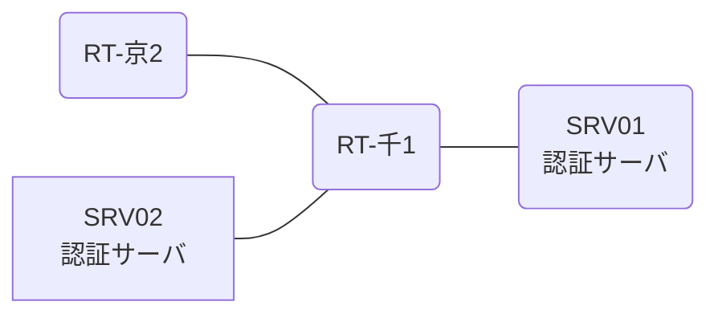

# 問題 20260808-020

> **本問は機器に接続せずに解答すること。追加の show 実行は認めない。**

## シナリオ

あなたは、ネットワークの運用を担当しています。2 つの拠点のルータが、共通の認証サーバ群を用いて、管理者の認証を行うように構成されています。一方のルータはサーバと直結しており、他方はそのルーターを経由してサーバに到達します。通信の一部において、想定されていない挙動が、観測されています。あなたは、提示されているところの情報のみを使用して、要求されている状態が満たされていない理由を、特定しなければなりません。千葉・京都 の両拠点で、利用者 noc-taro が権限レベル 15 で機器を操作できること。認証サーバ側の設定は変更できない。認証は認証サーバ群 RADGRP を用いること。



### 認証サーバの仕様

| 項目 | SRV01 | SRV02 |
|---|---|---|
| アドレス | 10.99.38.2 | 10.99.39.2 |
| 待受ポート | 1812 / 1813 | 11812 / 11813 |
| 共有鍵 | Rad-8102 | Rad-8102 |
| 受理する送信元 | 10.7.0.1 ・ 10.6.0.2 | 同左 |
| 台帳 | noc-taro(15) ・ helpdesk(1) ・ SUZUKI(15) | 同左 |
| 現在の稼働状態 | 稼働中 | 稼働中 |

### ルータのアドレス

| ルータ | Loopback0 | 認証サーバ方向のインタフェース |
|---|---|---|
| RT-千1(千葉) | 10.7.0.1 | Ethernet0/0 = 10.99.38.1 |
| RT-京2(京都) | 10.6.0.2 | Ethernet0/0 = 10.89.12.2 |

## 出力

| 拠点 | ユーザ | 結果 |
|---|---|---|
| 千葉 | noc-taro | ログイン可(権限レベル 15) |
| 千葉 | helpdesk | ログイン可(権限レベル 1) |
| 千葉 | break-glass | ログイン不可 |
| 千葉 | helpdesk からの特権昇格 | 昇格不可 |
| 千葉 | break-glass(コンソールから) | ログイン可(権限レベル 15) |
| 京都 | noc-taro | ログイン可(権限レベル 15) |
| 京都 | helpdesk | ログイン可(権限レベル 1) |
| 京都 | break-glass | ログイン不可 |
| 京都 | helpdesk からの特権昇格 | 昇格可(15) |
| 京都 | break-glass(コンソールから) | ログイン可(権限レベル 15) |

```
千葉: User was successfully authenticated. (即時)
京都: User was successfully authenticated. (即時)
```
```
RT-千1# show running-config | section aaa
aaa new-model
!
radius server RAD1
 address ipv4 10.99.38.2 auth-port 1812 acct-port 1813
 key Rad-8102
!
radius server RAD2
 address ipv4 10.99.39.2 auth-port 11812 acct-port 11813
 key Rad-8102
!
aaa group server radius RADGRP
 server name RAD1
 server name RAD2
 deadtime 5
!
aaa authentication login default group RADGRP local
aaa authentication login CONSOLE local
aaa authentication enable default group RADGRP enable
aaa authorization exec default group RADGRP local
aaa authorization exec CONSOLE local
!
ip radius source-interface Loopback0
radius-server timeout 5
radius-server retransmit 2
!
username break-glass privilege 15 secret 5 $1$xxxx
username SUZUKI privilege 15 secret 5 $1$yyyy
!
line con 0
 exec-timeout 0 0
 logging synchronous
 login authentication CONSOLE
 authorization exec CONSOLE
line vty 0 4
 exec-timeout 0 0
 transport input ssh
```
```
RT-京2# show running-config | section aaa
aaa new-model
!
radius server RAD1
 address ipv4 10.99.38.2 auth-port 1812 acct-port 1813
 key Rad-8102
!
radius server RAD2
 address ipv4 10.99.39.2 auth-port 11812 acct-port 11813
 key Rad-8102
!
aaa group server radius RADGRP
 server name RAD1
 server name RAD2
 deadtime 5
!
aaa authentication login default group RADGRP local
aaa authentication login CONSOLE local
aaa authorization exec default group RADGRP local
aaa authorization exec CONSOLE local
!
ip radius source-interface Loopback0
radius-server timeout 5
radius-server retransmit 2
!
username break-glass privilege 15 secret 5 $1$xxxx
username SUZUKI privilege 15 secret 5 $1$yyyy
!
line con 0
 exec-timeout 0 0
 logging synchronous
 login authentication CONSOLE
 authorization exec CONSOLE
line vty 0 4
 exec-timeout 0 0
 transport input ssh
```

## 設問

次のうち、正しいものは、どれですか。

## 選択肢
A. 認証サーバに、昇格用の利用者を登録する。

B. no aaa authentication enable default group RADGRP enable

C. radius server RAD2
 address ipv4 10.99.39.2 auth-port 11812 acct-port 11813
 exit

D. aaa authentication login MGMT1 group RADGRP local
