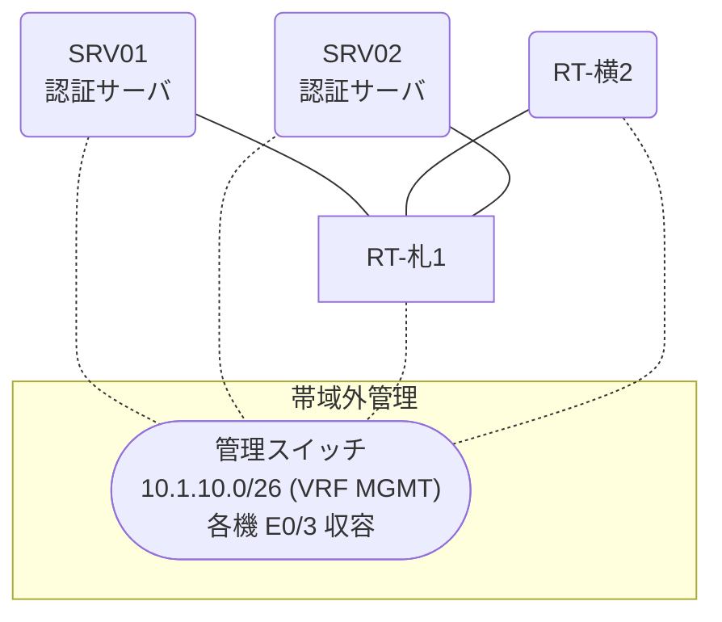

# 問題 20260808-021

> **本問は機器に接続せずに解答すること。追加の show 実行は認めない。**

## トポロジ

あなたは、下記のネットワークの保守を担当する技術者です。2 つの拠点のルータが、共通の認証サーバ群を用いて、管理者の認証を行うように構成されています。一方のルータはサーバと直結しており、他方はそのルーターを経由してサーバに到達します。



### 認証サーバの仕様

| 項目 | SRV01 | SRV02 |
|---|---|---|
| アドレス | 10.99.229.2 | 10.99.230.2 |
| 待受ポート | 1812 / 1813 | 11812 / 11813 |
| 共有鍵 | Rad-8102 | Rad-8102 |
| 受理する送信元 | 10.8.0.1 ・ 10.3.0.2 | 同左 |
| 台帳 | noc-taro(15) ・ watch-op(1) ・ SUZUKI(15) | 同左 |
| 現在の稼働状態 | 保守作業のため停止中 | 稼働中 |

### ルータのアドレス

| ルータ | Loopback0 | 認証サーバ方向のインタフェース |
|---|---|---|
| RT-札1(札幌) | 10.8.0.1 | Ethernet0/0 = 10.99.229.1 |
| RT-横2(横浜) | 10.3.0.2 | Ethernet0/0 = 10.56.12.2 |

## 要件

1. 札幌・横浜 の両拠点で、利用者 noc-taro が権限レベル 15 で機器を操作できること。
2. 認証は認証サーバ群 NOC-RADIUS を用いること。
3. 既定の方式リストは変更しないこと。

## 現在の状態

通信の一部において、想定されていない挙動が、観測されています。あなたは、提示されているところの情報のみを使用して、要求されている状態が満たされていない理由を、特定しなければなりません。

| 拠点 | ユーザ | 結果 |
|---|---|---|
| 札幌 | noc-taro | ログイン可(権限レベル 15) |
| 札幌 | watch-op | ログイン可(権限レベル 1) |
| 札幌 | backup-adm | ログイン不可 |
| 札幌 | watch-op からの特権昇格 | 昇格可(15) |
| 札幌 | backup-adm(コンソールから) | ログイン可(権限レベル 15) |
| 横浜 | noc-taro | ログイン不可 |
| 横浜 | watch-op | ログイン不可 |
| 横浜 | backup-adm | ログイン可(権限レベル 15) |
| 横浜 | watch-op からの特権昇格 | 昇格可(15) |
| 横浜 | backup-adm(コンソールから) | ログイン可(権限レベル 15) |

```
札幌: User was successfully authenticated. (約 10 秒)
横浜: No authoritative response from any server. (約 20 秒)
```

## 設定抜粋

```
RT-札1# show running-config | section aaa
aaa new-model
!
radius server RAD1
 address ipv4 10.99.229.2 auth-port 1812 acct-port 1813
 key Rad-8102
!
radius server RAD2
 address ipv4 10.99.230.2 auth-port 11812 acct-port 11813
 key Rad-8102
!
aaa group server radius NOC-RADIUS
 server name RAD1
 server name RAD2
 deadtime 5
!
aaa authentication login default group NOC-RADIUS local
aaa authentication login CONSOLE local
aaa authorization exec default group NOC-RADIUS local
aaa authorization exec CONSOLE local
!
ip radius source-interface Loopback0
radius-server timeout 5
radius-server retransmit 1
!
username backup-adm privilege 15 secret 5 $1$xxxx
username SUZUKI privilege 15 secret 5 $1$yyyy
!
line con 0
 exec-timeout 0 0
 logging synchronous
 login authentication CONSOLE
 authorization exec CONSOLE
line vty 0 4
 exec-timeout 0 0
 transport input ssh
```
```
RT-横2# show running-config | section aaa
aaa new-model
!
radius server RAD1
 address ipv4 10.99.229.2 auth-port 1812 acct-port 1813
 key Rad-8102
!
radius server RAD2
 address ipv4 10.99.230.2 auth-port 11812 acct-port 11813
 key Rad-8102
!
aaa group server radius NOC-RADIUS
 server name RAD1
 server name RAD2
 deadtime 5
!
aaa authentication login default group NOC-RADIUS local
aaa authentication login CONSOLE local
aaa authorization exec default group NOC-RADIUS local
aaa authorization exec CONSOLE local
!
(該当する行はない)
radius-server timeout 5
radius-server retransmit 1
!
username backup-adm privilege 15 secret 5 $1$xxxx
username SUZUKI privilege 15 secret 5 $1$yyyy
!
line con 0
 exec-timeout 0 0
 logging synchronous
 login authentication CONSOLE
 authorization exec CONSOLE
line vty 0 4
 exec-timeout 0 0
 transport input ssh
```

## 設問

次のうち、正しいものは、どれですか。

## 選択肢
A. exec の認可に代替手段が構成されていない。

B. ルータが指定している待受ポートがサーバの実際の値と異なる。

C. コンソール回線に専用の方式リストが適用されていない。

D. 認証要求の送信元アドレスが、サーバ側で許可された値になっていない。
