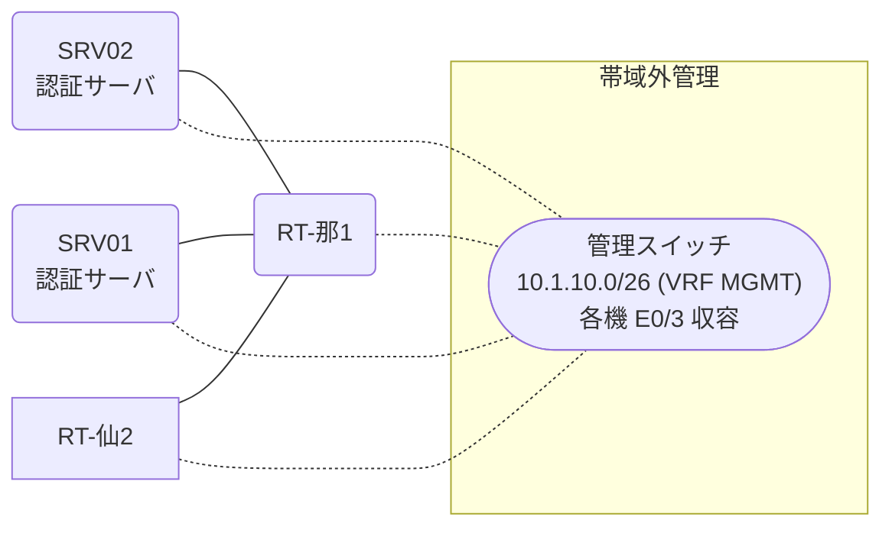

# 問題 20260808-023

> **本問は機器に接続せずに解答すること。追加の show 実行は認めない。**

## トポロジ

あなたは、ネットワークの運用を担当しています。2 つの拠点のルータが、共通の認証サーバ群を用いて、管理者の認証を行うように構成されています。一方のルータはサーバと直結しており、他方はそのルーターを経由してサーバに到達します。



### 認証サーバの仕様

| 項目 | SRV01 | SRV02 |
|---|---|---|
| アドレス | 10.99.58.2 | 10.99.59.2 |
| 待受ポート | 1812 / 1813 | 11812 / 11813 |
| 共有鍵 | Rad-8102 | Rad-8102 |
| 受理する送信元 | 10.2.0.1 ・ 10.9.0.2 | 同左 |
| 台帳 | adm-kato(15) ・ monitor-op(1) ・ SUZUKI(15) | 同左 |
| 現在の稼働状態 | 稼働中 | 稼働中 |

### ルータのアドレス

| ルータ | Loopback0 | 認証サーバ方向のインタフェース |
|---|---|---|
| RT-那1(那覇) | 10.2.0.1 | Ethernet0/0 = 10.99.58.1 |
| RT-仙2(仙台) | 10.9.0.2 | Ethernet0/0 = 10.71.12.2 |

## 要件

1. 那覇・仙台 の両拠点で、利用者 adm-kato が権限レベル 15 で機器を操作できること。
2. 認証は認証サーバ群 NOC-RADIUS を用いること。
3. 認証サーバ側の設定は変更できない。

## 現在の状態

ユーザーから、通信に関する事象が、報告されています。示されているところの出力および構成に基づいて、要求されているところの動作が得られていない理由が、判断されなければなりません。

| 拠点 | ユーザ | 結果 |
|---|---|---|
| 那覇 | adm-kato | ログイン可(権限レベル 15) |
| 那覇 | monitor-op | ログイン可(権限レベル 1) |
| 那覇 | emg-admin | ログイン不可 |
| 那覇 | monitor-op からの特権昇格 | 昇格可(15) |
| 那覇 | emg-admin(コンソールから) | ログイン不可 |
| 仙台 | adm-kato | ログイン可(権限レベル 15) |
| 仙台 | monitor-op | ログイン可(権限レベル 1) |
| 仙台 | emg-admin | ログイン不可 |
| 仙台 | monitor-op からの特権昇格 | 昇格可(15) |
| 仙台 | emg-admin(コンソールから) | ログイン可(権限レベル 15) |


## 設定抜粋

```
RT-那1# show running-config | section aaa
aaa new-model
!
radius server RAD1
 address ipv4 10.99.58.2 auth-port 1812 acct-port 1813
 key Rad-8102
!
radius server RAD2
 address ipv4 10.99.59.2 auth-port 11812 acct-port 11813
 key Rad-8102
!
aaa group server radius NOC-RADIUS
 server name RAD1
 server name RAD2
 deadtime 5
!
aaa authentication login default group NOC-RADIUS local
aaa authorization exec default group NOC-RADIUS local
!
ip radius source-interface Loopback0
radius-server timeout 2
radius-server retransmit 1
!
username emg-admin privilege 15 secret 5 $1$xxxx
username SUZUKI privilege 15 secret 5 $1$yyyy
!
line con 0
 exec-timeout 0 0
 logging synchronous
line vty 0 4
 exec-timeout 0 0
 transport input ssh
```
```
RT-仙2# show running-config | section aaa
aaa new-model
!
radius server RAD1
 address ipv4 10.99.58.2 auth-port 1812 acct-port 1813
 key Rad-8102
!
radius server RAD2
 address ipv4 10.99.59.2 auth-port 11812 acct-port 11813
 key Rad-8102
!
aaa group server radius NOC-RADIUS
 server name RAD1
 server name RAD2
 deadtime 5
!
aaa authentication login default group NOC-RADIUS local
aaa authentication login CONSOLE local
aaa authorization exec default group NOC-RADIUS local
aaa authorization exec CONSOLE local
!
ip radius source-interface Loopback0
radius-server timeout 2
radius-server retransmit 1
!
username emg-admin privilege 15 secret 5 $1$xxxx
username SUZUKI privilege 15 secret 5 $1$yyyy
!
line con 0
 exec-timeout 0 0
 logging synchronous
 login authentication CONSOLE
 authorization exec CONSOLE
line vty 0 4
 exec-timeout 0 0
 transport input ssh
```

## 設問

次のうち、正しいものは、どれですか。

## 選択肢
**A.**
```
那覇: No authoritative response from any server. (約 8 秒)
仙台: User was successfully authenticated. (即時)
```
**B.**
```
那覇: User authentication request was rejected by server. (即時)
仙台: User authentication request was rejected by server. (即時)
```
**C.**
```
那覇: User was successfully authenticated. (即時)
仙台: User was successfully authenticated. (即時)
```
