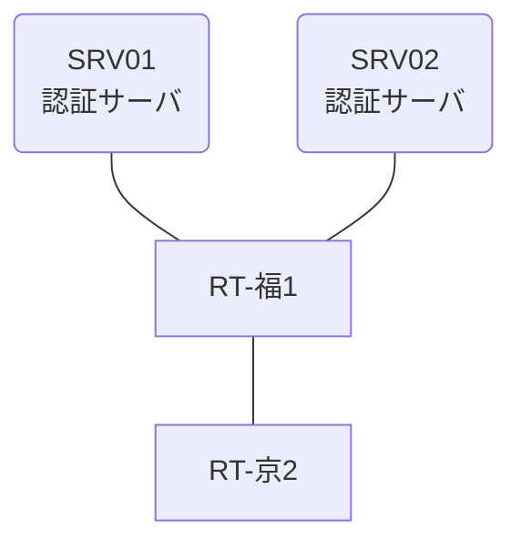

# 問題 20260808-036

> **本問は機器に接続せずに解答すること。追加の show 実行は認めない。**

## トポロジ

あなたは、ネットワークの運用を担当しています。2 つの拠点のルータが、共通の認証サーバ群を用いて、管理者の認証を行うように構成されています。一方のルータはサーバと直結しており、他方はそのルーターを経由してサーバに到達します。



### 認証サーバの仕様

| 項目 | SRV01 | SRV02 |
|---|---|---|
| アドレス | 10.99.103.2 | 10.99.104.2 |
| 待受ポート | 1812 / 1813 | 1645 / 1646 |
| 共有鍵 | K-9931 | K-9931 |
| 受理する送信元 | 10.7.0.1 ・ 10.9.0.2 | 同左 |
| 台帳 | adm-kato(15) ・ desk-01(1) ・ SUZUKI(15) | 同左 |
| 現在の稼働状態 | 保守作業のため停止中 | 稼働中 |

### ルータのアドレス

| ルータ | Loopback0 | 認証サーバ方向のインタフェース |
|---|---|---|
| RT-福1(福岡) | 10.7.0.1 | Ethernet0/0 = 10.99.103.1 |
| RT-京2(京都) | 10.9.0.2 | Ethernet0/0 = 10.42.12.2 |

## 要件

1. 福岡・京都 の両拠点で、利用者 adm-kato が権限レベル 15 で機器を操作できること。
2. 認証サーバが全て停止した場合でも、コンソールからは操作できること。
3. 認証は認証サーバ群 NOC-RADIUS を用いること。

## 現在の状態

利用者の認証が、意図されたとおりに行われていない、ということが、報告されています。原因として、**ルーターと認証サーバの共有鍵が一致していない。** と **ルータが指定している待受ポートがサーバの実際の値と異なる。** と **認証要求の送信元アドレスが、サーバ側で許可された値になっていない。** の 3 つが、想定されています。機器の構成は、まだ取得されていません。

| 拠点 | ユーザ | 結果 |
|---|---|---|
| 福岡 | adm-kato | ログイン可(権限レベル 15) |
| 福岡 | desk-01 | ログイン可(権限レベル 1) |
| 福岡 | emg-admin | ログイン不可 |
| 福岡 | desk-01 からの特権昇格 | 昇格可(15) |
| 福岡 | emg-admin(コンソールから) | ログイン可(権限レベル 15) |
| 京都 | adm-kato | ログイン不可 |
| 京都 | desk-01 | ログイン不可 |
| 京都 | emg-admin | ログイン可(権限レベル 15) |
| 京都 | emg-admin(コンソールから) | ログイン可(権限レベル 15) |

```
福岡: User was successfully authenticated. (約 15 秒)
京都: No authoritative response from any server. (約 30 秒)
```

## 設問

想定されているところの原因の、いずれであるかを、判断するために、**最も多くの候補を除外できる**出力は、どれですか。(1つを選択してください)

## 選択肢
A. 各ルータの `show running-config | section line con`

B. 各ルータでの `debug radius authentication`

C. 各ルータの `show running-config | include radius source-interface`

D. 各ルータでの `test aaa group NOC-RADIUS <利用者> <パスワード> legacy`
