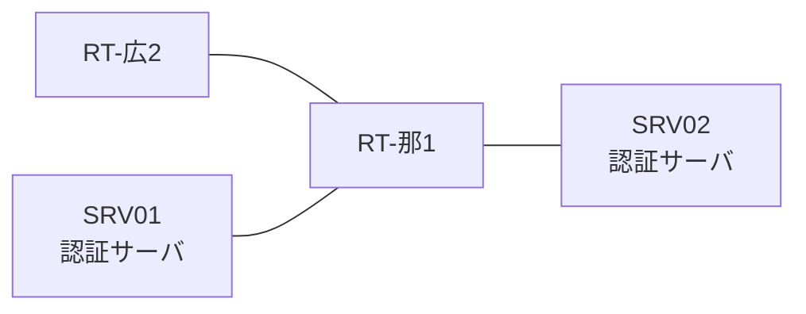

# 問題 20260808-037

> **本問は機器に接続せずに解答すること。追加の show 実行は認めない。**

## シナリオ

あなたの組織は、下記に示されているところのネットワークを運用しています。2 つの拠点のルータが、共通の認証サーバ群を用いて、管理者の認証を行うように構成されています。一方のルータはサーバと直結しており、他方はそのルーターを経由してサーバに到達します。ユーザーから、通信に関する事象が、報告されています。示されているところの出力および構成に基づいて、要求されているところの動作が得られていない理由が、判断されなければなりません。那覇・広島 の両拠点で、利用者 noc-hanako が権限レベル 15 で機器を操作できること。認証は認証サーバ群 AAA-SRV を用いること。緊急時にコンソールから操作できる経路を失わないこと。運用者の遠隔からの接続が失われないこと。



### 認証サーバの仕様

| 項目 | SRV01 | SRV02 |
|---|---|---|
| アドレス | 10.99.124.2 | 10.99.125.2 |
| 待受ポート | 1812 / 1813 | 11812 / 11813 |
| 共有鍵 | Ccnp-Aaa-77 | Ccnp-Aaa-77 |
| 受理する送信元 | 10.6.0.1 ・ 10.4.0.2 | 同左 |
| 台帳 | noc-hanako(15) ・ helpdesk(1) ・ SUZUKI(15) | 同左 |
| 現在の稼働状態 | 稼働中 | 稼働中 |

### ルータのアドレス

| ルータ | Loopback0 | 認証サーバ方向のインタフェース |
|---|---|---|
| RT-那1(那覇) | 10.6.0.1 | Ethernet0/0 = 10.99.124.1 |
| RT-広2(広島) | 10.4.0.2 | Ethernet0/0 = 10.92.12.2 |

## 出力

```
RT-広2# debug radius authentication
RADIUS: Pick NAS IP for u=0x7605 tableid=0 cfg_addr=10.4.0.2
RADIUS(00000000): Send Access-Request to 10.99.124.2:1812 id 1645/119, len 60
RADIUS:  NAS-IP-Address      [4]   6   10.4.0.2
RADIUS:  User-Name           [1]   10  "noc-hanako"
RADIUS:  User-Password       [2]   18  *
RADIUS(00000000): Started 2 sec timeout
RADIUS: Received from id 1645/119 10.99.124.2:1812, Access-Accept, len 69
RADIUS:  Service-Type        [6]   6   NAS Prompt
RADIUS:   Cisco AVpair       [1]   19  "shell:priv-lvl=15"
```

## 設問

次のうち、正しいものは、どれですか。

## 選択肢
A. 認証要求の送信元となるインタフェースが、明示的に指定されている。

B. 要求のタイムアウトは 4 秒に設定されている。

C. 1 台目の認証サーバとして 10.99.124.2 のポート 1645 が設定されている。

D. 認証要求の送信元アドレスは 10.4.2.2 である。
