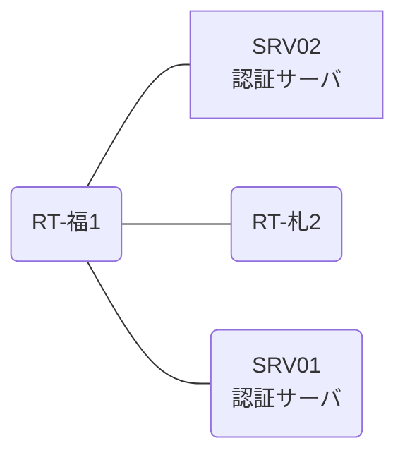

# 問題 20260808-042

> **本問は機器に接続せずに解答すること。追加の show 実行は認めない。**

## トポロジ

あなたは、ネットワークの運用を担当しています。2 つの拠点のルータが、共通の認証サーバ群を用いて、管理者の認証を行うように構成されています。一方のルータはサーバと直結しており、他方はそのルーターを経由してサーバに到達します。



### 認証サーバの仕様

| 項目 | SRV01 | SRV02 |
|---|---|---|
| アドレス | 10.99.38.2 | 10.99.39.2 |
| 待受ポート | 1812 / 1813 | 11812 / 11813 |
| 共有鍵 | Ccnp-Aaa-77 | Ccnp-Aaa-77 |
| 受理する送信元 | 10.5.0.1 ・ 10.9.0.2 | 同左 |
| 台帳 | noc-hanako(15) ・ helpdesk(1) ・ SUZUKI(15) | 同左 |
| 現在の稼働状態 | 保守作業のため停止中 | 稼働中 |

### ルータのアドレス

| ルータ | Loopback0 | 認証サーバ方向のインタフェース |
|---|---|---|
| RT-福1(福岡) | 10.5.0.1 | Ethernet0/0 = 10.99.38.1 |
| RT-札2(札幌) | 10.9.0.2 | Ethernet0/0 = 10.88.12.2 |

## 要件

1. 福岡・札幌 の両拠点で、利用者 noc-hanako が権限レベル 15 で機器を操作できること。
2. 認証は認証サーバ群 AAA-SRV を用いること。
3. 既定の方式リストは変更しないこと。

## 現在の状態

一部の通信が、意図されているとおりに動作していない、という報告があります。あなたは、示されているところの出力および構成に基づいて、その構成が、下記において記述されているとおりに動作していない理由を、判断する必要があります。

| 拠点 | ユーザ | 結果 |
|---|---|---|
| 福岡 | noc-hanako | ログイン可(権限レベル 15) |
| 福岡 | helpdesk | ログイン可(権限レベル 1) |
| 福岡 | break-glass | ログイン不可 |
| 福岡 | helpdesk からの特権昇格 | 昇格可(15) |
| 福岡 | break-glass(コンソールから) | ログイン可(権限レベル 15) |
| 札幌 | noc-hanako | ログイン不可 |
| 札幌 | helpdesk | ログイン不可 |
| 札幌 | break-glass | ログインは通るが exec 拒否 |
| 札幌 | break-glass(コンソールから) | ログイン可(権限レベル 15) |

```
福岡: User was successfully authenticated. (約 6 秒)
札幌: User was successfully authenticated. (約 6 秒)
```

## 設定抜粋

```
RT-福1# show running-config | section aaa
aaa new-model
!
radius server RAD1
 address ipv4 10.99.38.2 auth-port 1812 acct-port 1813
 key Ccnp-Aaa-77
!
radius server RAD2
 address ipv4 10.99.39.2 auth-port 11812 acct-port 11813
 key Ccnp-Aaa-77
!
aaa group server radius AAA-SRV
 server name RAD1
 server name RAD2
 deadtime 5
!
aaa authentication login default group AAA-SRV local
aaa authentication login CONSOLE local
aaa authorization exec default group AAA-SRV local
aaa authorization exec CONSOLE local
!
ip radius source-interface Loopback0
radius-server timeout 3
radius-server retransmit 1
!
username break-glass privilege 15 secret 5 $1$xxxx
username SUZUKI privilege 15 secret 5 $1$yyyy
!
line con 0
 exec-timeout 0 0
 logging synchronous
 login authentication CONSOLE
 authorization exec CONSOLE
line vty 0 4
 exec-timeout 0 0
 transport input ssh
```
```
RT-札2# show running-config | section aaa
aaa new-model
!
radius server RAD1
 address ipv4 10.99.38.2 auth-port 1812 acct-port 1813
 key Ccnp-Aaa-77
!
radius server RAD2
 address ipv4 10.99.39.2 auth-port 11812 acct-port 11813
 key Ccnp-Aaa-77
!
aaa group server radius AAA-SRV
 server name RAD1
 server name RAD2
 deadtime 5
!
aaa authentication login default local
aaa authentication login CONSOLE local
aaa authorization exec default group AAA-SRV local
aaa authorization exec CONSOLE local
!
ip radius source-interface Loopback0
radius-server timeout 3
radius-server retransmit 1
!
username break-glass privilege 15 secret 5 $1$xxxx
username SUZUKI privilege 15 secret 5 $1$yyyy
!
line con 0
 exec-timeout 0 0
 logging synchronous
 login authentication CONSOLE
 authorization exec CONSOLE
line vty 0 4
 exec-timeout 0 0
 login authentication VTY_AUTH
 transport input ssh
```

## 設問

次のうち、正しいものは、どれですか。

## 選択肢
A. 特権レベルへの昇格の認証が認証サーバ経由になっている。

B. 認証要求の送信元アドレスが、サーバ側で許可された値になっていない。

C. exec の認可に代替手段が構成されていない。

D. 回線が参照している方式リストが定義されていない。
