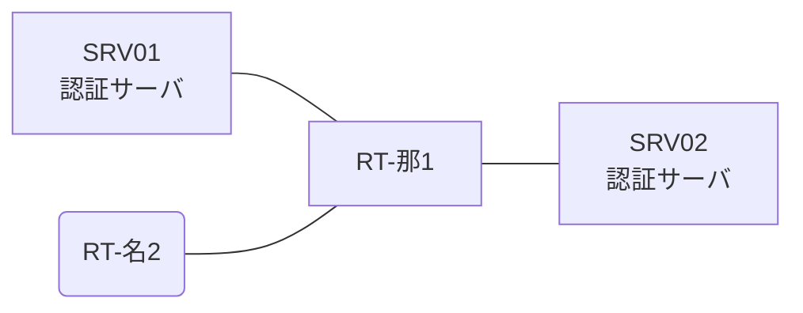

# 問題 20260808-043

> **本問は機器に接続せずに解答すること。追加の show 実行は認めない。**

## トポロジ

あなたは、下記のネットワークの保守を担当する技術者です。2 つの拠点のルータが、共通の認証サーバ群を用いて、管理者の認証を行うように構成されています。一方のルータはサーバと直結しており、他方はそのルーターを経由してサーバに到達します。



### 認証サーバの仕様

| 項目 | SRV01 | SRV02 |
|---|---|---|
| アドレス | 10.99.142.2 | 10.99.143.2 |
| 待受ポート | 1812 / 1813 | 1912 / 1913 |
| 共有鍵 | Rad-8102 | Rad-8102 |
| 受理する送信元 | 10.9.0.1 ・ 10.9.0.2 | 同左 |
| 台帳 | ope-suzuki(15) ・ desk-01(1) ・ SUZUKI(15) | 同左 |
| 現在の稼働状態 | 保守作業のため停止中 | 稼働中 |

### ルータのアドレス

| ルータ | Loopback0 | 認証サーバ方向のインタフェース |
|---|---|---|
| RT-那1(那覇) | 10.9.0.1 | Ethernet0/0 = 10.99.142.1 |
| RT-名2(名古屋) | 10.9.0.2 | Ethernet0/0 = 10.28.12.2 |

## 要件

1. 那覇・名古屋 の両拠点で、利用者 ope-suzuki が権限レベル 15 で機器を操作できること。
2. 認証サーバ側の設定は変更できない。
3. 認証は認証サーバ群 NOC-RADIUS を用いること。

## 現在の状態

いくつかの宛先への通信について、報告が上がっています。あなたは、示されているところの出力および構成に基づいて、その構成が、下記において記述されているとおりに動作していない理由を、判断する必要があります。

| 拠点 | ユーザ | 結果 |
|---|---|---|
| 那覇 | ope-suzuki | ログイン可(権限レベル 15) |
| 那覇 | desk-01 | ログイン可(権限レベル 1) |
| 那覇 | local-admin | ログイン不可 |
| 那覇 | desk-01 からの特権昇格 | 昇格可(15) |
| 那覇 | local-admin(コンソールから) | ログイン不可 |
| 名古屋 | ope-suzuki | ログイン可(権限レベル 15) |
| 名古屋 | desk-01 | ログイン可(権限レベル 1) |
| 名古屋 | local-admin | ログイン不可 |
| 名古屋 | desk-01 からの特権昇格 | 昇格可(15) |
| 名古屋 | local-admin(コンソールから) | ログイン可(権限レベル 15) |

```
那覇: User was successfully authenticated. (約 6 秒)
名古屋: User was successfully authenticated. (約 6 秒)
```

## 設定抜粋

```
RT-那1# show running-config | section aaa
aaa new-model
!
radius server RAD1
 address ipv4 10.99.142.2 auth-port 1812 acct-port 1813
 key Rad-8102
!
radius server RAD2
 address ipv4 10.99.143.2 auth-port 1912 acct-port 1913
 key Rad-8102
!
aaa group server radius NOC-RADIUS
 server name RAD1
 server name RAD2
 deadtime 5
!
aaa authentication login default group NOC-RADIUS local
aaa authorization exec default group NOC-RADIUS local
!
ip radius source-interface Loopback0
radius-server timeout 3
radius-server retransmit 1
!
username local-admin privilege 15 secret 5 $1$xxxx
username SUZUKI privilege 15 secret 5 $1$yyyy
!
line con 0
 exec-timeout 0 0
 logging synchronous
line vty 0 4
 exec-timeout 0 0
 transport input ssh
```
```
RT-名2# show running-config | section aaa
aaa new-model
!
radius server RAD1
 address ipv4 10.99.142.2 auth-port 1812 acct-port 1813
 key Rad-8102
!
radius server RAD2
 address ipv4 10.99.143.2 auth-port 1912 acct-port 1913
 key Rad-8102
!
aaa group server radius NOC-RADIUS
 server name RAD1
 server name RAD2
 deadtime 5
!
aaa authentication login default group NOC-RADIUS local
aaa authentication login CONSOLE local
aaa authorization exec default group NOC-RADIUS local
aaa authorization exec CONSOLE local
!
ip radius source-interface Loopback0
radius-server timeout 3
radius-server retransmit 1
!
username local-admin privilege 15 secret 5 $1$xxxx
username SUZUKI privilege 15 secret 5 $1$yyyy
!
line con 0
 exec-timeout 0 0
 logging synchronous
 login authentication CONSOLE
 authorization exec CONSOLE
line vty 0 4
 exec-timeout 0 0
 transport input ssh
```

## 設問

次のうち、正しいものは、どれですか。

## 選択肢
A. コンソール回線に専用の方式リストが適用されていない。

B. ルータが指定している待受ポートがサーバの実際の値と異なる。

C. 作成した方式リストが回線に適用されていない。

D. 認証要求の送信元アドレスが、サーバ側で許可された値になっていない。
