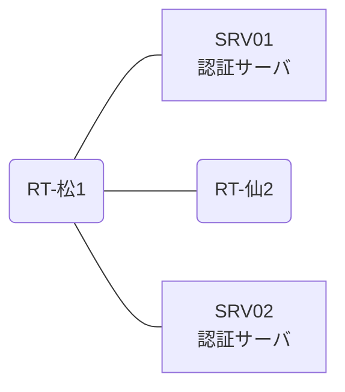

# 問題 20260808-045

> **本問は機器に接続せずに解答すること。追加の show 実行は認めない。**

## トポロジ

あなたの組織は、下記に示されているところのネットワークを運用しています。2 つの拠点のルータが、共通の認証サーバ群を用いて、管理者の認証を行うように構成されています。一方のルータはサーバと直結しており、他方はそのルーターを経由してサーバに到達します。



### 認証サーバの仕様

| 項目 | SRV01 | SRV02 |
|---|---|---|
| アドレス | 10.99.231.2 | 10.99.232.2 |
| 待受ポート | 1812 / 1813 | 11812 / 11813 |
| 共有鍵 | K-9931 | K-9931 |
| 受理する送信元 | 10.9.0.1 ・ 10.3.0.2 | 同左 |
| 台帳 | ope-suzuki(15) ・ monitor-op(1) ・ SUZUKI(15) | 同左 |
| 現在の稼働状態 | 保守作業のため停止中 | 稼働中 |

### ルータのアドレス

| ルータ | Loopback0 | 認証サーバ方向のインタフェース |
|---|---|---|
| RT-松1(松山) | 10.9.0.1 | Ethernet0/0 = 10.99.231.1 |
| RT-仙2(仙台) | 10.3.0.2 | Ethernet0/0 = 10.20.12.2 |

## 要件

1. 松山・仙台 の両拠点で、利用者 ope-suzuki が権限レベル 15 で機器を操作できること。
2. 認証は認証サーバ群 RAD-GROUP を用いること。
3. 認証サーバが全て停止した場合でも、コンソールからは操作できること。

## 現在の状態

通信の一部において、想定されていない挙動が、観測されています。示されているところの出力および構成に基づいて、要求されているところの動作が得られていない理由が、判断されなければなりません。

| 拠点 | ユーザ | 結果 |
|---|---|---|
| 松山 | ope-suzuki | ログイン可(権限レベル 15) |
| 松山 | monitor-op | ログイン可(権限レベル 1) |
| 松山 | emg-admin | ログイン不可 |
| 松山 | monitor-op からの特権昇格 | 昇格可(15) |
| 松山 | emg-admin(コンソールから) | ログイン可(権限レベル 15) |
| 仙台 | ope-suzuki | ログイン不可 |
| 仙台 | monitor-op | ログイン不可 |
| 仙台 | emg-admin | ログイン可(権限レベル 15) |
| 仙台 | emg-admin(コンソールから) | ログイン可(権限レベル 15) |


## 設定抜粋

```
RT-松1# show running-config | section aaa
aaa new-model
!
radius server RAD1
 address ipv4 10.99.231.2 auth-port 1812 acct-port 1813
 key K-9931
!
radius server RAD2
 address ipv4 10.99.232.2 auth-port 11812 acct-port 11813
 key K-9931
!
aaa group server radius RAD-GROUP
 server name RAD1
 server name RAD2
 deadtime 5
!
aaa authentication login default group RAD-GROUP local
aaa authentication login CONSOLE local
aaa authorization exec default group RAD-GROUP local
aaa authorization exec CONSOLE local
!
ip radius source-interface Loopback0
radius-server timeout 5
radius-server retransmit 2
!
username emg-admin privilege 15 secret 5 $1$xxxx
username SUZUKI privilege 15 secret 5 $1$yyyy
!
line con 0
 exec-timeout 0 0
 logging synchronous
 login authentication CONSOLE
 authorization exec CONSOLE
line vty 0 4
 exec-timeout 0 0
 transport input ssh
```
```
RT-仙2# show running-config | section aaa
aaa new-model
!
radius server RAD1
 address ipv4 10.99.231.2 auth-port 1812 acct-port 1813
 key OLD-KEY
!
radius server RAD2
 address ipv4 10.99.232.2 auth-port 11812 acct-port 11813
 key OLD-KEY
!
aaa group server radius RAD-GROUP
 server name RAD1
 server name RAD2
 deadtime 5
!
aaa authentication login default group RAD-GROUP local
aaa authentication login CONSOLE local
aaa authorization exec default group RAD-GROUP local
aaa authorization exec CONSOLE local
!
ip radius source-interface Loopback0
radius-server timeout 5
radius-server retransmit 2
!
username emg-admin privilege 15 secret 5 $1$xxxx
username SUZUKI privilege 15 secret 5 $1$yyyy
!
line con 0
 exec-timeout 0 0
 logging synchronous
 login authentication CONSOLE
 authorization exec CONSOLE
line vty 0 4
 exec-timeout 0 0
 transport input ssh
```

## 設問

次のうち、正しいものは、どれですか。

## 選択肢
**A.**
```
松山: User authentication request was rejected by server. (約 15 秒)
仙台: User authentication request was rejected by server. (約 15 秒)
```
**B.**
```
松山: User was successfully authenticated. (約 15 秒)
仙台: User was successfully authenticated. (約 15 秒)
```
**C.**
```
松山: User was successfully authenticated. (約 15 秒)
仙台: No authoritative response from any server. (約 30 秒)
```
