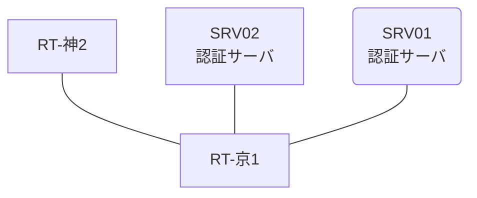

# 問題 20260808-049

> **本問は機器に接続せずに解答すること。追加の show 実行は認めない。**

## シナリオ

あなたは、ネットワークの運用を担当しています。2 つの拠点のルータが、共通の認証サーバ群を用いて、管理者の認証を行うように構成されています。一方のルータはサーバと直結しており、他方はそのルーターを経由してサーバに到達します。一部の通信が、意図されているとおりに動作していない、という報告があります。あなたは、示されているところの出力および構成に基づいて、その構成が、下記において記述されているとおりに動作していない理由を、判断する必要があります。京都・神戸 の両拠点で、利用者 ope-suzuki が権限レベル 15 で機器を操作できること。認証は認証サーバ群 AUTH-GRP を用いること。認証サーバ側の設定は変更できない。



### 認証サーバの仕様

| 項目 | SRV01 | SRV02 |
|---|---|---|
| アドレス | 10.99.93.2 | 10.99.94.2 |
| 待受ポート | 1812 / 1813 | 11812 / 11813 |
| 共有鍵 | Ccnp-Aaa-77 | Ccnp-Aaa-77 |
| 受理する送信元 | 10.4.0.1 ・ 10.0.0.2 | 同左 |
| 台帳 | ope-suzuki(15) ・ monitor-op(1) ・ SUZUKI(15) | 同左 |
| 現在の稼働状態 | 保守作業のため停止中 | 稼働中 |

### ルータのアドレス

| ルータ | Loopback0 | 認証サーバ方向のインタフェース |
|---|---|---|
| RT-京1(京都) | 10.4.0.1 | Ethernet0/0 = 10.99.93.1 |
| RT-神2(神戸) | 10.0.0.2 | Ethernet0/0 = 10.38.12.2 |

## 出力

| 拠点 | ユーザ | 結果 |
|---|---|---|
| 京都 | ope-suzuki | ログイン不可 |
| 京都 | monitor-op | ログイン不可 |
| 京都 | local-admin | ログインは通るが exec 拒否 |
| 京都 | ope-suzuki(6 セッション目以降) | ログイン不可 |
| 京都 | local-admin(コンソールから) | ログイン可(権限レベル 15) |
| 神戸 | ope-suzuki | ログイン可(権限レベル 15) |
| 神戸 | monitor-op | ログイン可(権限レベル 1) |
| 神戸 | local-admin | ログイン不可 |
| 神戸 | monitor-op からの特権昇格 | 昇格可(15) |
| 神戸 | ope-suzuki(6 セッション目以降) | ログイン可(権限レベル 15) |
| 神戸 | local-admin(コンソールから) | ログイン可(権限レベル 15) |

認証サーバがすべて停止した場合:

| 拠点 | ユーザ | 結果 |
|---|---|---|
| 京都 | local-admin | ログイン可(権限レベル 15) |
| 京都 | SUZUKI | ログイン可(権限レベル 15) |
| 京都 | local-admin(コンソールから) | ログイン可(権限レベル 15) |
| 神戸 | local-admin | ログイン可(権限レベル 15) |
| 神戸 | SUZUKI | ログイン可(権限レベル 15) |
| 神戸 | local-admin(コンソールから) | ログイン可(権限レベル 15) |

```
京都: User was successfully authenticated. (約 10 秒)
神戸: User was successfully authenticated. (約 10 秒)
```
```
RT-京1# show running-config | section aaa
aaa new-model
!
radius server RAD1
 address ipv4 10.99.93.2 auth-port 1812 acct-port 1813
 key Ccnp-Aaa-77
!
radius server RAD2
 address ipv4 10.99.94.2 auth-port 11812 acct-port 11813
 key Ccnp-Aaa-77
!
aaa group server radius AUTH-GRP
 server name RAD1
 server name RAD2
 deadtime 5
!
aaa authentication login default local
aaa authentication login CONSOLE local
aaa authorization exec default group AUTH-GRP local
aaa authorization exec CONSOLE local
aaa authorization console
!
ip radius source-interface Loopback0
radius-server timeout 5
radius-server retransmit 1
!
username local-admin privilege 15 secret 5 $1$xxxx
username SUZUKI privilege 15 secret 5 $1$yyyy
!
line con 0
 exec-timeout 0 0
 logging synchronous
 login authentication CONSOLE
 authorization exec CONSOLE
line vty 0 4
 exec-timeout 0 0
 login authentication VTY_AUTH
 transport input ssh
line vty 5 15
 exec-timeout 0 0
 transport input ssh
```
```
RT-神2# show running-config | section aaa
aaa new-model
!
radius server RAD1
 address ipv4 10.99.93.2 auth-port 1812 acct-port 1813
 key Ccnp-Aaa-77
!
radius server RAD2
 address ipv4 10.99.94.2 auth-port 11812 acct-port 11813
 key Ccnp-Aaa-77
!
aaa group server radius AUTH-GRP
 server name RAD1
 server name RAD2
 deadtime 5
!
aaa authentication login default group AUTH-GRP local
aaa authentication login CONSOLE local
aaa authorization exec default group AUTH-GRP local
aaa authorization exec CONSOLE local
aaa authorization console
!
ip radius source-interface Loopback0
radius-server timeout 5
radius-server retransmit 1
!
username local-admin privilege 15 secret 5 $1$xxxx
username SUZUKI privilege 15 secret 5 $1$yyyy
!
line con 0
 exec-timeout 0 0
 logging synchronous
 login authentication CONSOLE
 authorization exec CONSOLE
line vty 0 4
 exec-timeout 0 0
 transport input ssh
line vty 5 15
 exec-timeout 0 0
 transport input ssh
```

## 設問

次のうち、正しいものは、どれですか。

## 選択肢
A. アクセスリストが、認証サーバからの応答を遮断している。

B. 回線が参照している方式リストが定義されていない。

C. exec の認可に代替手段が構成されていない。

D. コンソール回線に対する認可が有効化されていない。
