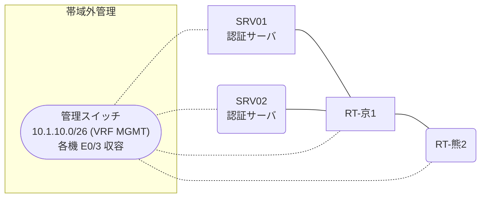

# 問題 20260808-051

> **本問は機器に接続せずに解答すること。追加の show 実行は認めない。**

## トポロジ

あなたは、ネットワークの運用を担当しています。2 つの拠点のルータが、共通の認証サーバ群を用いて、管理者の認証を行うように構成されています。一方のルータはサーバと直結しており、他方はそのルーターを経由してサーバに到達します。



### 認証サーバの仕様

| 項目 | SRV01 | SRV02 |
|---|---|---|
| アドレス | 10.99.46.2 | 10.99.47.2 |
| 待受ポート | 1812 / 1813 | 1645 / 1646 |
| 共有鍵 | Ccnp-Aaa-77 | Ccnp-Aaa-77 |
| 受理する送信元 | 10.4.0.1 ・ 10.3.0.2 | 同左 |
| 台帳 | adm-kato(15) ・ helpdesk(1) ・ SUZUKI(15) | 同左 |
| 現在の稼働状態 | 稼働中 | 稼働中 |

### ルータのアドレス

| ルータ | Loopback0 | 認証サーバ方向のインタフェース |
|---|---|---|
| RT-京1(京都) | 10.4.0.1 | Ethernet0/0 = 10.99.46.1 |
| RT-熊2(熊本) | 10.3.0.2 | Ethernet0/0 = 10.51.12.2 |

## 要件

1. 京都・熊本 の両拠点で、利用者 adm-kato が権限レベル 15 で機器を操作できること。
2. 緊急時にコンソールから操作できる経路を失わないこと。
3. 運用者の遠隔からの接続が失われないこと。
4. 認証は認証サーバ群 NOC-RADIUS を用いること。

## 現在の状態

利用者の認証が、意図されたとおりに行われていない、ということが、報告されています。原因として、**認証要求の送信元アドレスが、サーバ側で許可された値になっていない。** と **アクセスリストが、認証サーバからの応答を遮断している。** と **アクセスリストが、認証要求の送信を遮断している。** の 3 つが、想定されています。機器の構成は、まだ取得されていません。

| 拠点 | ユーザ | 結果 |
|---|---|---|
| 京都 | adm-kato | ログイン可(権限レベル 15) |
| 京都 | helpdesk | ログイン可(権限レベル 1) |
| 京都 | break-glass | ログイン不可 |
| 京都 | helpdesk からの特権昇格 | 昇格可(15) |
| 京都 | adm-kato(6 セッション目以降) | ログイン可(権限レベル 15) |
| 京都 | break-glass(コンソールから) | ログイン可(権限レベル 15) |
| 熊本 | adm-kato | ログイン不可 |
| 熊本 | helpdesk | ログイン不可 |
| 熊本 | break-glass | ログイン可(権限レベル 15) |
| 熊本 | adm-kato(6 セッション目以降) | ログイン不可 |
| 熊本 | break-glass(コンソールから) | ログイン可(権限レベル 15) |

認証サーバがすべて停止した場合:

| 拠点 | ユーザ | 結果 |
|---|---|---|
| 京都 | break-glass | ログイン可(権限レベル 15) |
| 京都 | SUZUKI | ログイン可(権限レベル 15) |
| 京都 | break-glass(コンソールから) | ログイン可(権限レベル 15) |
| 熊本 | break-glass | ログイン可(権限レベル 15) |
| 熊本 | SUZUKI | ログイン可(権限レベル 15) |
| 熊本 | break-glass(コンソールから) | ログイン可(権限レベル 15) |

```
京都: User was successfully authenticated. (即時)
熊本: No authoritative response from any server. (約 8 秒)
```

## 設問

想定されているところの原因の、いずれであるかを、判断するために、**最も多くの候補を除外できる**出力は、どれですか。(1つを選択してください)

## 選択肢
A. 各ルータの `show ip access-lists`

B. 各ルータの `show aaa servers`

C. 各ルータの `show running-config | section line vty`

D. 各ルータでの `test aaa group NOC-RADIUS <利用者> <パスワード> legacy`
