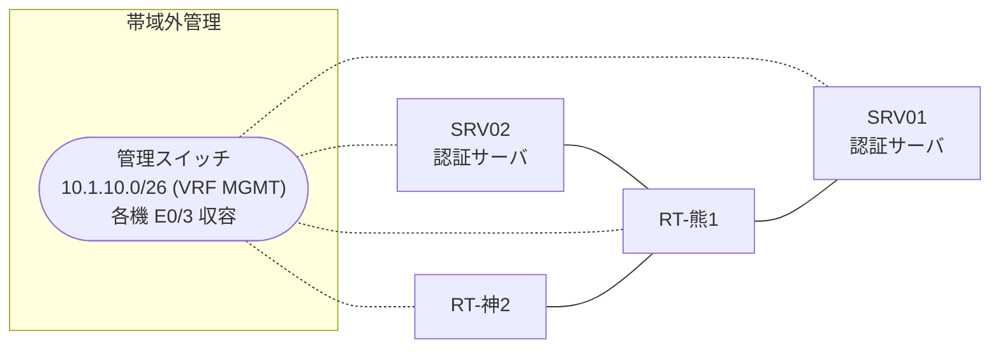

# 問題 20260808-053

> **本問は機器に接続せずに解答すること。追加の show 実行は認めない。**

## トポロジ

あなたの組織は、下記に示されているところのネットワークを運用しています。2 つの拠点のルータが、共通の認証サーバ群を用いて、管理者の認証を行うように構成されています。一方のルータはサーバと直結しており、他方はそのルーターを経由してサーバに到達します。



### 認証サーバの仕様

| 項目 | SRV01 | SRV02 |
|---|---|---|
| アドレス | 10.99.176.2 | 10.99.177.2 |
| 待受ポート | 1812 / 1813 | 1912 / 1913 |
| 共有鍵 | Ccnp-Aaa-77 | Ccnp-Aaa-77 |
| 受理する送信元 | 10.7.0.1 ・ 10.2.0.2 | 同左 |
| 台帳 | noc-hanako(15) ・ monitor-op(1) ・ SUZUKI(15) | 同左 |
| 現在の稼働状態 | 保守作業のため停止中 | 稼働中 |

### ルータのアドレス

| ルータ | Loopback0 | 認証サーバ方向のインタフェース |
|---|---|---|
| RT-熊1(熊本) | 10.7.0.1 | Ethernet0/0 = 10.99.176.1 |
| RT-神2(神戸) | 10.2.0.2 | Ethernet0/0 = 10.34.12.2 |

## 要件

1. 熊本・神戸 の両拠点で、利用者 noc-hanako が権限レベル 15 で機器を操作できること。
2. 認証は認証サーバ群 RADGRP を用いること。
3. 認証サーバ側の設定は変更できない。

## 現在の状態

ユーザーから、通信に関する事象が、報告されています。あなたは、提示されているところの情報のみを使用して、要求されている状態が満たされていない理由を、特定しなければなりません。

```
RT-神2# debug radius authentication
RADIUS: Pick NAS IP for u=0x7605 tableid=0 cfg_addr=10.2.0.2
RADIUS(00000000): Send Access-Request to 10.99.176.2:1812 id 1645/119, len 60
RADIUS:  NAS-IP-Address      [4]   6   10.2.0.2
RADIUS:  User-Name           [1]   10  "noc-hanako"
RADIUS:  User-Password       [2]   18  *
RADIUS(00000000): Started 3 sec timeout
RADIUS(00000000): Request timed out!
RADIUS: Retransmit to (10.99.176.2:1812,1813) for id 1645/119
RADIUS(00000000): Started 3 sec timeout
RADIUS(00000000): Request timed out!
RADIUS: Fail-over to (10.99.177.2:1912,1913) for id 1645/119
RADIUS(00000000): Started 3 sec timeout
RADIUS: Received from id 1645/119 10.99.177.2:1912, Access-Accept, len 69
RADIUS:  Service-Type        [6]   6   NAS Prompt
RADIUS:   Cisco AVpair       [1]   19  "shell:priv-lvl=15"
```

## 設問

次のうち、正しいものは、どれですか。

## 選択肢
A. 認証要求の送信元となるインタフェースは、明示的に指定されていない。

B. 要求のタイムアウトは 6 秒に設定されている。

C. 要求の再送は 1 回の送信につき 3 回行われる。

D. 要求のタイムアウトは 3 秒に設定されている。
