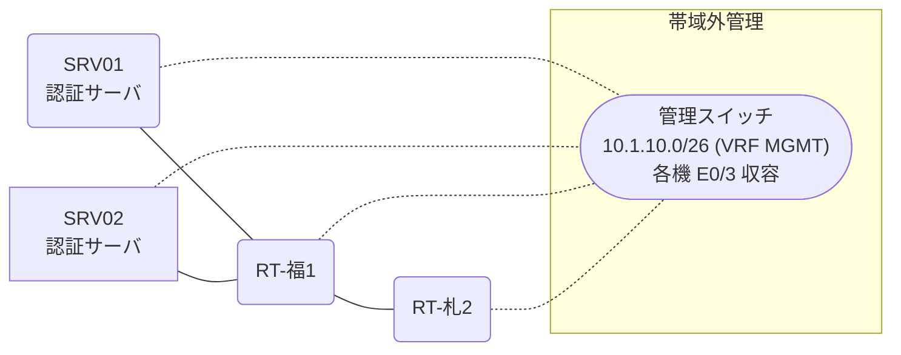

# 問題 20260808-055

> **本問は機器に接続せずに解答すること。追加の show 実行は認めない。**

## シナリオ

あなたの組織は、下記に示されているところのネットワークを運用しています。2 つの拠点のルータが、共通の認証サーバ群を用いて、管理者の認証を行うように構成されています。一方のルータはサーバと直結しており、他方はそのルーターを経由してサーバに到達します。ローカルの認証から、認証サーバ群を用いる認証への移行が、実施されようとしています。作業は、遠隔からの接続によって行われています。福岡・札幌 の両拠点で、利用者 noc-taro が権限レベル 15 で機器を操作できること。認証は認証サーバ群 RAD-GROUP を用いること。移行の作業中に、運用者の遠隔からの接続が失われないこと。移行の前後にわたり、緊急時にコンソールから操作できる経路を失わないこと。



### 認証サーバの仕様

| 項目 | SRV01 | SRV02 |
|---|---|---|
| アドレス | 10.99.131.2 | 10.99.132.2 |
| 待受ポート | 1812 / 1813 | 11812 / 11813 |
| 共有鍵 | Rad-8102 | Rad-8102 |
| 受理する送信元 | 10.2.0.1 ・ 10.2.0.2 | 同左 |
| 台帳 | noc-taro(15) ・ monitor-op(1) ・ SUZUKI(15) | 同左 |
| 現在の稼働状態 | 保守作業のため停止中 | 稼働中 |

### ルータのアドレス

| ルータ | Loopback0 | 認証サーバ方向のインタフェース |
|---|---|---|
| RT-福1(福岡) | 10.2.0.1 | Ethernet0/0 = 10.99.131.1 |
| RT-札2(札幌) | 10.2.0.2 | Ethernet0/0 = 10.86.12.2 |

## 出力

```
RT-札2# show running-config | section aaa
aaa new-model
!
radius server RAD1
 address ipv4 10.99.131.2 auth-port 1812 acct-port 1813
 key Rad-8102
!
radius server RAD2
 address ipv4 10.99.132.2 auth-port 11812 acct-port 11813
 key Rad-8102
!
aaa group server radius RAD-GROUP
 server name RAD1
 server name RAD2
 deadtime 5
!
aaa authentication login default local
aaa authentication login CONSOLE local
aaa authorization exec default local
aaa authorization exec CONSOLE local
!
ip radius source-interface Loopback0
!
username noc-taro privilege 15 secret 5 $1$zzzz
username break-glass privilege 15 secret 5 $1$xxxx
username SUZUKI privilege 15 secret 5 $1$yyyy
!
line con 0
 exec-timeout 0 0
 logging synchronous
 login authentication CONSOLE
 authorization exec CONSOLE
line vty 0 4
 exec-timeout 0 0
 transport input ssh
line vty 5 15
 exec-timeout 0 0
 transport input ssh
```
```
RT-福1# show running-config | section aaa
aaa new-model
!
radius server RAD1
 address ipv4 10.99.131.2 auth-port 1812 acct-port 1813
 key Rad-8102
!
radius server RAD2
 address ipv4 10.99.132.2 auth-port 11812 acct-port 11813
 key Rad-8102
!
aaa group server radius RAD-GROUP
 server name RAD1
 server name RAD2
 deadtime 5
!
aaa authentication login default local
aaa authentication login CONSOLE local
aaa authorization exec default local
aaa authorization exec CONSOLE local
!
ip radius source-interface Loopback0
!
username noc-taro privilege 15 secret 5 $1$zzzz
username break-glass privilege 15 secret 5 $1$xxxx
username SUZUKI privilege 15 secret 5 $1$yyyy
!
line con 0
 exec-timeout 0 0
 logging synchronous
 login authentication CONSOLE
 authorization exec CONSOLE
line vty 0 4
 exec-timeout 0 0
 transport input ssh
line vty 5 15
 exec-timeout 0 0
 transport input ssh
```

## 設問

現在の接続が失われることなく、移行を進めるために、次に適用されなければならない構成は、どれですか。(1つを選択してください)

## 選択肢
A. aaa authentication login default group RAD-GROUP local
aaa authorization exec default group RAD-GROUP local

B. aaa authorization exec default group RAD-GROUP

C. no ip radius source-interface Loopback0

D. 認証サーバの利用者台帳に、運用者を登録する。
