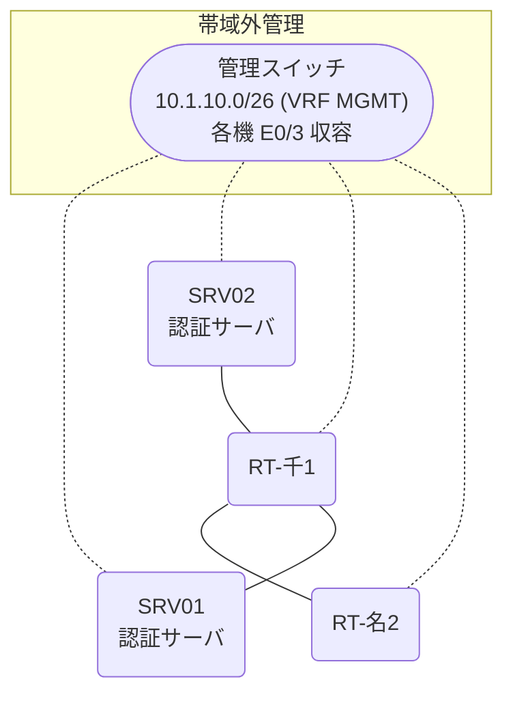

# 問題 20260808-056

> **本問は機器に接続せずに解答すること。追加の show 実行は認めない。**

## トポロジ

あなたの組織は、下記に示されているところのネットワークを運用しています。2 つの拠点のルータが、共通の認証サーバ群を用いて、管理者の認証を行うように構成されています。一方のルータはサーバと直結しており、他方はそのルーターを経由してサーバに到達します。



### 認証サーバの仕様

| 項目 | SRV01 | SRV02 |
|---|---|---|
| アドレス | 10.99.6.2 | 10.99.7.2 |
| 待受ポート | 1812 / 1813 | 1912 / 1913 |
| 共有鍵 | Sh4red-Key | Sh4red-Key |
| 受理する送信元 | 10.4.0.1 ・ 10.0.0.2 | 同左 |
| 台帳 | noc-hanako(15) ・ monitor-op(1) ・ SUZUKI(15) | 同左 |
| 現在の稼働状態 | 稼働中 | 稼働中 |

### ルータのアドレス

| ルータ | Loopback0 | 認証サーバ方向のインタフェース |
|---|---|---|
| RT-千1(千葉) | 10.4.0.1 | Ethernet0/0 = 10.99.6.1 |
| RT-名2(名古屋) | 10.0.0.2 | Ethernet0/0 = 10.20.12.2 |

## 要件

1. 千葉・名古屋 の両拠点で、利用者 noc-hanako が権限レベル 15 で機器を操作できること。
2. 認証サーバが全て停止した場合でも、コンソールからは操作できること。
3. 認証は認証サーバ群 AAA-SRV を用いること。

## 現在の状態

通信の一部において、想定されていない挙動が、観測されています。あなたは、提示されているところの情報のみを使用して、要求されている状態が満たされていない理由を、特定しなければなりません。

| 拠点 | ユーザ | 結果 |
|---|---|---|
| 千葉 | noc-hanako | ログイン可(権限レベル 15) |
| 千葉 | monitor-op | ログイン可(権限レベル 1) |
| 千葉 | backup-adm | ログイン不可 |
| 千葉 | monitor-op からの特権昇格 | 昇格可(15) |
| 千葉 | noc-hanako(6 セッション目以降) | ログイン不可 |
| 千葉 | backup-adm(コンソールから) | ログイン可(権限レベル 15) |
| 名古屋 | noc-hanako | ログイン可(権限レベル 15) |
| 名古屋 | monitor-op | ログイン可(権限レベル 1) |
| 名古屋 | backup-adm | ログイン不可 |
| 名古屋 | monitor-op からの特権昇格 | 昇格可(15) |
| 名古屋 | noc-hanako(6 セッション目以降) | ログイン可(権限レベル 15) |
| 名古屋 | backup-adm(コンソールから) | ログイン可(権限レベル 15) |

認証サーバがすべて停止した場合:

| 拠点 | ユーザ | 結果 |
|---|---|---|
| 千葉 | backup-adm | ログイン可(権限レベル 15) |
| 千葉 | SUZUKI | ログイン可(権限レベル 15) |
| 千葉 | backup-adm(コンソールから) | ログイン可(権限レベル 15) |
| 名古屋 | backup-adm | ログイン可(権限レベル 15) |
| 名古屋 | SUZUKI | ログイン可(権限レベル 15) |
| 名古屋 | backup-adm(コンソールから) | ログイン可(権限レベル 15) |

```
千葉: User was successfully authenticated. (即時)
名古屋: User was successfully authenticated. (即時)
```

## 設定抜粋

```
RT-千1# show running-config | section aaa
aaa new-model
!
radius server RAD1
 address ipv4 10.99.6.2 auth-port 1812 acct-port 1813
 key Sh4red-Key
!
radius server RAD2
 address ipv4 10.99.7.2 auth-port 1912 acct-port 1913
 key Sh4red-Key
!
aaa group server radius AAA-SRV
 server name RAD1
 server name RAD2
 deadtime 5
!
aaa authentication login default local
aaa authentication login CONSOLE local
aaa authentication login REMOTE group AAA-SRV local
aaa authorization exec default group AAA-SRV local
aaa authorization exec CONSOLE local
aaa authorization console
!
ip radius source-interface Loopback0
radius-server timeout 3
radius-server retransmit 2
!
username backup-adm privilege 15 secret 5 $1$xxxx
username SUZUKI privilege 15 secret 5 $1$yyyy
!
line con 0
 exec-timeout 0 0
 logging synchronous
 login authentication CONSOLE
 authorization exec CONSOLE
line vty 0 4
 exec-timeout 0 0
 login authentication REMOTE
 transport input ssh
line vty 5 15
 exec-timeout 0 0
 transport input ssh
```
```
RT-名2# show running-config | section aaa
aaa new-model
!
radius server RAD1
 address ipv4 10.99.6.2 auth-port 1812 acct-port 1813
 key Sh4red-Key
!
radius server RAD2
 address ipv4 10.99.7.2 auth-port 1912 acct-port 1913
 key Sh4red-Key
!
aaa group server radius AAA-SRV
 server name RAD1
 server name RAD2
 deadtime 5
!
aaa authentication login default group AAA-SRV local
aaa authentication login CONSOLE local
aaa authorization exec default group AAA-SRV local
aaa authorization exec CONSOLE local
aaa authorization console
!
ip radius source-interface Loopback0
radius-server timeout 3
radius-server retransmit 2
!
username backup-adm privilege 15 secret 5 $1$xxxx
username SUZUKI privilege 15 secret 5 $1$yyyy
!
line con 0
 exec-timeout 0 0
 logging synchronous
 login authentication CONSOLE
 authorization exec CONSOLE
line vty 0 4
 exec-timeout 0 0
 transport input ssh
line vty 5 15
 exec-timeout 0 0
 transport input ssh
```

## 設問

次のうち、正しいものは、どれですか。

## 選択肢
A. 特権レベルへの昇格の認証が認証サーバ経由になっている。

B. 認証サーバの利用者台帳に当該利用者が登録されていない。

C. 方式リストが、一部の vty 回線にしか適用されていない。

D. ルータと認証サーバの共有鍵が一致していない。
